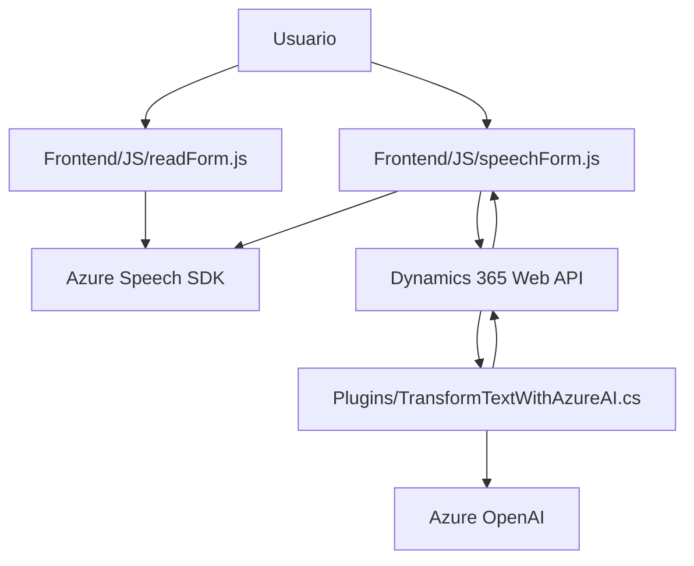

### Breve resumen técnico
El repositorio muestra una infraestructura enfocada principalmente en la integración entre un frontend basado en servicios client-side y Dynamics CRM mediante plugins. También incluye la interacción directa con servicios cognitivos de Microsoft Azure, como Speech SDK y OpenAI, para la transcripción, síntesis de voz y procesamiento de datos mediante inteligencia artificial.

---

### Descripción de arquitectura

#### **Arquitectura general:**
La solución está construida bajo una arquitectura **cliente-servidor**, donde:
1. **Frontend:**
   - Utiliza scripts JavaScript para manipulación del DOM, procesamiento de voz (entrada y síntesis), y comunicación con APIs externas (Azure Speech SDK y Dynamics API).
   - Modularidad funcional basada en operaciones específicas de formularios.

2. **Backend:**
   - Plugins de Dynamics CRM implementados en .NET/C#. Activados en eventos específicos del sistema, como transformaciones en registros y otras acciones empresariales. Estos plugins interactúan con servicios externos, como Azure OpenAI.

3. **Patrón de integración:**
   - **API Gateway:** El sistema Dynamics CRM opera como una puerta que integra los servicios del cliente y los servicios cloud.
   - **Facades:** Plugins encapsulan las interacciones con servicios externos como OpenAI y gestionan la lógica empresarial.

#### **Conclusión:**
La arquitectura es **n capas**:
1. **Capa de presentación (Frontend):** Interacción del usuario en tiempo real mediante JavaScript (procesos en el navegador).
2. **Capa lógica (CRM Plugins):** Procesamiento de reglas empresariales y normativa de datos, incluyendo transformación IA.
3. **Capa de servicios:** Integración con APIs externas como Speech SDK y OpenAI.

---

### Tecnologías usadas
1. **Frontend:**
   - **JavaScript:** Para manipulación del DOM, síntesis y reconocimiento de voz, e interacción con APIs.
   - **Azure Speech SDK:** Utilizado para sintetizar texto y procesar entrada de voz con micrófono.
   - **Dynamics 365 Web API:** Utilizado desde el frontend para actualizar registros y buscar información en formularios.

2. **Backend:**
   - **C#:** Utilizado para desarrollar plugins bajo la interfaz `IPlugin` de Dynamics CRM.
   - **Azure OpenAI:** Para procesamiento avanzado de texto mediante servicios de inteligencia artificial.
   - **Microsoft.Xrm.Sdk:** Para realizar operaciones en el sistema Dynamics CRM.
   - **System.Net.Http, Newtonsoft.Json.Linq:** Herramientas para comunicación con APIs REST y manipulación de objetos JSON.

3. **Patrones:**
   - **Plugin Pattern:** Los plugins siguen el esquema nativo de Dynamics CRM.
   - **Modularidad y Facades:** Cada función/plugin se encarga de una tarea específica, separando responsabilidades.

---

### Diagrama Mermaid válido para GitHub

---

### Conclusión final
El repositorio presenta un **sistema de integración sobre Dynamics CRM**, que utiliza módulos de frontend y plugins de backend altamente conectados con servicios en la nube. La arquitectura sigue el enfoque de **n capas**, con un cliente que procesa solicitudes en el navegador y un backend que ejecuta reglas empresariales. Mediante la utilización de APIs (Azure Speech SDK y OpenAI), el sistema ofrece una solución potente para la automatización de procesos empresariales basados en voz y texto estructurado. Elegante para escenarios con dependencias de Dynamics y Azure.