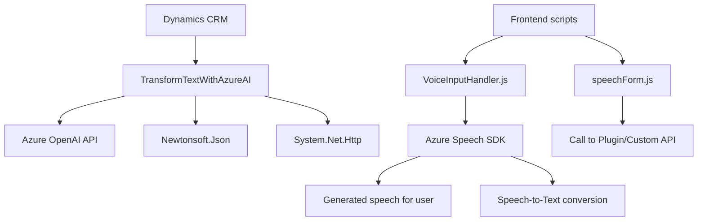

### Breve resumen técnico

El repositorio presentado contiene tres archivos principales que se integran para habilitar funcionalidad orientada a interacción basada en voz y procesamiento de texto en Microsoft Dynamics CRM (Customer Relationship Management). La solución aprovecha recursos avanzados como Azure Speech SDK y Azure OpenAI API.

A continuación, se analiza cada aspecto solicitado en detalle:

---

### Descripción de arquitectura

1. **Tipo de solución**:  
   - La solución es un integrado de varios componentes:  
     - **Frontend:** Scripts en JavaScript que habilitan entrada y salida de voz en formularios (interpretación, síntesis, reconocimiento).
     - **Backend/plugin:** Una funcionalidad programa para Dynamics CRM que interactúa con Azure OpenAI para procesamiento avanzado de texto.  

   En esencia, la solución es una arquitectura **híbrida**, combinando servicios frontales (interacción usuario-voz) y plugins traseros (procesamiento clave).

2. **Arquitectura técnica**:  
   - **Frontend:** Modular en JavaScript (estructuras n capas).  
   - **Backend:** **Arquitectura orientada a servicios (SOA)**, interactuando con APIs externas y procesos basados en eventos. Los plugins utilizan patrones estándar de Dynamics CRM.  
   - Las diferentes capas interactúan con servicios externos como Azure Speech SDK y Azure OpenAI. Esto refleja una integración basada en **servicios externos**.  

3. **Tecnologías utilizadas**:  
   - **Frontend:**  
     - **Azure Speech SDK:** Para entrada/salida de voz.  
     - JavaScript.  
   - **Backend/Plugin:**  
      - Framework de Microsoft Dynamics CRM.  
      - **Azure OpenAI API** para procesamiento de texto avanzado.  
      - **Newtonsoft.Json** para manipulación JSON.

4. **Componentes externos o dependencias:**  
   - **Azure Speech SDK:** Interacción en tiempo real para entrada/salida de voz.  
   - **Azure OpenAI API:** Procesamiento de texto avanzado con modelos GPT.  
   - **Dynamics CRM SDK:** Integración nativa de plugins y eventos en Dynamics.  
   - **Newtonsoft.Json:** Manejo de estructuras JSON.  
   - **System.Net.Http:** Llamadas HTTP a servicios externos.

---

### Tecnologías usadas y patrones:
- **Patrones arquitectónicos:**  
  - **Integración API/Servicios externos:** Azure Speech SDK, Azure OpenAI API.  
  - **Modularidad:** Las funciones separadas en JavaScript realizan tareas específicas, manteniendo bajo acoplamiento.  
  - **Event-Driven:** El SDK siempre responde mediante eventos asíncronos.  
  - **Plugin-Based Architecture:** El archivo `.cs` sigue la estructura de implementación típica para Dynamics CRM.

- **Tecnologías:**  
  - Frontend: JavaScript + Speech SDK (Azure).  
  - Backend: .NET Framework (+ Dynamics CRM SDK).  
  - Externas: Azure Speech, Azure OpenAI, Newtonsoft.Json.

---

### Diagrama Mermaid

A continuación, se representa la arquitectura general de la solución en formato **Mermaid** compatible con **GitHub Markdown**:

---

### Conclusión final

La solución es un ejemplo claro de integración moderna en sistemas empresariales, combinando tecnologías avanzadas de Microsoft Azure (voz y AI) con las capacidades nativas de Dynamics CRM. La arquitectura de servicios externos y distribución modular garantiza escalabilidad y mantenibilidad. Además, buena separación de responsabilidades y uso de patrones event-driven optimiza la interacción del sistema.

Recomendaciones adicionales:
1. Asegurar manejo seguro de configuraciones como claves, URLs y credenciales.
2. Considerar el uso de contenedores para gestionar backend/plugin y escalar servicios según la demanda.
3. Evaluar la documentación de los scripts para mejorar la comprensión de desarrolladores externos.