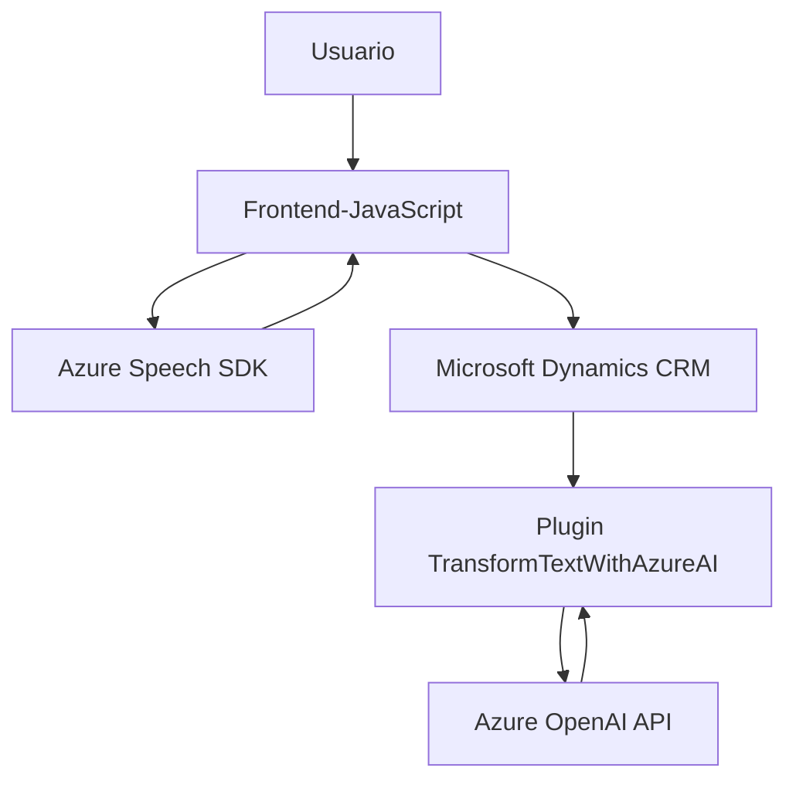

### Breve resumen técnico

El repositorio presenta una solución que integran funcionalidades de reconocimiento de voz y síntesis de texto con el servicio de **Azure Speech SDK**, además de extender **Microsoft Dynamics CRM** mediante un plugin que utiliza **Azure OpenAI API** para procesar y transformar texto en formato estructurado.

---

### Descripción de arquitectura

1. **Tipo de solución**:  
   - La solución consta de dos partes principales:  
     - Un **frontend** basado en JavaScript para interacción del usuario con formularios en una interfaz web.  
     - Un **plugin** backend para extender Microsoft Dynamics CRM usando una arquitectura de eventos.  
   - Por lo tanto, integra tanto la interfaz web (frontend) como servicios backend en Dynamics.

2. **Tipo de arquitectura**:  
   - **Frontend:** Segue una arquitectura **modular y desacoplada** con funciones separadas para tareas específicas (lectura de formularios, síntesis/reconocimiento de voz, ejecución de APIs externas).  
   - **Plugin:** Sigue una **arquitectura plugin** **event-driven** propia de Dynamics CRM que se integra con servicios externos.   
   - La solución no corresponde a un monolito ni un esquema completo basado en microservicios, pero puede interpretarse como una arquitectura **híbrida** con componentes modulares conectados a APIs en la nube (SaaS), como **Azure Speech SDK** y **Azure OpenAI Service**.

---

### Tecnologías, frameworks y patrones utilizados

1. **Tecnologías**:  
   - **Frontend**: JavaScript para manipulación de formularios, reconocimiento y síntesis de voz.  
   - **Backend (Plugin)**: C# como lenguaje base para implementar la lógica detrás de Dynamics CRM y conexión con Azure OpenAI service.  
   - **APIs consumidas**:  
     - Azure Speech SDK (https://aka.ms/csspeech/jsbrowserpackageraw).  
     - Azure OpenAI (mediante OAuth tokens).  
     - Dynamics CRM Web API (Xrm.WebApi).  

2. **Frameworks y librerías**:  
   - **Newtonsoft.Json** y **System.Text.Json** para manejo de JSON en la capa de backend.  
   - **System.Net.Http** para realizar llamadas a AI y APIs externas.

3. **Patrones arquitectónicos aplicados**:  
   - **Facade Pattern**: Abstracción de complejidad para cargar y utilizar SDKs externos, simplificando llamadas.  
   - **Callback/Event-driven architecture**: Uso de eventos para cargar SDKs de manera asincrónica y ejecutar lógica cuando se activa un evento de Dynamics CRM.  
   - **Desacoplamiento funcional**: Los módulos están diseñados con funciones claras y reutilizables que sirven propósitos definidos.  
   - **Integration of Cloud Services (SaaS)**: Consumo de servicios basados en API (Azure Speech y OpenAI).

---

### Dependencias o componentes externos

- **Azure Speech SDK**: Para realizar síntesis/reconocimiento de voz.  
- **Azure OpenAI API**: Para transformar texto en JSON estructurado o realizar procesamientos avanzados de lenguaje natural.  
- **Microsoft Dynamics CRM Web API**: Para trabajar con entidades dentro del contexto de un sistema CRM.  
- **HTTP Client Libraries**: Facilitando la comunicación con APIs.  
- **Newtonsoft/JSON**: Para serialización y deserialización de estructuras de datos JSON.

---

### Diagrama Mermaid válido para GitHub

---

### Conclusión final

La solución está orientada hacia accesibilidad y automatización en la interacción entre usuarios y formularios dentro de una interfaz web integrada con Microsoft Dynamics CRM. Combina una arquitectura modular en el frontend con una plugin architecture en el backend. Su principal fortaleza radica en el uso de servicios de nube, como **Azure Speech SDK** y **Azure OpenAI**, que complementan las capacidades de procesamiento de voz y lenguaje natural, mejorando ampliamente la experiencia de usuario y reduciendo la necesidad de intervención humana en la actualización de formularios.