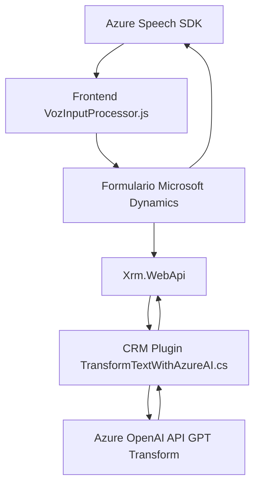

### Breve resumen técnico

La solución descrita implementa un sistema híbrido que integra una interfaz frontend para interacción con usuarios (basada en formularios y procesamiento de voz), una API backend que permite transformar datos mediante Azure AI/OpenAI, y una lógica de plugin para extender las capacidades de Microsoft Dynamics CRM. El sistema utiliza servicios externos como **Azure Speech SDK** y **Azure OpenAI** para proporcionar funcionalidades avanzadas de síntesis de voz y transformación inteligente basada en IA.

---

### Descripción de arquitectura

La arquitectura general es un sistema basado en **n capas** que integra tanto componentes frontend, como procesamiento de datos en el backend y extensiones dentro de Microsoft Dynamics CRM:

1. **Frontend**:
   - Basado en JavaScript, interactúa con los formularios de usuario para recopilar datos y procesarlos mediante voz usando **Azure Speech SDK**.
   - Modularidad: las funciones están organizadas para ser reutilizables y encapsulan diferentes responsabilidades (entrada de voz, transformación de datos visibles).

2. **Backend/Plugins**:
   - Implementación en C# como plugins dentro de Microsoft Dynamics CRM.
   - Utiliza peticiones HTTP hacia un microservicio externo que encapsula la lógica de transformación con **Azure OpenAI**.
   - El plugin maneja la lógica de entrada/salida y se integra directamente en el flujo del CRM mediante la interfaz de plugins.

---

### Tecnologías y frameworks usados

1. **Frontend**:
   - **JavaScript**: núcleo del desarrollo para la interacción con formularios y respuestas en tiempo real.
   - **Azure Speech SDK**: para síntesis y reconocimiento de voz, cargado dinámicamente.
   - DOM APIs: manipulación dinámica de scripts y estructuras visibles en los formularios.

2. **Backend/Plugins**:
   - **C#: Microsoft Dynamics Plugins**: extensión de CRM mediante la interfaz `IPlugin`.
   - **Azure OpenAI**: consumo de modelos GPT mediante REST.
   - **Newtonsoft.Json** y `System.Text.Json`: manipulación de JSON en las respuestas de Azure OpenAI.
   - **System.Net.Http**: comunicación con servicios REST.

3. **Servicios externos**:
   - Azure servicios:
     - Azure Speech SDK.
     - Azure OpenAI.

---

### Dependencias o componentes externos

1. **Azure Speech SDK**: para reconocimiento y síntesis de voz.
2. **Azure OpenAI API**: para transformar texto basado en IA.
3. **Microsoft Dynamics CRM API**: para manipulación de formularios y campos empresariales.
4. **JavaScript APIs de navegador**: para carga dinámica de scripts, extracción de datos visibles y manipulación de atributos.
5. **Newtonsoft.Json y System.Text.Json**: bibliotecas para manejo de JSON.
6. **Xrm.WebApi**: para llamadas al API REST de Microsoft Dynamics.

---

### Diagrama Mermaid válido

---

### Conclusión final

La solución descrita está diseñada para ser un sistema modular basado en **n capas**, que integra un frontend dinámico para la interacción con usuarios mediante formularios y procesamiento de voz, un plugin especializado para extender las capacidades de Microsoft Dynamics CRM y servicios de inteligencia artificial como **Azure Speech SDK** y **Azure OpenAI API**.

Esta arquitectura aprovecha patrones como:
- Modularidad en el frontend.
- Integración con microservicios (API personalizada para procesamiento de datos con IA).
- Extensión mediante plugin en el entorno de Microsoft Dynamics.

Es altamente escalable y configurable, lo que permite ampliar su funcionalidad con más servicios de Azure o tercerización de microservicios externos.