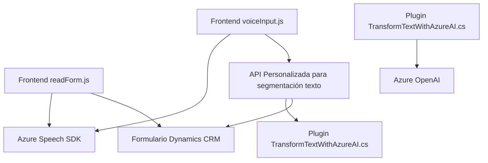

### Breve resumen técnico

La estructura de los archivos sugiere que el repositorio forma parte de un sistema integrado de entrada y salida de voz que interactúa con una plataforma informática, probablemente **Microsoft Dynamics CRM**. Incluye:

- **Frontend (readForm.js, voiceInput.js):** Maneja la entrada de voz para capturar datos y la salida de voz mediante lectura de formularios tipo Dynamics CRM utilizando Azure Speech SDK.
- **Backend Plugin (TransformTextWithAzureAI.cs):** Utiliza Azure OpenAI para transformar texto de entrada en un JSON estructurado y realiza tareas en el contexto de Dynamics CRM.

---

### Descripción de arquitectura

El sistema representa una solución orientada a servicios, con distintos módulos de interacción que producen una arquitectura compuesta por los siguientes principios:

1. **Patrones:**
   - **Event-driven:** Entrada y salida de voz en frontend y comunicación con el servicio externo se disparan por eventos generados en tiempo de ejecución.
   - **Microfrontend:** Segmentación clara de responsabilidades por funcionalidades de front.
   - **Cliente-Servidor:** Comunica frontend con backend mediante una API personalizada.
   - **Integración con servicios externos:** Usa el Azure Speech SDK en el frontend y Azure OpenAI en el plugin backend.

2. **Arquitectura:**
   - Híbrida: Parte del sistema puede estar basada en una arquitectura de frontend-backend en un Framework de CRM como Dynamics con funcionalidad adicional basada en microservicios (caso Azure AI).
   - Enfoque orientado al servicio: Servicios de terceros (Azure SDK y OpenAI) se integran directamente.
   - Modularidad explícita en el frontend y backend.
   - El backend está diseñado bajo el principio de arquitectura de plugin (propia de Dynamics CRM).

3. **Capas:**
   - **Frontend (UX y reconocimiento/síntesis de voz):**
     - Captura datos del usuario mediante voz y los escribe dinámicamente en campos del formulario de Dynamics CRM.
     - Utilización del SDK de Azure Speech y Javascript para construir funcionalidades dinámicas.
   - **Backend Plugin:**
     - Ejecuta operaciones de transformación/interacción con texto mediante Azure OpenAI.
     - Procesa texto de entrada sometido por APIs personalizadas en Dynamics CRM y sintetiza un output en forma de JSON.

---

### Tecnologías usadas

1. **Frontend:**
   - **JavaScript:** Desarrollo dinámico y modular de funcionalidades.
   - **Azure Speech SDK:** Integración para síntesis y reconocimiento de voz.
   - **Browser APIs:** Métodos nativos del navegador para Interacción DOM, creación dinámica de scripts, etc.

2. **Backend Plugin:**
   - **C#/.NET:** Utilización para la creación de plugins de Dynamics CRM.
   - **Microsoft Dynamics SDK (`Microsoft.Xrm`):** Framework de CRM para obtener contexto del formulario y ejecutar modificaciones.
   - **System.Net.Http + json handling libraries:** Uso de APIs HTTP para conectar servicios como Azure AI.

3. **Servicios externos:**
   - **Azure Speech SDK:** Para reconocimiento y síntesis de voz (text-to-speech y speech-to-text en frontend).
   - **Azure OpenAI:** Para operaciones avanzadas de procesamiento de lenguaje natural (NLP) en backend.

---

### Diagrama Mermaid

---

### Conclusión final

El repositorio representa una arquitectura que interactúa a múltiples niveles: Frontend y Backend, comunicándose con servicios externos. En el lado frontend, usa un enfoque modular basado en eventos para habilitar entrada y salida de voz, mientras en el backend crea un Plugin orientado a servicios externos (Azure OpenAI), ideal para integración con sistemas empresariales como Dynamics CRM.

Posibles áreas de mejora:
1. **Seguridad:**
   - Las claves de API (por ejemplo, `azureKey`) están manejadas directamente en el código fuente de front y pueden ser movidas a una plataforma segura.
2. **Modularidad ampliada:**
   - Uso de clases o módulos más explícitos en el frontend para mecánicas reutilizables como el acceso dinámico al SDK.
3. **Configuración dinámica:**
   - Parámetros como `endpoint`, `normas` y `deployment` podrían ser externalizados en un archivo de configuración o sistema de vault.

En general, la solución ofrece un buen inicio en términos de arquitectura híbrida, adaptándose a escenarios dinámicos de UX y mediante servicios escalables basados en la nube.