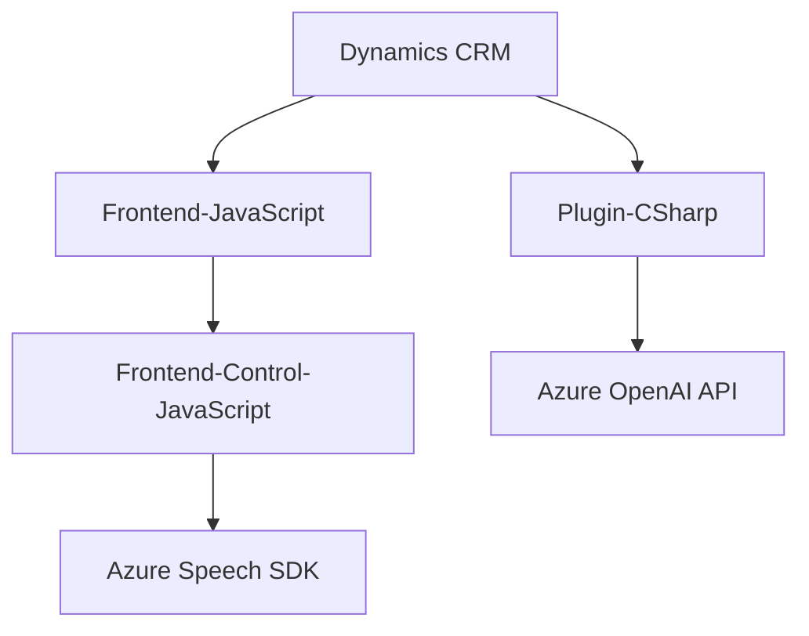

### Breve resumen técnico:

El repositorio forma parte de una solución interconectada que implementa funcionalidades para entrada/salida de voz y procesamiento de datos aplicada a formularios en un CRM. Incluye componentes frontend, API externa con IA en Azure, y un plugin de Dynamics CRM.

---

### Descripción de arquitectura:

La arquitectura parece seguir un enfoque **modular con integración de servicios externos**, principalmente Azure Speech SDK y Azure OpenAI API. Combina patrones SOA para la comunicación con APIs externas y de plugins para Dynamics CRM. Los módulos están divididos claramente según responsabilidades:

1. **Frontend (JavaScript):** Implementación de funcionalidades de entrada de voz/control y síntesis en el navegador, con integración directa al sistema CRM.
2. **Backend Plugin (C#):** Procesamiento de texto enviado desde el CRM, delegando la Transformación del texto a la API Azure OpenAI.

El diseño global apunta hacia un enfoque **"Hexagonal"**, que separa la lógica entre capas y utiliza puertos externos (Servicios como Speech SDK o API externa) para funciones específicas. No se observa que sea una arquitectura de microservicio autónomo, ya que depende del CRM como centro de interacción.

---

### Tecnologías usadas:

1. **Frontend:**
   - **JavaScript**: Lenguaje principal de codificación.
   - **Frameworks/Dynamics CRM APIs**:
       - Dynamics CRM Context APIs (`executionContext` y `formContext`).
       - Xrm.WebApi para llamadas al backend del CRM.
   - **Azure Speech SDK:** Para síntesis y reconocimiento de voz.
   - **Asynchronous Patterns:** Promises y callbacks para la gestión de SDK y API externas.

2. **Plugin (Backend):**
   - **C# con Dynamics CRM SDK:** Desarrollo basado en el framework CRM.
   - **Azure OpenAI API:** Conexión mediante solicitudes HTTP POST para procesamiento de texto con inteligencia artificial.
   - **HTTP Client Libraries:** Gestión de llamadas desde el código C#.
   - **JSON Manipulation Libraries** (e.g., NewtonSoft JSON): Para manejar respuestas en formato JSON.

3. **Patrones:**
   - **Facade:** La entrada principal por métodos como `startVoiceInput` encapsula varios comportamientos.
   - **Lazy Loading:** Dinámica para cargar el Speech SDK en tiempo de ejecución.
   - **Wrapper SDK:** El encapsulamiento y la delegación del uso del SDK de Azure son evidentes en cada capa (Frontend/Plugin).
   - **Plugin-Based and Service-Oriented Architecture:** La interacción con el API de OpenAI es clara en el plugin y la separación de responsabilidades facilita el mantenimiento.

---

### Diagrama Mermaid:

---

### Conclusión final:

La solución presenta una arquitectura **modular altamente integrada** con un sistema CRM, utilizando servicios de Azure para ampliar sus funcionalidades y mantenerse flexible. El diseño y separación de lógica en frontend y un backend con plugin reflejan una implementación robusta:

1. El frontend se encarga de gestionar la interacción usuario-sistema (voz, datos del formulario).
2. La capa backend (plugin) implementa capacidades avanzadas de transformación de texto mediante IA y se comunica con un microservicio de Azure OpenAI.

Aunque no se define como microservicios independientes, demuestra un enfoque "plugin/módulo/servicio externo" que puede evolucionar hacia una arquitectura distribuida. La carga dinámica del SDK, el uso de APIs con autenticación y los patrones desacoplados facilitan la escalabilidad y ampliación posterior.

Es importante revisar el manejo y almacenamiento de claves API para prevenir riesgos de seguridad.