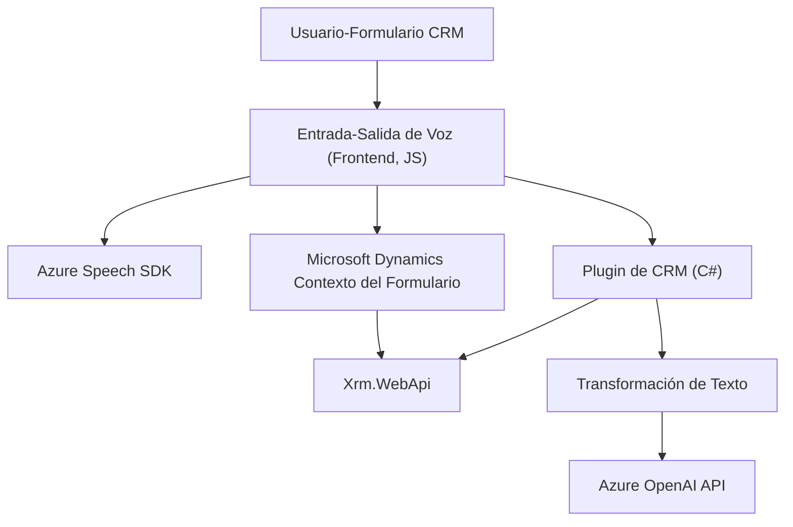

### Breve resumen técnico

Los tres archivos analizados presentan funcionalidades dentro de un ecosistema estrechamente integrado con **Microsoft Dynamics CRM** y **Azure Services**. El enfoque está en proporcionar herramientas complementarias para la interacción con formularios (entrada y salida de voz) y procesamiento de texto mediante IA. Utilizan servicios avanzados de Azure Speech y Azure OpenAI para ofrecer funcionalidades dinámicas integradas con formularios en el CRM.

---

### Descripción de arquitectura

1. **Type of Solution**:  
   - Esta solución combina elementos para la **extensión de funcionalidades de un sistema CRM** (Microsoft Dynamics).
   - Los componentes están orientados hacia la consulta y modificación de datos en un contexto de cliente usando integración con servicios cognitivos de Azure.

2. **Tipo de arquitectura:**  
   - Se utiliza principalmente una **arquitectura de plugins basada en eventos** (Dynamics CRM).  
   - El diseño refleja patrones de **arquitectura en capas**, donde las diferentes funciones (captura de voz, síntesis, procesamiento de IA) están separadas por módulos. El enfoque de integración con APIs externas sugiere elementos de **arquitecturas orientadas a servicios (SOA)**.

3. **Modularización:**  
   - Cada archivo tiene una responsabilidad específica: 
     - **Frontend:** Captura de voz, síntesis, y asignación dinámica en el navegador/formulario (Azure Speech SDK).
     - **Backend (plugin):** Procesamiento avanzado e integración con **Azure OpenAI** para transformación de datos con normas específicas.

---

### Tecnologías usadas
- **Front-End:**
  - **Azure Speech SDK**: Usado para sintetizar y captar entradas de voz, con configuraciones de lenguaje, región y API Key.
  - **JavaScript**: Implementación de funciones modularizadas y lógicas específicas de interacción con formularios del CRM.
  - **Xrm Web API** (Microsoft Dynamics): Gestión de datos dinámicos de formularios y entidades dentro del CRM.

- **Backend:**
  - **C# (Microsoft.Xrm.Sdk)**: Plugin que interactúa de forma directa con el contexto de ejecución del CRM.
  - **Azure OpenAI API**: Servicio externo para el procesamiento de texto proporcionado por el usuario, capaz de realizar transformaciones avanzadas.
  - **Newtonsoft.Json** y **System.Net.Http**: Facilitan la integración y comunicación con APIs mediante el uso de JSON y solicitudes HTTP.

---

### Dependencias externas que podrían estar presentes
1. **Azure Speech SDK** (Frontend):  
   - URL: `https://aka.ms/csspeech/jsbrowserpackageraw`.
   - Funcionalidades: Reconocimiento y síntesis de voz.

2. **Azure OpenAI API** (Backend):  
   - Uso: Procesamiento avanzado de texto con normas específicas y generación de datos JSON semánticamente válidos.

3. **Microsoft Dynamics CRM APIs**:  
   - Dependencias internas del entorno CRM para interacción con datos de formularios (atributos, entidades, contextos).

4. **Libraries (Newtonsoft.Json)**:  
   - Manipulación de datos JSON como parte de la lógica del plugin en C#.

5. **Servicios CRM relacionados** (event plugins y Xrm.WebApi):  
   - Para búsquedas, asignación dinámica y ejecución de funciones relativas a los campos de los formularios.

---

### Diagrama Mermaid 

El siguiente diagrama sintetiza la interacción entre frontend, backend y los servicios externos involucrados.

---

### Conclusión final

La solución descrita se centra en enriquecer la experiencia del usuario en un **CRM (Microsoft Dynamics)** mediante la integración con servicios cognitivos de **Azure**. El frontend procesa dinámicamente entradas y salidas de voz utilizando **Azure Speech SDK**, manipulando datos visibles de formularios. El backend complementa estas funcionalidades transformando datos usando **Azure OpenAI API** y organizándolos en formatos útiles mediante plugins especializados del CRM.

**Fortalezas**:
1. Modularización y desacoplamiento: Funcionalidades bien separadas entre captura de voz, síntesis, y procesamiento avanzado de texto.
2. Integración avanzada con servicios externos: Permite aprovechar APIs de Azure para mejorar el procesamiento de voz y texto.

**Consideraciones**:
1. Seguridad: Las credenciales de Azure (API Key, región) deben ser manejadas de forma segura para evitar vulnerabilidades.
2. Escalabilidad: Uso extensivo de servicios externos (Speech y OpenAI) puede generar dependencias críticas ante límites de uso.