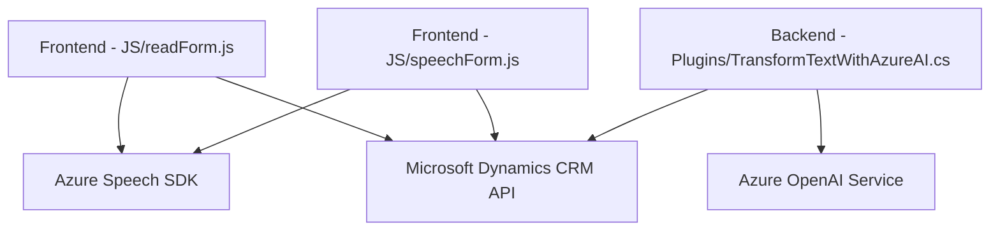

### Breve resumen técnico:

El repositorio describe una solución que combina tecnologías frontend (JavaScript) y backend (.NET) para integrar funcionalidades avanzadas de reconocimiento y síntesis de voz, procesamiento de texto con inteligencia artificial y manipulación de datos en formularios de sistemas CRM (como Dynamics 365). Utiliza el **Azure Speech SDK** y **Azure OpenAI** para las capacidades de voz e IA.

---

### Descripción de arquitectura:

La arquitectura general presentada es **orientada a servicios** con un enfoque **n-capas** (frontend para interacción de usuario, backend para lógica del servidor, y API externa para IA). Aunque no se detalla explícitamente cómo interactúan los componentes del sistema, los siguientes módulos conforman la solución:

1. **Frontend:** Archivos de JavaScript (`readForm.js`, `speechForm.js`) destinados a manipular y extender la usabilidad de formularios de sistemas CRM en el navegador, integrando reconocimiento y síntesis de voz.  
2. **Backend:** El archivo del Plugin (`TransformTextWithAzureAI.cs`) extiende la funcionalidad del sistema Dynamics mediante integración con **Azure OpenAI API** para realizar transformaciones de entrada basada en IA.  
3. **Servicios externos:** La solución incluye dependencias críticas en Azure, tanto para reconocimiento/síntesis de voz como para el procesamiento avanzado de texto con OpenAI.  

---

### Tecnologías usadas:

#### Frontend:
- **Tecnología principal:**  
  - **JavaScript:** Modularizado y orientado a eventos para la interacción del usuario.  
- **Dependencias externas:**  
  - `Azure Speech SDK` (importado dinámicamente).  
  - **Microsoft Dynamics CRM ExecutionContext API.**

#### Backend:
- **Tecnología principal:**  
  - **C#:** Desarrollo de plugins para Dynamics 365 utilizando la API del SDK de Microsoft.  
- **Dependencias externas:**  
  - **Azure OpenAI Service:** Integración con modelos GPT mediante HTTP requests.  
  - **Newtonsoft.Json y System.Text.Json:** Manipulación JSON.  

#### Patrones de diseño:
- **Modularización:** Organización del código en funciones y clases dedicadas a tareas únicas.  
- **Event-driven programming:** Uso de eventos y callbacks (por ejemplo, en reconocimiento de voz y ejecución de plugins).  
- **Integración con servicios externos:** Dependencia y conexión con APIs de Azure y Dynamics 365.

---

### Diagrama Mermaid:

---

### Conclusión final:

La solución se basa en el desarrollo Fullstack integrado con tecnologías de Microsoft (Dynamics CRM, Azure Speech SDK, Azure OpenAI). El diseño modular y las dependencias externas permiten integraciones de IA para mejorar la usabilidad de formularios mediante voz y transformación de texto legible.

La arquitectura, aunque orientada a servicios y con n-capas, tiene un alto grado de dependencia de Azure. Esta elección optimiza la solución en cuanto a escalabilidad y eficiencia para empresas que operan en entornos Dynamics.

Si se tuviera que mejorar este proyecto, sería bueno:
1. **Documentar las APIs externas:** Para facilitar su personalización y prueba, junto con ejemplos claros.
2. **Centralizar configuraciones externas:** (por ejemplo, claves de API y URLs) en un archivo de configuración para reducir problemas de mantenimiento futuro.
3. **Mensajería asincrónica:** Implementar patrones de recuperación alternativos para las dependencias remotas (por ejemplo: mecanismos de reintento ante fallos con Azure OpenAI).

Existen claras sinergias entre los módulos y las dependencias, lo que convierte esta solución en una buena elección para escenarios empresariales.