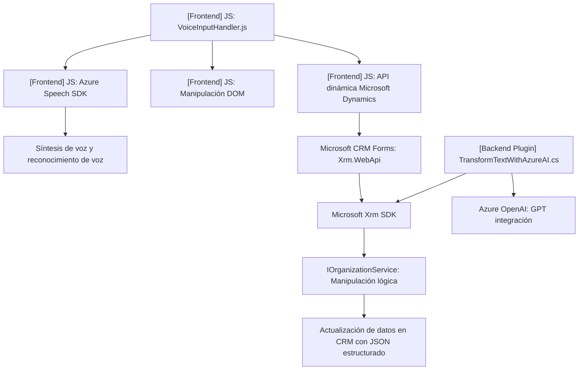

### Análisis Técnico y Detallado del Repositorio

#### **Breve Resumen Técnico**
El repositorio implementa una solución orientada al uso de tecnologías basadas en Microsoft Dynamics CRM, Azure Speech SDK, y Azure OpenAI. Está diseñado para facilitar la automatización y enriquecimiento en la manipulación de formularios, captura de voz y transformación de texto mediante servicios inteligentes. Los componentes están organizados en tres capas funcionales principales: frontend (JavaScript), backend como extension mediante plugins (C#), e integración con servicios externos (Azure).

---

#### **1. Tipo de solución**
- **Frontend**: Procesamiento de formularios de usuario, captura y síntesis de voz, interacción con SDKs externos como Azure Speech.
- **Plugins (Backend)**: Extensiones de Microsoft Dynamics CRM para transformación de texto utilizando Azure OpenAI.
- **Integración con APIs externas**: Realiza llamadas y configuraciones a servicios externos como Azure Speech SDK y Azure OpenAI.

---

#### **2. Tecnologías, Frameworks y Patrones**
**Tecnologías Usadas:**
- **Frontend (JavaScript)**:
  - Azure Speech SDK para síntesis y reconocimiento de voz.
  - Manipulación DOM para interacción con formularios.
  - APIs personalizadas de Dynamics CRM (`Xrm.WebApi`).

- **Backend/Plugins (C#)**:
  - Microsoft Dynamics SDK (`IPlugin`, `IOrganizationService`).
  - Azure OpenAI para procesamiento avanzado de texto.
  - HTTP Client para solicitudes REST (Unity Http).

**Frameworks y Patrones:**
1. **Facade Pattern**: 
   - En el frontend, funciones con nombres claros como `startVoiceInput` actúan como punto de entrada.
   - En el backend, clases como `TransformTextWithAzureAI` encapsulan la implementación para facilitar la integración con Microsoft Dynamics.

2. **Service-Oriented Architecture (SOA)**:
   - Uso intensivo de servicios externos como Azure Speech SDK y Azure OpenAI, evidenciando la orientación de la arquitectura hacia servicios.

3. **Event-Driven Architecture (EDA)**:
   - Los métodos en el frontend son invocados por eventos del usuario (por ejemplo, reconocimiento de voz).

4. **Single Responsibility Principle (SRP)**:
   - Cada función está diseñada para cumplir un propósito independiente (e.g., `speakText` para síntesis de texto, `getVisibleFieldData` para obtener campos visibles).

5. **Integration with External APIs**:
   - Backend y frontend funcionan como intermediarios entre el usuario y los servicios ofrecidos por Azure.

---

#### **3. Tipo de arquitectura**
La solución combina varias arquitecturas:
1. **N capas**: 
   - El repositorio separa claramente las responsabilidades entre diferentes capas funcionales:
     - **Frontend**: Interacción directa con el usuario. (Templos y formularios dinámicos).
     - **API/dependencias externas**: Azure OpenAI y Azure Speech SDK encapsulan lógica empresarial sobre servicios externos.
     - **Backend Plugins**: Extensiones para Microsoft Dynamics CRM que operan en capa lógica con transformación y almacenamiento.

2. **Estilo Microservicios REST**:
   - Los servicios externos como Azure OpenAI y Speech SDK son utilizados de manera modular e independientes del entorno local.

---

#### **4. Dependencias o Componentes Externos**
- **Azure Speech SDK (JavaScript)**:
  - Para síntesis y reconocimiento de voz. (URL de carga: `https://aka.ms/csspeech/jsbrowserpackageraw`).
- **Azure OpenAI (Backend)**:
  - Transformación avanzada de texto mediante procesamiento IA y modelos GPT.
- **Microsoft Dynamics API**:
  - Manipulación y actualización de datos en formularios dinámicos.
- **Newtonsoft.Json**:
  - Gestión eficiente de objetos JSON para la API Azure OpenAI.
- **HTTP Client**:
  - Implementación REST para comunicación dinámico con Azure OpenAI.

---

#### **5. Diagrama Mermaid Compatible con GitHub**

---

#### **Conclusión Final**
El repositorio implementa una solución robusta y modular que aprovecha dos servicios clave de Azure (Speech SDK y OpenAI) para automatizar procesos relacionados con la interacción usuario-formulario y procesamiento avanzado de texto. Está altamente acoplado al ecosistema de Microsoft Dynamics CRM, ofreciendo extensibilidad por medio de plugins en C# y una capa frontend en JavaScript. 

Los patrones empleados, como la modularidad y SOA, aseguran escalabilidad y facilidad de mantenimiento, mientras el uso de servicios externos permite aprovechar capacidades avanzadas sin necesidad de implementar lógica compleja localmente. La arquitectura n capas y la integración de microservicios externos hacen de este un ejemplo sólido de modernización dentro del contexto de herramientas empresariales.