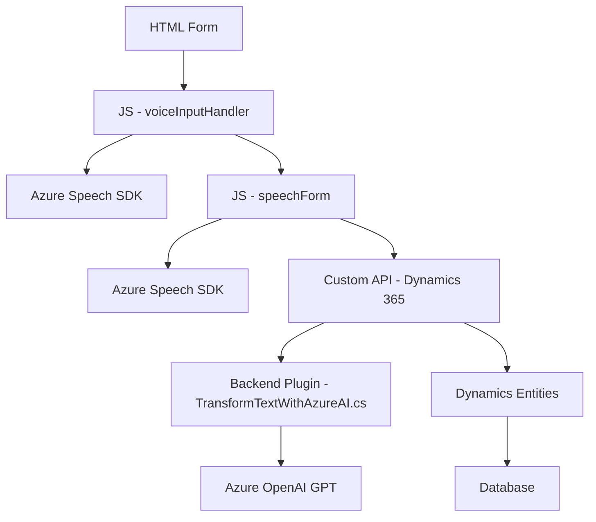

### Breve resumen técnico

El proyecto en su conjunto implementa una solución de **integración avanzada entre formularios web y servicios de inteligencia artificial (Azure Speech SDK y Azure OpenAI)**, utilizando tecnologías como **JavaScript** para la interacción en el frontend y **C# y Dynamics 365 SDK** para la lógica de backend en forma de plugins. Los componentes hacen uso de servicios en la nube de Microsoft para reconocimiento de voz y procesamiento de texto.

---

### Descripción de la arquitectura

La arquitectura del sistema está dividida en **dos capas principales**:
1. **Capa de presentación (Frontend):** 
   - Maneja la captura y procesamiento inicial de formularios web en un entorno cliente, utilizando el Speech SDK para la síntesis de voz y el reconocimiento de comandos por voz. Esta capa también llama a servicios como la API de Dynamics para completar información.
   
2. **Capa de lógica empresarial (Plugins Backend):**
   - Esta capa implementa un plugin en Dynamics 365 que utiliza el servicio Azure OpenAI para transformar texto mediante procesamiento avanzado (por ejemplo, generar estructuras JSON a partir de texto siguiendo normas predefinidas).

En términos arquitectónicos globales, la solución utiliza un enfoque **n-capas**, donde la lógica del frontend interactúa con una capa backend mediante APIs y SDKs. Una parte de la lógica también puede considerarse alineada al estilo **hexagonal** o **puertos y adaptadores**, al implementar adaptadores para interactuar con servicios externos como Azure Speech y Azure OpenAI.

---

### Tecnologías utilizadas

#### Frontend:
- **JavaScript:** Lenguaje principal para la lógica del cliente.
- **Azure Speech SDK:** Para tareas de síntesis y reconocimiento de voz.
- **Dynamics 365 Form Context API:** Para la manipulación de formularios en el frontend.

#### Backend:
- **C# (.NET Framework):** Lenguaje para la construcción de plugins.
- **Azure OpenAI GPT:** Para procesamiento avanzado de texto.
- **Dynamics 365 SDK:** Para la interacción con sistemas CRM y flujo de ejecución nativo.

#### Patrones:
- Modularización.
- Service Integration Pattern.
- Callback-based Architecture.
- Plugin Design Pattern (backend).
- External API Communication (por la integración con Azure Speech/OpenAI).

---

### Diagrama Mermaid

---

### Conclusión final

Este repositorio parece ser parte de un sistema que combina accesibilidad, procesamiento de voz, e inteligencia artificial con un enfoque en datos y formularios en un entorno de Dynamics CRM. Es una **solución híbrida** que combina un **frontend basado en la comunicación y procesamiento de voz con un backend que ejecuta un plugin** para transformar datos en texto estructurado. Esta arquitectura es ideal para escenarios empresariales que demandan eficiencia, precisión en el manejo de datos y accesibilidad amigable para el usuario. 

Potenciales limitaciones incluyen fuertes dependencias en servicios externos de Azure y Dynamics 365, lo cual puede representar costos adicionales en infraestructura y puede necesitar planes de contingencia en caso de interrupciones de servicio. Sin embargo, el uso de integraciones y modularización asegura flexibilidad y facilidad de mantenimiento para futuros desarrollos.