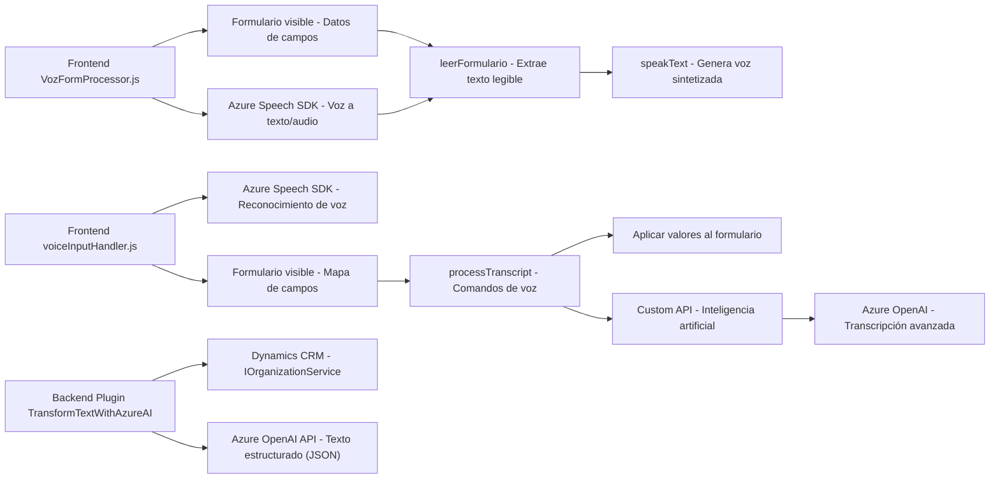

### Breve resumen técnico

El repositorio contiene tres archivos enfocados en interacción con formularios y servicios externos relacionados con voz, reconocimiento de comandos verbales, y uso de inteligencia artificial para procesamiento de texto en un entorno de Dynamics 365. Esto sugiere que es una solución híbrida compuesta por un módulo frontend para voz y texto, con plugins backend para procesar datos mediante API externas (Azure Speech y Azure OpenAI).

---

### Descripción de arquitectura

La arquitectura parece ser **n-capas con integración a servicios externos**, utilizando una separación lógica:

1. **Frontend (JS)**: 
   - Procesamiento de voz y reconocimiento verbal usando SDK de Azure Speech.
   - Interacción con datos visibles en formularios del navegador (probablemente en Dynamics CRM).

2. **Backend Plugin (C#)**:
   - Extiende Dynamics CRM con un plugin que interactúa con el servicio Azure OpenAI.
   - Realiza transformaciones avanzadas en texto (estructuración de JSON).

La arquitectura funciona como una combinación entre un monolito (Dynamics CRM) y SOA (consumo de APIs externas como Azure Speech y OpenAI).

---

### Tecnologías usadas

1. **Frontend**:
   - **JavaScript**: Lenguaje base del frontend.
   - **Azure Speech SDK**: Procesamiento de síntesis y reconocimiento de voz.
   - **Dynamics 365 Web API (`Xrm.WebApi`)**: Manipulación de datos en Dynamics CRM.

2. **Backend**:
   - **C#** y **Dynamics CRM Plugin Framework**: Implementación del plugin.
   - **Azure OpenAI API**: Procesamiento y transformación de texto con IA.
   - **Libraries**:
     - `Newtonsoft.Json.Linq`: Manejo dinámico de JSON.
     - `System.Net.Http`: Comunicación HTTP hacia APIs.

---

### Diagrama **Mermaid** válido para GitHub

---

### Conclusión final

Este repositorio implementa una solución modular para la interacción avanzada con Dynamics 365 CRM, enfocándose en dos funcionalidades clave: procesamiento de voz para formularios y transformación dinámica de texto mediante inteligencia artificial. El uso de tecnologías como Azure Speech SDK y Azure OpenAI API demuestra un enfoque moderno y orientado a servicios. Además, la arquitectura utiliza una mezcla de capas y patrones SOA que permiten la integración con servicios externos de manera eficiente.