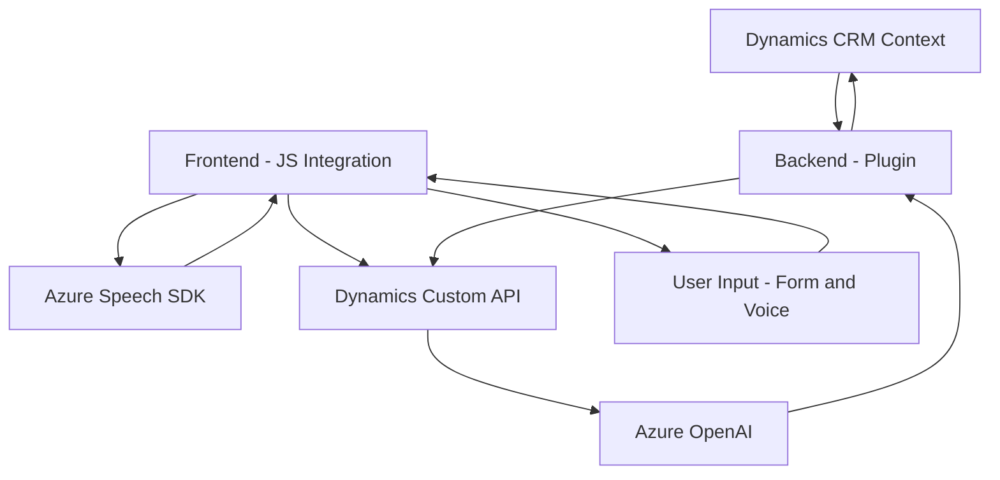

### Breve resumen técnico:
El repositorio implementa funcionalidades relacionadas con la integración de servicios de reconocimiento y síntesis de voz de Azure Speech SDK, junto con la transformación de texto usando Azure OpenAI en un entorno de Dynamics 365 CRM. La solución integra tanto componentes frontend (JavaScript) como backend (.NET/C#), permitiendo interacción con formularios dinámicos en Dynamics 365 mediante APIs externas.

---

### Descripción de arquitectura:
La arquitectura es **modular** con múltiples componentes:
1. **Frontend (JavaScript)**:
   - Archivos como `readForm.js` y `speechForm.js` son responsables de implementar funciones de lectura y síntesis de voz, así como reconocimiento de voz y manipulación dinámica de formularios.
   - Basados en **event-driven programming**, se cargan dinámicamente los SDKs de Azure, procesan datos en tiempo real y realizan llamadas asincrónicas a APIs externas como Azure Speech Service.

2. **Backend (.NET/C#)**:
   - El archivo `TransformTextWithAzureAI.cs` utiliza el **plugin design pattern** de Dynamics 365 para interceptar datos y enviar transformaciones a Azure OpenAI.
   - Adopta una **client-server arquitectura** al procesar solicitudes REST hacia servicios de Azure.

Por el enfoque dado, esta solución se puede categorizar como una **arquitectura de n capas**, donde las capas son: presentación (frontend), lógica de negocio (Azure Speech y plugin), y acceso a datos (Dynamics 365). Aunque integra microservicios de Azure, el sistema resultante está dentro de un entorno monolítico propio de Dynamics CRM.

---

### Tecnologías usadas:
#### Frontend:
- **JavaScript**: Implementación de las funcionalidades de reconocimiento de voz, síntesis de texto y manipulación dinámica de formularios.
- **Azure Speech SDK**: Para síntesis y reconocimiento de voz.
- **Fetch API**: Potencialmente utilizado para realizar llamadas a APIs externas.

#### Backend:
- **C#** (.NET Framework): Implementación del plugin con la interfaz `IPlugin`.
- **Microsoft Dynamics CRM SDK**: Para respuesta y transformación de datos en el contexto del CRM.
- **Azure OpenAI**: Transformación de texto estructurado mediante reglas específicas.
- **Newtonsoft.Json**: Procesamiento y manipulación de datos JSON.

#### General:
- **Cloud Native**: Dependencia explícita de servicios basados en Azure (OpenAI y Speech SDK).
- **REST APIs**: Comunicaciones HTTP para interactuar con servicios externos.

---

### Diagrama Mermaid:

---

### Conclusión final:
La solución es una integración avanzada para gestionar interacciones multimodales (voz, texto) en un entorno de Dynamics 365. La arquitectura modular y dependencias de servicios de Azure permiten una alta capacidad de procesamiento de datos en tiempo real, aunque la dependencia del monolito CRM limita su escalabilidad más allá de Dynamics. Es ideal para entornos empresariales robustos que quieran extender capacidades de formularios dinámicos hacia interfaces más naturales.