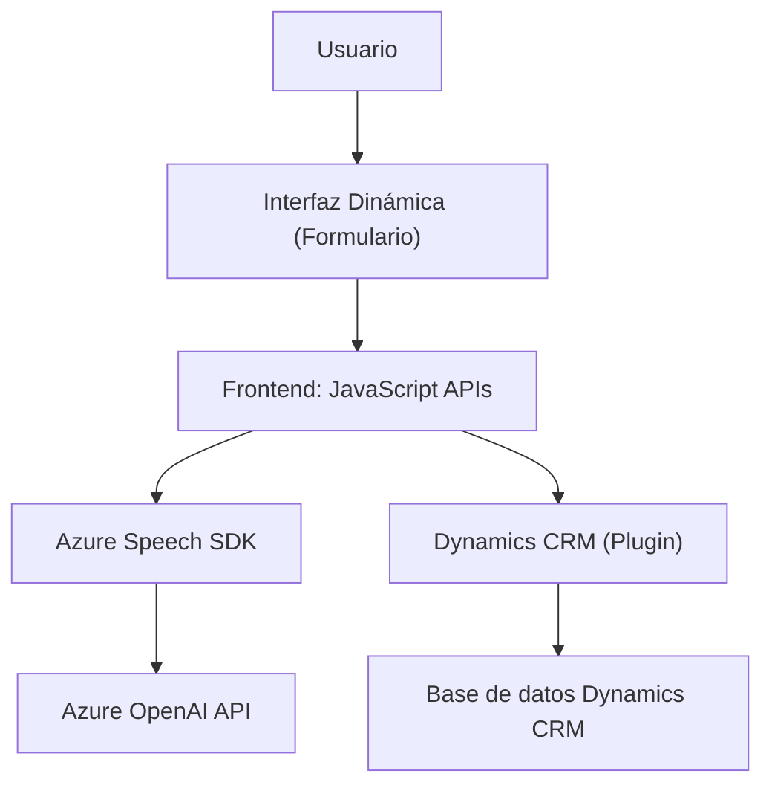

### Breve resumen técnico
La solución está orientada a la integración entre Microsoft Dynamics CRM y Azure, ofreciendo funcionalidad de entrada y salida de voz. Los archivos proporcionados implementan una interfaz de usuario (frontend) para realizar operaciones con formularios y un plugin basado en el SDK de Dynamics CRM para transformar datos utilizando Azure AI.

---

### Descripción de arquitectura
La arquitectura del proyecto es híbrida, con características tanto de arquitectura de **n-capas** como de integración hacia **funcionalidades en la nube**. Los componentes principales se organizan en las siguientes capas:
1. **Capa de presentación (Frontend/JS):** Interactúa con la interfaz gráfica del usuario (formularios de Dynamics 365), utilizando el Azure Speech SDK para entrada y salida de voz.
2. **Capa de lógica de aplicación (Plugins/CS):** Contiene un plugin para la programación orientada a reglas del sistema Dynamics CRM y también realiza transformaciones de texto mediante la API de Azure OpenAI.
3. **Capa de servicios externos (Azure Speech & OpenAI):** Aprovecha Azure Speech SDK para la síntesis y transcripción de voz y Azure OpenAI para la interpretación del texto trascrito.

---

### Tecnologías usadas
1. **Frontend (JavaScript):**
   - **Microsoft Azure Speech SDK:** Reconocimiento y síntesis de voz.
   - **Dynamics 365 Framework:** Permite la manipulación de formularios y entidades en Dynamics CRM.

2. **Plugins (C#):**
   - **Dynamics CRM SDK (Microsoft.Xrm.Sdk):** Framework para desarrollar extensiones personalizadas de Dynamics CRM.
   - **System.Net.Http:** Para integrar la API de Azure OpenAI.
   - **Azure OpenAI API:** Para transformar texto y realizar tareas de NLP (procesamiento de lenguaje natural).

3. **Patrones:**
   - **Modularidad:** Funciones y clases con separaciones claras de responsabilidades.
   - **Integración con servicios externos:** Uso de SDKs como Microsoft Azure Speech y OpenAI.
   - **Single Responsibility Principle (SRP):** Cada función y método están claramente diseñados para tener una única responsabilidad.

---

### Diagrama Mermaid

---

### Conclusión final
Este proyecto representa una solución empresarial diseñada para enriquecer la interactividad de formularios de **Dynamics 365 CRM** mediante entrada y salida de voz asistida por **Azure Speech SDK**. Adicionalmente, incorpora una integración del **Azure OpenAI API** mediante un plugin desarrollado en C#. La arquitectura está enfocada en escalabilidad y modularidad, con integración directa hacia servicios en la nube. Esto asegura una experiencia rica para aplicaciones destinadas a entornos laborales y empresariales.