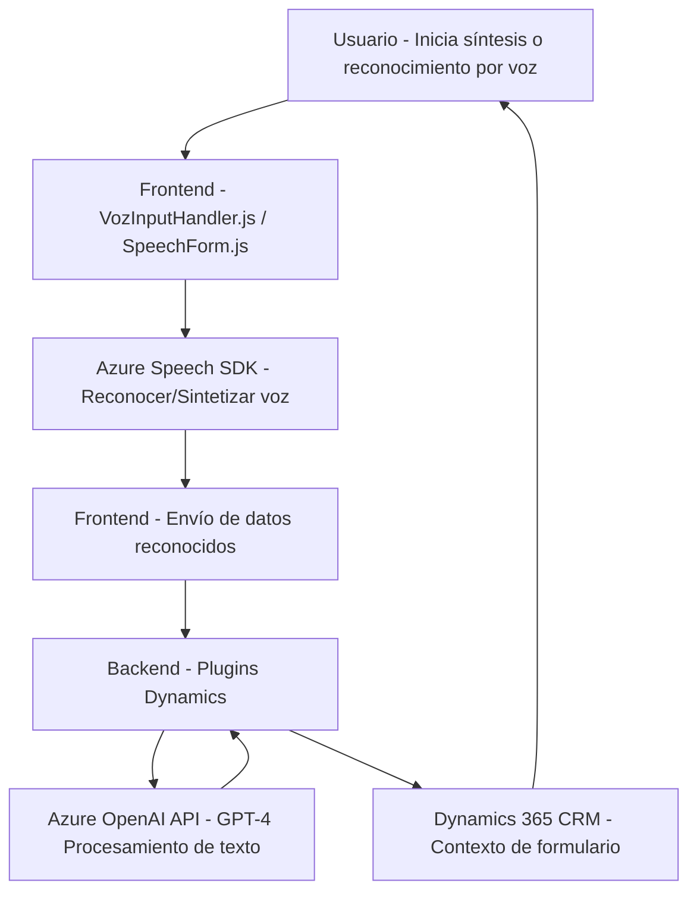

### Breve resumen técnico
El repositorio implementa una solución híbrida centrada en la accesibilidad y la interacción con formularios mediante síntesis y reconocimiento de voz (archivos frontend) combinada con procesamiento avanzado de textos vía Azure OpenAI en un entorno Dynamics 365 (backend). Se observa la conexión entre componentes frontales y lógicos, que interactúan a través de APIs de Azure y servicios CRM.

---

### Descripción de arquitectura
La solución utiliza una arquitectura de **n capas**, con las siguientes características:
1. **Capa de presentación (Frontend/JS):** Maneja la interacción del usuario con formularios mediante Javascript y la integración del Azure Speech SDK.
2. **Capa lógica intermedia (Plugins/TransformTextWithAzureAI):** Implementa lógica avanzada de procesamiento de datos utilizando Azure OpenAI a través de plugins en Dynamics 365.
3. **Capa de integración con servicios externos:** Proporciona accesibilidad y procesamiento en tiempo real utilizando Azure Speech SDK y Azure OpenAI GPT-4.

Patrones identificados:
- **Modularidad:** Código dividido en funciones y clases específicas.
- **Facade:** Funciones como `startVoiceInput` simplifican la orquestación de procesos.
- **Integración de API externa:** Amplio acoplamiento a servicios de Azure.
- **Adapter:** En backend se adapta la estructura recibida del OpenAI para utilizarla en Dynamics.

---

### Tecnologías usadas
1. **Frontend:**
   - **Javascript:** Para la lógica de interacción con formularios y síntesis/reconocimiento de voz.
   - **Azure Speech SDK:** Para funcionalidad de accesibilidad por voz.
   
2. **Backend:**
   - **C#:** Para la programación de plugins en Dynamics 365 CRM.
   - **Azure OpenAI (GPT-4):** Procesa texto con reglas específicas.
   - **REST API:** Comunicación directa con servicios Azure.
   - **Newtonsoft.Json / System.Text.Json:** Manejo y transformación de JSON en backend.

3. **Plataforma:**
   - **Dynamics 365 CRM:** Contexto de ejecución de plugins y manipulación de formularios administrativos.

---

### Dependencias y componentes externos
1. **Internas:**
   - Dynamics 365 SDK (`Microsoft.Xrm.Sdk`) para operaciones en el contexto del formulario.
   - APIs nativas de Javascript para el acceso dinámico a datos del navegador.

2. **Externas:**
   - **Azure Speech SDK:** Reconocimiento y síntesis de voz directamente desde el frontend.
   - **Azure OpenAI GPT-4 API:** Procesamiento de texto según reglas específicas.
   - **Custom API:** Invocaciones desde el frontend para validar o transformar datos.

---

### Diagrama Mermaid

---

### Conclusión final
Este repositorio implementa una solución bien integrada para mejorar la accesibilidad y enriquecer la experiencia del usuario en un entorno que utiliza Dynamics 365 CRM. La arquitectura de capas permite una separación adecuada entre presentación, lógica intermedia, y servicios externos, lo que facilita la extensión modular del sistema. Sin embargo, la fuerte dependencia de servicios externos como Azure Speech SDK y Azure OpenAI API podría requerir soluciones alternativas para mitigar posibles problemas de conectividad o costos.