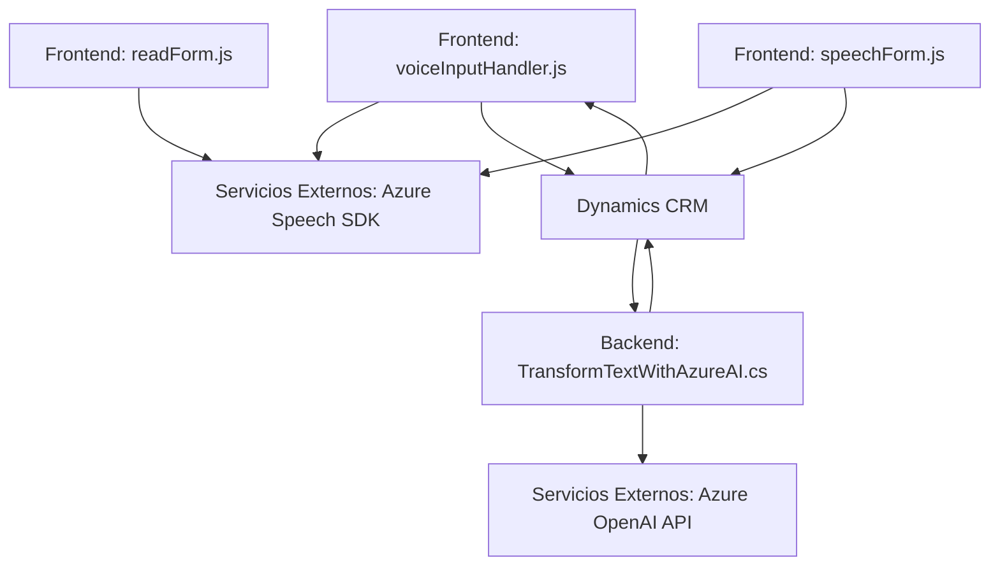

# Análisis técnico del repositorio

## Breve resumen técnico
El repositorio en GitHub parece ser una solución integrada que utiliza **Azure Speech SDK** y **Azure OpenAI**, diseñada principalmente para trabajar en conjunto con **Dynamics 365 CRM**. Está compuesto por múltiples archivos. La funcionalidad principal se centra en el manejo de voz y texto en formularios dinámicos mediante inteligencia artificial y servicios externos de Azure.

### Tipo de solución
1. La solución corresponde a una combinación entre **frontend** (manejo de formularios y entrada de voz en el cliente) y **backend** (plugins de Dynamics CRM y consumo de APIs externas de Azure).
2. Es un ecosistema híbrido con módulos que integran directamente servicios en la nube y complementos (plugins) dentro de Dynamics CRM.

---

## Descripción de la arquitectura
La solución tiene una arquitectura **híbrida** que fusiona componentes frontend y backend. Sus elementos incluyen:

1. **Frontend**:
   - Módulos JavaScript (como `readForm.js` y `speechForm.js`) que interactúan con el cliente CRM ejecutando scripts adaptativos sobre páginas de formularios. Utilizan el SDK de Azure Speech para generación y reconocimiento de voz, transformando datos y cubriendo casos como faltantes de datos o errores en tiempo de ejecución.
   - También se define una integración directa con APIs externas y llamadas a métodos del servidor.

2. **Backend**:
   - Plugin `TransformTextWithAzureAI.cs` implementado con **Microsoft.Xrm.SDK** para extender funcionalidad en el CRM y procesar texto con Azure OpenAI.
   - Las operaciones del backend aprovechan eventos del sistema CRM (como creación de registros, entrada de datos) para desencadenar ejecuciones automáticas.

3. **Patrones arquitectónicos**:
   - __Modularización__: Los archivos de código tienen responsabilidad separada y foco claro en tareas específicas.
   - __Integración externa__: APIs de Azure que actúan junto al SDK del CRM y un entorno de ejecución externo para voz y procesamiento de texto.
   - __Plugin-based design__: En el backend, se emplean plugins para agregar funcionalidad especializada en Dynamics 365 CRM.

---

## Tecnologías usadas
1. **Frontend**:
   - **JavaScript**.
   - **Azure Speech SDK** (`SpeechSDK.SpeechConfig`, `SpeechSDK.AudioConfig`, etc.) para sintetizar voz y reconocer transcripciones.
   - Entorno de integración de scripts en Dynamics CRM (Xrm.Page, executionContext).
   - Promesas asincrónicas para consumo de APIs y manejo de eventos dinámicos.

2. **Backend**:
   - **C#** para el módulo `TransformTextWithAzureAI.cs`.
   - Dynamics CRM SDK (`Microsoft.Xrm.Sdk`) para la extensión de funcionalidad del CRM.
   - **Azure OpenAI API** para procesamiento de texto avanzado con IA.
   - `System.Net.Http`, `System.Text.Json` como tecnología base para integración con servicios REST.
   
3. **Servicios externos**:
   - Dependencia crítica de acceso a Microsoft Azure:
     - **Azure Speech SDK**.
     - **Azure OpenAI API**.

---

## Diagrama **Mermaid**
El diagrama ilustra las interacciones y los componentes del sistema, incluyendo comunicación entre frontend, backend y servicios externos.

---

## Conclusión final
Este repositorio integra una solución de reconocimiento de voz, generación de texto hablado y transformación de datos utilizando servicios de **Azure Speech SDK** y **Azure OpenAI** en el entorno de **Dynamics CRM**. La arquitectura es una combinación de estructuras **frontend** para interacción dinámica y **backend** con plugins especializados. Destaca por su enfoque en modularidad y adaptabilidad.

1. **Ventajas**:
   - Fácil integración con servicios cloud.
   - Uso de tecnologías modernas como SDK de Azure y OpenAI.
   - Capacidad de manejar escenarios IA y reconocimiento de voz.

2. **A mejorar**:
   - Aunque los módulos son bien estructurados y funcionales, sería útil agregar más documentación sobre las configuraciones iniciales específicas requeridas por Azure (claves, regiones, etc.).
   - Mayor robustez en manejo de errores críticos en el backend (ej. excepciones a nivel de plugin en CRM ante falencias de API).

Este diseño es óptimo para trabajar en entornos corporativos que busquen automatizar operaciones en formularios y aprovechar servicios de IA en el análisis y transformación de datos.