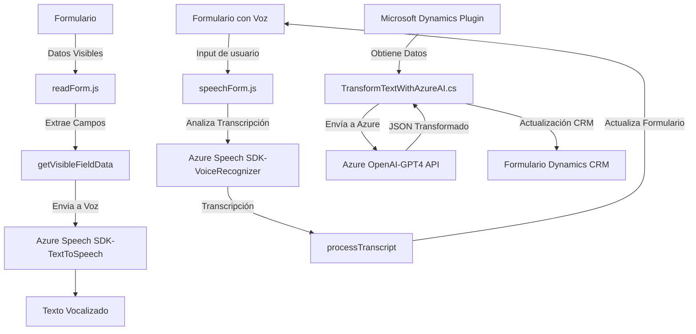

### Breve resumen técnico

Este repositorio centraliza funcionalidades de entrada de voz, transformación de texto y procesamiento dinámico de formularios en el contexto de Microsoft Dynamics CRM. Integra varios componentes utilizando SDKs externos y patrones de arquitectura orientados a eventos para manejar formularios dinámicos e interacciones basadas en voz. Además, utiliza servicios de inteligencia artificial como Azure OpenAI para enriquecer el procesamiento de datos.

---

### Descripción de arquitectura

1. **Front-end**:
   - Los archivos `readForm.js` y `speechForm.js` estructuran la funcionalidad para capturar datos de formularios y realizar síntesis/reconocimiento de voz.
   - Las operaciones se ejecutan mediante un modelo de funcionalidades modulares y dependencias externas como **Azure Speech SDK**.
   - Las funciones están organizadas con un enfoque en la separación de responsabilidades (extracción de datos, procesamiento de voz, etc.).

2. **Back-end Plugin**:
   - El archivo `TransformTextWithAzureAI.cs` es un plugin específico para Microsoft Dynamics CRM.
   - Implementa un flujo API que conecta Dynamics con Azure OpenAI GPT-4 para transformar texto.

3. **Patron arquitectónico**:
   - **Microservicios acoplados con eventos**:
     - Azure Speech SDK es utilizado para entrada de voz en procesos independientes.
     - Azure OpenAI transforma texto en un microservicio independiente conectado a Dynamics CRM.
   - **Estructura dinámica basada en eventos y modularidad**, común en aplicaciones empresariales que integran SDKs externos y APIs personalizadas.

---

### Tecnologías usadas

1. **JavaScript** (archivos frontend):
   - Flujos asincrónicos para la carga dinámica y uso de SDKs.
   - `window` y DOM para manejar dinámicamente datos de formularios.
   - Lógica para interactuar con APIs externas (Azure Speech SDK).

2. **C#** (archivo backend):
   - Framework **Microsoft Dynamics CRM SDK**: Integración nativa con plugins CRM mediante `IPlugin`.
   - Cliente HTTP (`HttpClient`) para comunicación con servicios REST (Azure OpenAI).
   - Manipulación de JSON con `System.Text.Json` para flujo de datos estructurados.

3. **Servicios Azure**:
   - **Azure Speech SDK**: Para entrada y salida vocal.
   - **Azure OpenAI GPT-4**: Procesamiento avanzado de texto con capacidad de IA.

---

### Diagrama Mermaid válido para GitHub

---

### Conclusión final

El sistema descrito en el código tiene una arquitectura centrada en módulos y patrones de integración con SDKs y APIs externas, optimizando funcionalidades empresariales en el contexto de Microsoft Dynamics CRM. Se emplea una arquitectura combinada de eventos y microservicios, con gestión adecuada de dependencias como Azure Speech SDK y Azure OpenAI. Este enfoque se traduce en una solución moderna y escalable para la interacción dinámica basada en voz y la inteligencia artificial para la transformación de datos.