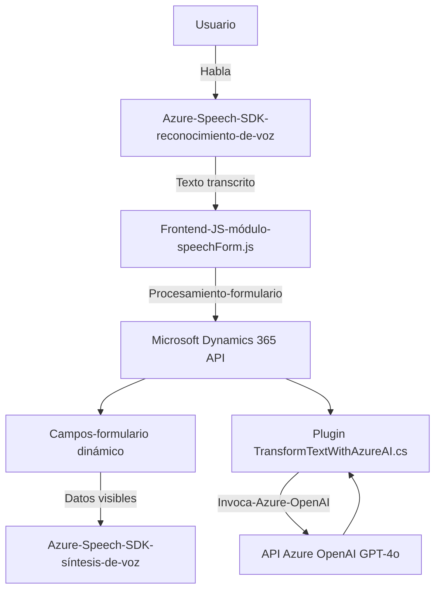

### Breve resumen técnico

El proyecto parece estar diseñado para una integración entre **Microsoft Dynamics 365 (CRM)** y los servicios cognitivos de **Microsoft Azure**. El sistema tiene dos componentes principales:

1. **Frontend**: Implementado en JavaScript, gestiona dos funciones clave:
   - Reconocimiento de voz (conversión de comandos hablados en texto y su posterior procesamiento).
   - Síntesis de texto a voz (lectura en voz alta de contenido de formularios).

2. **Backend/Plugin**: Un plugin de **Dynamics CRM de .NET/C#,** que utiliza **Azure OpenAI** para aplicar reglas de negocio sobre los datos proporcionados por el usuario y devolver un JSON estructurado.

---

### Descripción de arquitectura

La arquitectura es **en capas con integración de servicios externos**:
1. **Frontend interactivo (JavaScript)**: Este componente actúa como puente entre el usuario y el sistema. Realiza captura de voz, síntesis de texto a voz, y transmisión de datos hablados hacia el backend del CRM.
2. **Backend con Dynamics CRM y Plugin**: El plugin extiende las funcionalidades de CRM y se conecta a Azure OpenAI para procesar datos de usuario y devolver resultados claros para la aplicación o interfaces de usuario.

Aunque hay integración con servicios externos como **Azure Speech SDK** y **Azure OpenAI API**, este no parece ser una arquitectura completamente basada en microservicios. El diseño general sigue principios de modularidad, separación de capas (frontend y backend), y disponibilidad en un ecosistema de datos centralizado.

---

### Tecnologías usadas

- **Frontend**:
  - **JavaScript**: Desarrollo de los módulos de frontend.
  - **Azure Speech SDK**: Para reconocimiento de voz y síntesis de texto a voz. Gestionado con carga dinámica.
  - **Dynamics 365 API**: Se utiliza para acceder y manipular el contenido del formulario.

- **Backend**:
  - **Microsoft Dynamics SDK**: Extiende funcionalidades en el entorno CRM.
  - **C# / .NET Framework**: Lenguaje y framework para el desarrollo del plugin.
  - **Azure OpenAI API**: Procesamiento avanzado de texto con GPT-4o.

- **Otros**:
  - **System.Net.Http** y **System.Text.Json**: Para llamadas HTTP y deserialización JSON.
  - **Newtonsoft.Json**: Potencialmente útil para procesamiento JSON.

---

### Diagrama Mermaid válido para GitHub

---

### Conclusión Final

El sistema implementado está fuertemente acoplado al ecosistema Microsoft Azure y Dynamics CRM, adecuado para contextos empresariales que requieren procesamiento de voz y generación de datos de forma inteligente para la automatización de tareas en formularios dinámicos.

Se aplica una arquitectura **en capas** donde el frontend y el backend tienen roles claramente definidos, y un enfoque basado en **integración de servicios** para aprovechar las capacidades avanzadas de Azure Speech SDK y OpenAI.

El diseño sigue buenas prácticas de modularidad, encapsulación funcional y aprovechamiento de APIs externas para delegar tareas especializadas.