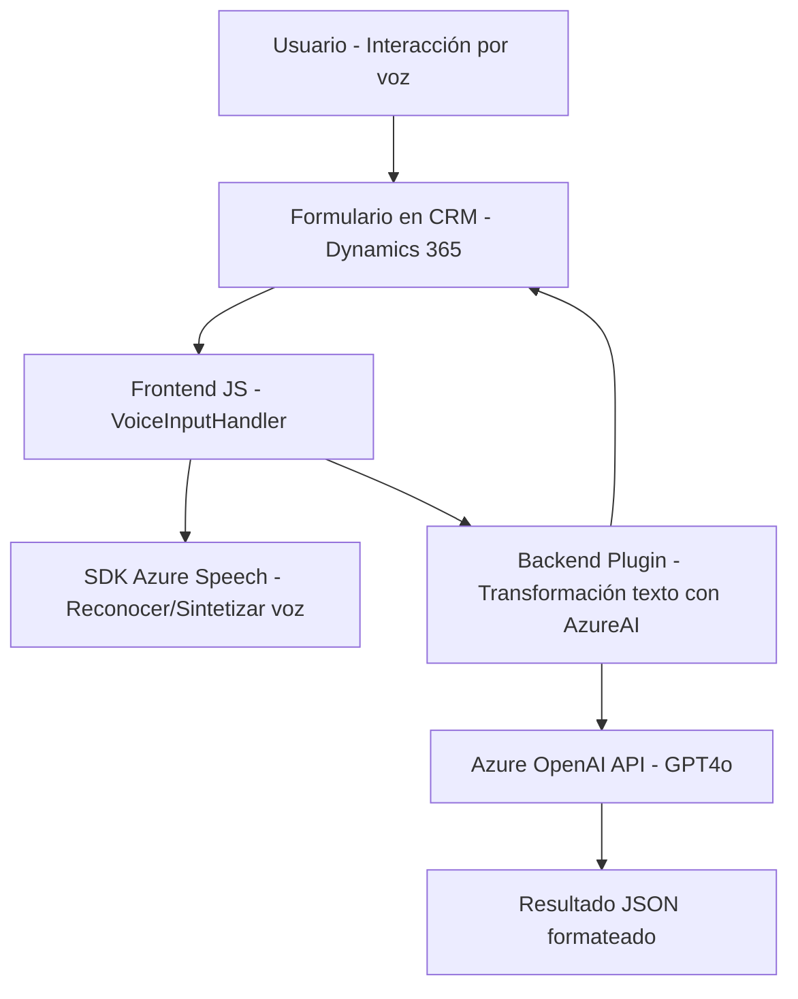

### Breve resumen técnico
El repositorio implementa una solución con capacidades de integración entre un sistema de CRM (Dynamics 365), Azure Speech SDK, y Azure OpenAI API. Abarca tanto frontend para interacción con formularios (mediante comandos de voz) como plugins en el backend para transformar datos en el CRM con inteligencia artificial.

---

### Descripción de arquitectura
La arquitectura está basada en un modelo **de n capas** y se integra con **servicios externos** en tiempo de ejecución. Consta de las siguientes principales componentes:
1. **Frontend (JavaScript)**: Capaz de capturar voz, procesar datos, y realizar mapeos dinámicos en formularios de Dynamics 365. Usa modularización y patrones de diseño como SDK Wrapper y Dynamic Data Binding.
2. **Backend (Plugin)**: Extensión programada en C# del CRM que implementa un patrón de integración con Azure OpenAI API para transformar texto. Esto indica un enfoque **service-oriented**.
3. **Servicios externos**: Los componentes dependen de APIs como Azure OpenAI y Azure Speech para IA y capacidades de texto a voz/reconocimiento de voz.

---

### Tecnologías usadas
1. **Frontend**:
   - Azure Speech SDK: Para reconocimiento de voz y síntesis.
   - Dynamics 365 context (`executionContext`): Para manipulación de formularios.
   - JavaScript (ES6+): Lógica de procesamiento vinculada con el CRM.
2. **Backend**:
   - Microsoft Dynamics CRM SDK (`Microsoft.Xrm.Sdk`): Integración mediante plugins.
   - C#: Desarrollo del plugin que interactúa con Azure OpenAI.
   - Azure OpenAI API: Servicio para transformación de texto usando modelos como GPT.

---

### Diagrama Mermaid

---

### Conclusión final
La solución se estructura como un sistema **compatible con n capas**, donde cada capa tiene una responsabilidad distinta:
1. **Capa de presentación** (Frontend): Captura voz, procesa datos, y los mapea al formulario de CRM.
2. **Capa de lógica empresarial** (Backend): Procesa datos mediante un plugin que transforma texto hacia un formato estructurado con Azure OpenAI.
3. **Capa de integración** (APIs de terceros): Usadas para reconocimiento de voz (Azure Speech SDK) y generación de texto procesado (Azure OpenAI).

Su diseño es modular, extensible y sigue patrones estándar de integración de SDKs en JavaScript y plugins en C#. Combina varias tecnologías modernas para ofrecer una solución que interactúa fluidamente con formularios orientada a mejorar la interacción humano-computadora en contextos empresariales con uso de CRM.