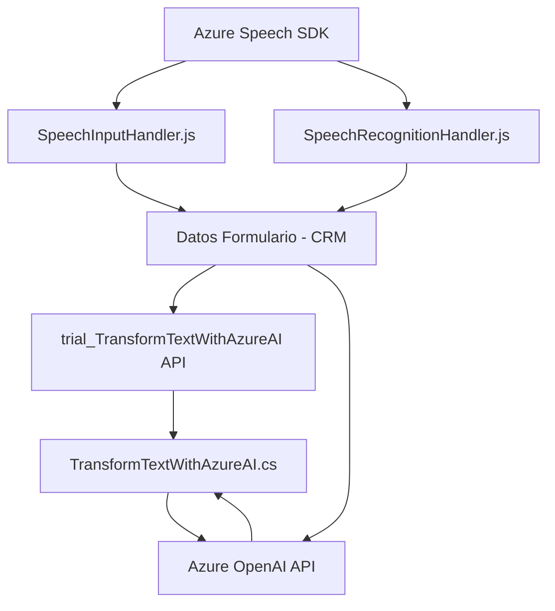

# Análisis técnico

### Resumen técnico
El repositorio contiene una solución orientada a la interacción entre un sistema CRM (Dynamics 365) y tecnologías de Microsoft Azure, incluyendo el Speech SDK y OpenAI. La solución proporciona dos funciones principales: síntesis de voz a partir de datos de formulario, y procesamiento/transcripción de voz para asignación de valores en formularios del CRM. Un tercer componente, desarrollado como un plugin en C#, extiende capacidades al integrar inteligencia artificial para transformar texto mediante Azure OpenAI.

---

### Descripción de la arquitectura
#### Tipo de solución:
1. **Aplicación Híbrida:**
   - Combina un frontend/scripts basado en JavaScript para la interacción de usuarios y datos.
   - Incluye un plugin en Dynamics CRM desarrollado en C# para procesar texto con Azure OpenAI.
2. **Dependencias externas:** utiliza servicios de Microsoft Azure (Speech SDK y OpenAI) y APIs personalizadas en Dynamics 365.

#### Arquitectura:
La solución sigue un enfoque **modular de n-capas**:
1. **Capa de presentación (Frontend)**:
   - Scripts JavaScript (`speechForm.js`, `readForm.js`) procesan datos desde formularios CRM y ofrecen funciones interactivas como reconocimiento de voz, síntesis de texto hablado y transcripción.
   - Se utilizan SDKs como Azure Speech.
2. **Capa de lógica de negocio (Plugins)**:
   - El plugin C# (`TransformTextWithAzureAI.cs`) encapsula la lógica para transformar texto mediante Azure OpenAI. Opera como una extensión de Dynamics CRM, respondiendo a eventos definidos.
3. **Capa de integración y servicios**:
   - Dinámica de llamadas REST a APIs externas de Microsoft Azure.
   - Utilización de APIs personalizadas de Dynamics CRM (`trial_TransformTextWithAzureAI`).

### Tecnologías usadas
- **Frontend**: JavaScript.
- **Backend/Servidor**: C#, Plugins de Dynamics CRM.
- **Servicios externos**:
  - Azure Speech SDK: para transcripción y síntesis de voz.
  - Azure OpenAI: para operaciones de inteligencia artificial en procesamiento y transformación de texto.
- **Librerías utilizadas**:
  - Newtonsoft.Json.Linq (para manipular JSON en C#).
  - Microsoft.Xrm.Sdk (integración con Dynamics CRM).
  - System.Net.Http (solicitudes HTTP en el plugin).

### Patrones de diseño observados
1. **Arquitectura en capas**:
   - Separación entre la presentación (scripts frontales) y la lógica de negocio (plugin con funciones específicas).
2. **Modularidad y responsabilidad única**:
   - Funcionalidades separadas y bien definidas en ambos scripts y el plugin.
3. **Interacción asíncrona**:
   - Uso de callbacks en JavaScript para la carga dinámica de SDKs.
4. **Uso de adaptadores dinámicos**:
   - Mapas de atributos para conectar etiquetas visibles con datos subyacentes del CRM.
5. **Plugin-based Architecture**:
   - Extensión de Dynamics CRM con un plugin que encapsula lógica de negocio.

### Dependencias o componentes externos presentes
1. **SDKs**:
   - Azure Speech SDK: Sintetización y reconocimiento de voz.
   - Azure OpenAI: Generación y transformación de texto mediante IA.
2. **Frameworks y servicios**:
   - Dynamics 365 CRM: Contexto principal para interacción entre datos de formularios y funciones personalizadas.
   - APIs REST de Dynamics CRM para consultar atributos y entidades.
3. **Librerías auxiliares**:
   - Newtonsoft.Json (procesamiento JSON).
   - System.Net.Http para comunicación con OpenAI API.

---

### Diagrama Mermaid

---

### Conclusión final
La solución representa una integración avanzada entre un sistema CRM, servicios de inteligencia artificial y capacidades de procesamiento de voz. Utiliza una arquitectura en capas, con herramientas como Azure Speech SDK y OpenAI para habilitar interacción natural con usuarios mediante voz y texto. Los scripts JavaScript están orientados al manejo de eventos del frontend, mientras que el plugin C# extiende las capacidades del CRM con transformación avanzada de datos.

Este diseño modular facilita el mantenimiento y la escalabilidad, permitiendo incorporar futuras extensiones sobre la misma arquitectura.