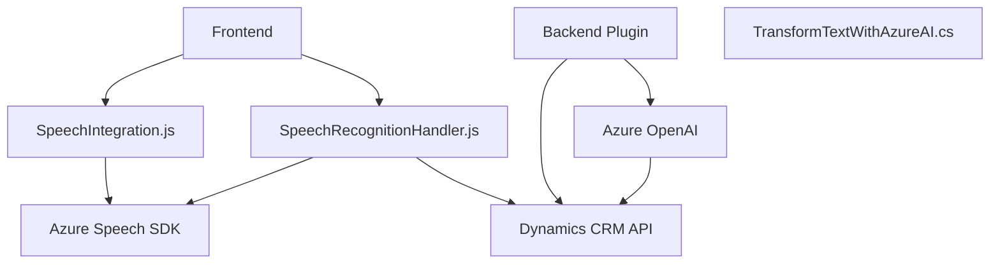

### Breve resumen técnico

El repositorio contiene una solución orientada a la integración de servicios de voz y procesamiento de texto dinámico. Específicamente, incluye funciones para reconocer y sintetizar voz, interactuar con formularios dinámicos en sistemas CRM como Dynamics y procesar texto mediante Azure OpenAI para generar JSON estructurado.

---

### Descripción de arquitectura

1. **Tipo de solución**: La solución constituye un sistema híbrido compuesto por una integración de API externa (Azure Speech SDK y OpenAI), procesamiento de formularios dinámicos, y plugins de CRM. Los módulos identificados incluyen:
   - **Frontend**: Scripts que implementan lógica para la síntesis y reconocimiento de voz, además de la interacción con formularios.
   - **Backend/Plugin**: Un componente embebido en Dynamics CRM que utiliza Azure OpenAI para procesamiento avanzado de texto.
   
2. **Arquitectura**: Este sistema se clasifica como una **arquitectura de microservicios**. Sus componentes cumplen con funciones específicas: manejo de voz en el navegador (frontend), procesamiento de APIs externas en un plugin backend y comunicación con servicios de Azure para AI.

---

### Tecnologías utilizadas

1. **Frontend**:
   - Lenguaje: JavaScript.
   - SDK utilizado:
     - **Azure Speech SDK** para síntesis y reconocimiento de voz.
   - Entorno de ejecución: Integrado con formularios dinámicos de Dynamics CRM.

2. **Backend/Plugin**:
   - Lenguaje: C#.
   - Framework: Dynamics CRM Plugin runtime.
   - Dependencias externas:
     - **Azure OpenAI REST API** para ejecución de IA descentralizada.
     - Bibliotecas para manejo de JSON (`Newtonsoft.Json.Linq`, `System.Text.Json`).

3. **Patrones arquitectónicos**:
   - **Integración de servicios externos**: Comunicación con servicios SaaS como Azure Speech SDK y OpenAI.
   - **Callback-driven**: Carga y ejecución de SDK dinámicos mediante callbacks.
   - **Modularidad**: Código dividido en funciones de propósito único, muchas ligadas a procesos asincrónicos.

---

### Diagrama Mermaid válido para GitHub

---

### Conclusión final

La solución forma parte de un ecosistema que utiliza una combinación de interacción cliente-servidor y servicios externos de Azure para brindar funcionalidades avanzadas, como reconocimiento y síntesis de voz, además de procesamiento de texto con IA. Es altamente modular, bien organizada para soportar escenarios dinámicos en entornos CRM como Dynamics. Reutiliza tecnologías líderes como Azure Speech SDK y OpenAI para maximizar su eficacia y escalabilidad.