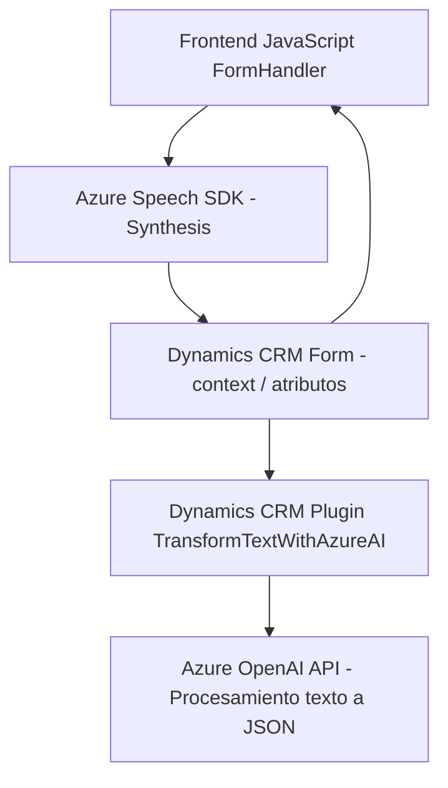

### Breve resumen técnico

El repositorio describe una solución híbrida que utiliza tecnologías web (frontend en JavaScript) y plugins basados en .NET para integrar funcionalidades avanzadas de voz y procesamiento de texto en Microsoft Dynamics 365. La solución se apoya en servicios externos, como **Azure Speech SDK** y **Azure OpenAI**, para realizar síntesis, transcripción de voz y procesamiento de datos.

---

### Descripción de arquitectura

1. **Tipo de solución**:  
   - Predominantemente una extensión para **Microsoft Dynamics CRM**.  
   - Incluye un frontend para las interacciones en formularios (JavaScript) y un plugin backend (C#, .NET) con integración de APIs externas.

2. **Tipo de arquitectura**:  
   - **Frontend**: Modular basado en funciones.  
   - **Backend**: Arquitectura de plugins bajo el modelo de Dynamics 365.  
   - Uso de componentes externos (Azure Speech SDK y OpenAI).  
   - **N capas**: - Claro distanciamiento entre capa de presentación (UI con Dynamics), lógica de negocio y servicios/integraciones externas.

3. **Interacciones y dependencia de componentes externos**:  
   El sistema se apoya en:  
   - **Azure Speech SDK** para síntesis y reconocimiento de voz en el frontend.
   - **Dynamics 365 API** para acceso y modificación de formularios y datos.  
   - **Azure OpenAI API** para transformar textos en formato estructurado (JSON).  

---

### Tecnologías usadas

1. **Frontend (JavaScript)**:  
   - Lenguaje: JavaScript.  
   - SDK: **Azure Speech SDK** (integración dinámica del script del SDK desde un URL público).  
   - Dependencia con **Dynamics 365** para manipulación de formularios.  

2. **Backend (C#)**:  
   - Framework: .NET.  
   - Dependencia directa con **Microsoft Dynamics CRM SDK**.  
   - Uso de **System.Net.Http** para realizar solicitudes HTTP a servicios externos, como Azure OpenAI.

3. **Patrones utilizados**:  
   - **Callback Pattern**: Uso de funciones de retorno para manejar eventos asincrónicos en JavaScript.  
   - **Modularidad**: Dividido por funciones específicas en frontend y backend (SRP - Single Responsibility Principle).  
   - **Arquitectura de plugins**: Interacción directa con el sistema base de Dynamics CRM mediante la implementación de la interfaz de plugin.

---

### Diagrama Mermaid válido para GitHub

---

### Conclusión final

La solución implementada en este repositorio es una extensión para **Microsoft Dynamics CRM** que mejora la interacción entre el usuario y la plataforma a través de tecnologías avanzadas como **Azure Speech SDK** y **Azure OpenAI API**. La arquitectura muestra una combinación de frontend y backend funcionales, con integración directa de servicios externos en un modelo de n capas. El diseño modular del código facilita la mantenibilidad y escalabilidad de las funciones. Además, el uso de APIs externas permite adaptarse a flujos dinámicos y mejorar la experiencia del usuario.

Recomendaciones:
- Asegurarse de que las claves de Azure y configuraciones críticas se gestionen en un entorno seguro.
- Implementar mejores prácticas de manejo de errores y registros en ambos lados (frontend y backend).