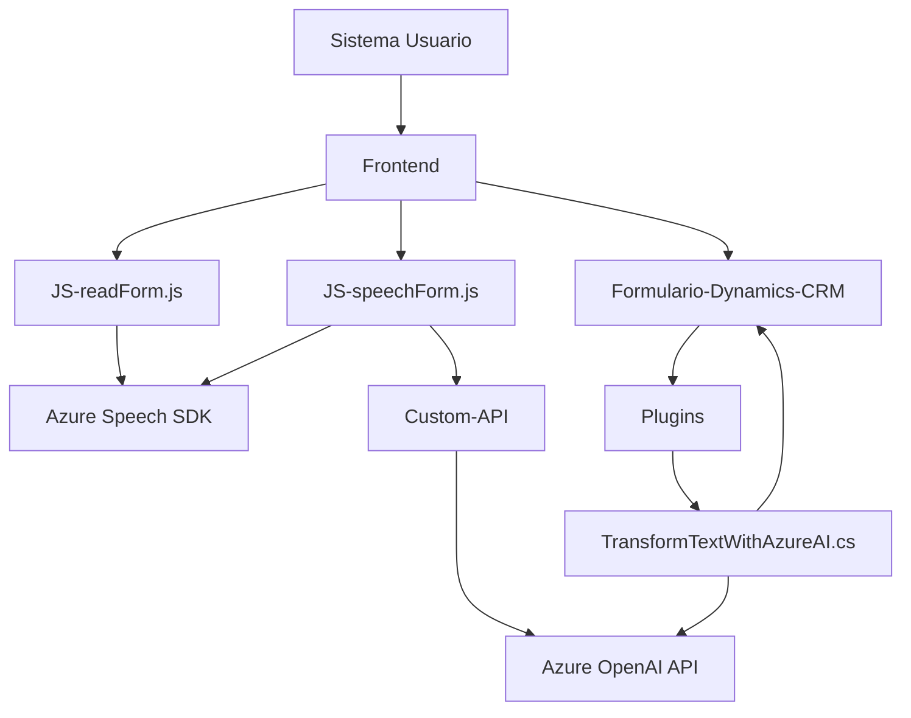

### **Breve Resumen Técnico:**
El repositorio analiza una aplicación que integra funcionalidad de entrada y síntesis de voz con el uso del Azure Speech SDK y Azure OpenAI. Está organizada en módulos, donde los archivos analizados encapsulan lógicas específicas orientadas a formularios dinámicos y comunicación con APIs externas. La solución está centrada en mejorar la accesibilidad y la interacción avanzada con datos en aplicaciones empresariales.

---

### **Descripción de la arquitectura:**  
La solución sigue una arquitectura **orientada a servicios con integración de plugins**. Los diversos componentes interactúan con servicios y APIs externas (Azure Speech SDK y Azure OpenAI). A nivel de diseño, se utiliza un patrón **de capas** para segmentar las funcionalidades con un enfoque modular:  
1. **Capa de presentación (Front):** Los archivos `readForm.js` y `speechForm.js` gestionan la entrada/salida con el usuario y son responsables de manejar y manipular los datos de formularios visibles.  
2. **Capa de aplicación lógica:** El plugin `TransformTextWithAzureAI.cs` aplica las reglas para la transformación avanzada del texto, integrándose con APIs de Microsoft Dynamics CRM.  
3. **Capa de integración con servicios externos:** Comunicación con:
   - Azure Speech SDK para reconocimiento y síntesis de voz.
   - Azure OpenAI API para transformación de texto con inteligencia artificial.

Aunque aún no se evidencia una comunicación entre varios servicios independientes, el sistema tiene el potencial de evolucionar hacia una arquitectura de **microservicios**, dado el uso ya establecido de servicios remotos y su segmentación lógica.

---

### **Tecnologías, Frameworks y Patrones Usados:**
1. **Lenguajes y Frameworks:**
   - **JavaScript (Frontend)**: Para la interacción con formularios dinámicos y el browser-side Azure Speech SDK.  
   - **C# (Plugin en Dynamics):** Implementación basada en Microsoft Dynamics CRM SDK.  
2. **Integraciones:**
   - **Azure Speech SDK:** Para reconocimiento y síntesis de voz.  
   - **Azure OpenAI API:** Para transformación avanzada de textos mediante IA.  
3. **Patrones usados:**  
   - **Encapsulación modular:** Cada archivo contiene funciones específicas con objetivos delimitados.  
   - **Plugin-based Architecture:** Aplica lógica extensible en eventos del CRM como parte de una arquitectura de plugins.  
   - **Factory Method:** Uso para configurar instancias del SDK de Azure Speech.  
   - **Delegación clara de responsabilidad:** Cada componente tiene un propósito específico (ej. extracción de datos visibles, síntesis de voz, mapeo de datos entre campos).

---

### **Dependencias o componentes externos posibles:**
1. **Azure Speech SDK:** Para la síntesis y reconocimiento de voz.  
2. **Azure OpenAI API:** Para transformación de texto con inteligencia artificial.  
3. **Microsoft Dynamics CRM SDK:** Para integrar la lógica del plugin en el CRM.  
4. **HTTP Libraries (e.g., System.Net.Http):** Para enviar solicitudes a APIs externas.  
5. **JSON Parsing Libraries:** `System.Text.Json`, `Newtonsoft.Json` para manejar datos JSON.

---

### **Diagrama Mermaid compatible con GitHub Markdown:**

---

### **Conclusión Final:**
La solución constituye una aplicación híbrida enfocada en la accesibilidad y el manejo dinámico de formularios dentro de un sistema como Microsoft Dynamics CRM. Presenta una arquitectura de capas con integración a servicios externos y utiliza patrones de diseño organizados. Gracias a su modularidad, el sistema puede extenderse hacia una arquitectura más compleja, como microservicios, facilitando su escalabilidad en aplicaciones empresariales modernas.