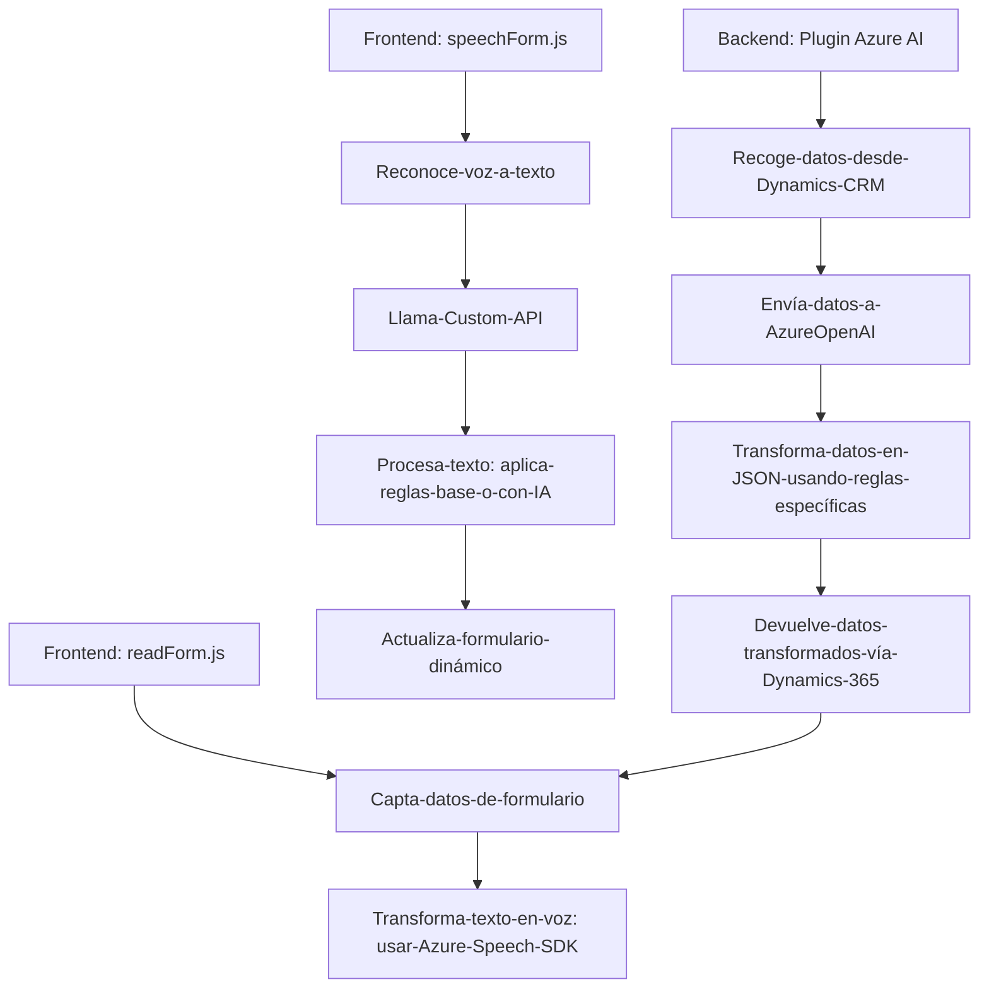

### Breve resumen técnico
La solución presentada es un sistema que integra la captura, procesamiento y manipulación de datos mediante voz y texto (human-to-machine interaction), y utiliza servicios externos como Azure Speech SDK y Azure OpenAI. Este sistema parece centrarse en dos principales funcionalidades:
1. Captura de voz y síntesis de voz (en el frontend).
2. Procesamiento de texto dinámico con IA (en el backend).

### Descripción de arquitectura
**Tipo de solución:**  
Es una solución híbrida con múltiples componentes:
1. **Frontend:** Procesos en JavaScript para la captura de voz y síntesis de voz que interactúan con formularios dinámicos.  
2. **Backend (Plugin de Dynamics CRM):** Procesos que transforman texto a través de servicios de inteligencia artificial en Azure OpenAI y manipulan la salida en formato JSON.

**Arquitectura general:**  
La arquitectura empleada podría clasificarse como **monolítica distribuida**:
- **Frontend:** Modular y basado en la integración de servicios externos (event-driven, integrando dependencias como Speech SDK y Dynamics CRM Web API).
- **Backend:** Corresponde a un plugin definido con Dynamics CRM SDK que actúa como un módulo integrado en una arquitectura tipo monolito extendido, aunque depende de un servicio externo como microservicio (Azure OpenAI).

**Patrones utilizados:**
1. **Modularidad**:
   - Cada funcionalidad en los scripts JavaScript del frontend está diseñada como un módulo independiente (captura de voz, síntesis de voz, procesamiento de datos de formularios).
   - Se emplea encapsulación de lógica en funciones específicas.

2. **Integración de APIs:**  
   - Uso de Azure Speech SDK y servicios externos como API de Dynamics 365 y Azure OpenAI para voz, transcripción, procesamiento texto y generación de JSON.

3. **Event-driven architecture:**  
   - Decisiones condicionales según eventos como la carga del SDK y la captura de voz.

4. **Facade Pattern:**  
   - Las funciones principales organizan y simplifican la ejecución de lógica compleja en diversos flujos dentro del frontend y backend.

5. **Pipeline de procesamiento:**  
   - Los datos pasan por diferentes etapas en formato JSON, ajustados mediante reglas predefinidas en el backend (plugin).

### Tecnologías utilizadas
- **Frontend:** JavaScript.
  - **Azure Speech SDK JS:** Para la captura de voz y síntesis de voz.
  - **Dynamics CRM Web API:** Gestión de datos dependientes del formulario del cliente.

- **Backend:**  
  - **Dynamics CRM SDK:** Procesos que manejan la extensión vía plugins.
  - **Azure OpenAI API:** Procesamiento y transformación inteligente de texto.
  - **.NET Framework/C#:** Desarrollo de plugins extendiendo funcionalidades del CRM.
  - **Serialization using System.Text.Json / Newtonsoft.Json:** Manejo eficiente de JSON en plugins.

### Diagrama Mermaid

### Conclusión final
Este sistema combina tecnologías para mejorar accesibilidad y automatización de datos en entornos CRM como Dynamics 365. Utiliza funciones frontend para capturar voz y procesar datos en tiempo real, mientras que el backend transforma datos por medio de inteligencia artificial. Aunque el sistema utiliza integraciones externas como Azure Speech SDK y Azure OpenAI API, su arquitectura es más cercana a un **modelo monolítico distribuido** con componentes modulares pero acoplados (como plugins y servicios del CRM). Su estructura es adecuada para sistemas de interacción humano-máquina, especialmente en entornos corporativos donde el procesamiento de datos dinámico y la accesibilidad sean críticos.