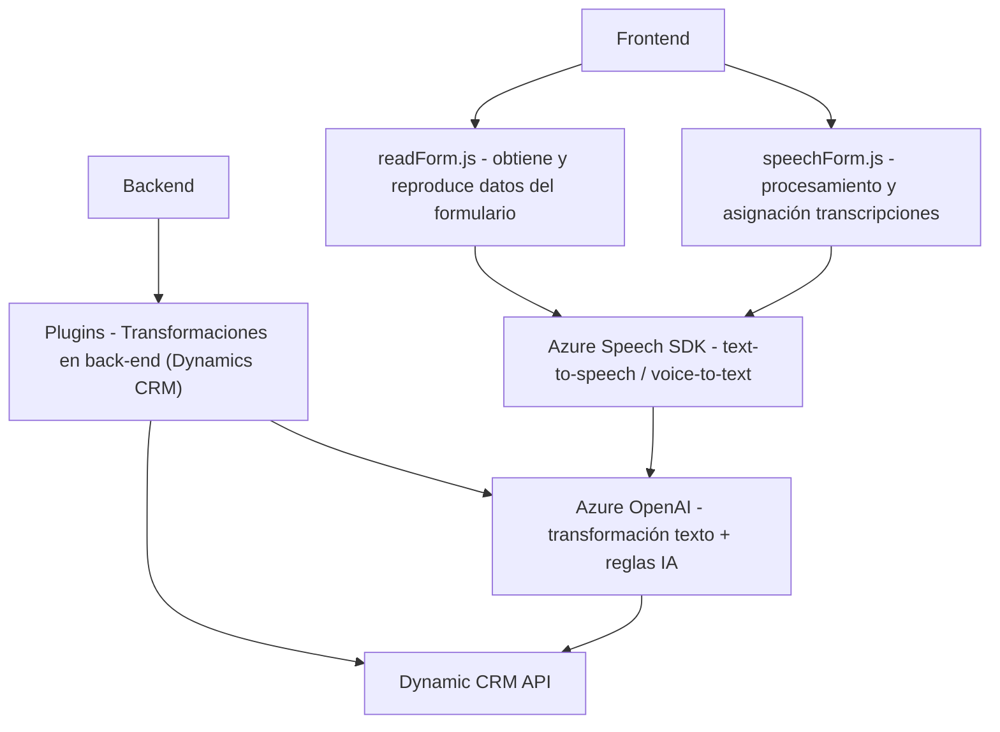

### Breve resumen técnico:
Este repositorio alberga un conjunto de archivos que implementan funcionalidades de interacción entre formularios dinámicos en Microsoft Dynamics CRM y servicios en la nube de Azure (Speech SDK y OpenAI). Se trata de una solución **híbrida** orientada a la integración de reconocimiento de voz, síntesis de voz, procesamiento de datos por voz y transformaciones basadas en inteligencia artificial.

---

### Descripción de arquitectura:
1. **Tipo de solución:**  
   La solución parece incluir **front-end** en JavaScript para interacción con usuarios y **plugins** en C# para extender las funcionalidades del back-end del Dynamics CRM. Es una solución orientada a servicios en la nube y backend dinámico.

2. **Tipo de arquitectura:**  
   - **Modular desenfocada por funcionalidad:** El código está dividido en módulos front-end y back-end que separan la lógica de negocio, interacción con APIs externas (Azure Speech SDK y Azure OpenAI), y procesamiento de datos en formularios.
   - **Arquitectura basada en eventos:** Lo notable es cómo se utiliza la carga dinámica del SDK y las interacciones entre APIs y formularios a través de eventos.
   - **Servicios externos:** Se integra con Azure Speech SDK para reconocimiento de voz, síntesis de texto a voz, y OpenAI para transformación de datos, lo que indica una arquitectura **orientada a servicios y nube**. 

3. **Patrones principales:**  
   - **Plugin Pattern:** Plugins en C# se adhieren al patrón estándar mediante `IPlugin`.
   - **Integración de APIs REST:** Comunicación con Azure y Dynamic CRM mediante REST APIs para procesamiento de IA y almacenamiento de datos.
   - **Desacoplamiento funcional:** Cada función/módulo tiene roles específicos, como interpretación de voz, interacción con APIs, o procesamiento de datos de formularios.

---

### Tecnologías usadas:
1. **Front-end:**  
   - **JavaScript** para implementar la lógica en archivos como `readForm.js` y `speechForm.js`.  
   - **Azure Speech SDK**: Sínteis y reconocimiento de voz en aplicaciones web.  
   - Dinámicas del framework de formularios, posiblemente Microsoft Dynamics CRM/D365.  

2. **Back-end:**  
   - **C#** con .NET Framework para los plugins de Dynamics.  
   - Azure OpenAI Service para el procesamiento avanzado de lengua natural.  

3. **Dependencias comunes:**  
   - **Microsoft Dynamics CRM SDK:** Para integrar con el sistema CRM.  
   - **Microsoft Speech SDK**: Reconocimiento y síntesis de voz.  
   - **Azure OpenAI Service:** Procesamiento avanzado de texto.  

---

### Diagrama Mermaid:

---

### Conclusión final:
La solución utiliza una combinación de front-end modular en **JavaScript** con **Azure Speech SDK** para interacción contextual entre usuarios y formularios web (sínteis/reconocimiento de voz), complementada con un back-end de **C# plugins** desarrollados para **Microsoft Dynamics CRM**. En dicho back-end se explota Azure OpenAI para transformar datos ajustados a reglas específicas.

La arquitectura refleja una integración híbrida de servicios cloud (Azure Speech/OpenAI) y CRM empresarial. Aunque modular, la solución podría evolucionar a una arquitectura más escalable, por ejemplo con microservicios, en lugar de depender de plugins.