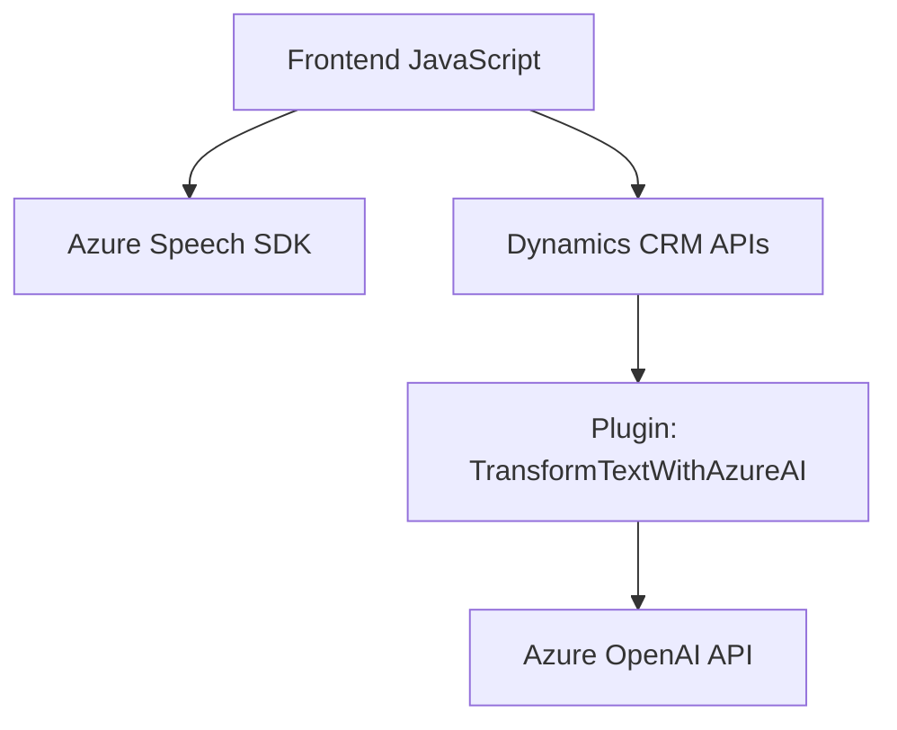

### Breve resumen técnico

El análisis de los archivos y estructuras del repositorio indica una solución orientada a proporcionar interacción de voz usando servicios de Azure Speech SDK, integración con Dynamics CRM y procesamiento avanzado de texto mediante Azure OpenAI. El sistema consiste en un frontend (JavaScript) para interacción de usuario, un backend conectado a Dynamics CRM (C# Plugin), y comunicación con servicios externos (APIs).

---

### Descripción de arquitectura

La solución adopta una arquitectura **n-capas** combinada con elementos de integración de servicios externos:  
1. **Capa frontend:** JavaScript en el navegador para interacción por voz, lectura de formularios y síntesis de texto hablado usando el API Azure Speech SDK.  
2. **Capa lógica de negocio:** Plugins Dynamics CRM que ejecutan procesos como transformaciones de texto y asignación a campos del CRM.  
3. **Servicios externos:** Azure Speech SDK, Azure OpenAI, y Custom APIs del CRM son servicios externos que manejan operaciones como reconocimiento de voz, síntesis de voz y operaciones con IA.

Se utiliza una estructura modular y altamente desacoplada con una clara separación de responsabilidades, lo que facilita el mantenimiento y escalabilidad.

---

### Tecnologías usadas

1. **Frontend:**
   - **Azure Speech SDK:** Para reconocimiento de voz y síntesis de texto hablado.
   - **JavaScript:** Para manipulación del DOM y lógica de lectura/formularios.
   - **Dynamics CRM (Xrm):** Para acceder a APIs y mapas de formularios del CRM.

2. **Backend Plugin:**
   - **C# (Dynamics CRM SDK):** Para manipulación de contexto y ejecución de lógica en el CRM.
   - **Azure OpenAI API:** Para realizar transformaciones avanzadas de texto usando IA.
   - **HTTP Client:** Para integración con servicios externos.
   - **JSON Serialización:** Uso de bibliotecas como `System.Text.Json`.

3. **Patrones:**
   - **Event-driven Programming:** Comunicación inicia desde entrada de voz o interacción de usuario.
   - **Loader Pattern:** SDK cargado dinámicamente en frontend.
   - **Mapper:** Asignación de valores de texto o JSON procesados a campos del CRM.
   - **Facade:** Simplificación del uso de APIs externas por medio de Plugins y funciones utilitarias.

---

### Diagrama Mermaid

Representación gráfica de las relaciones entre las capas principales del sistema y servicios externos:

---

### Conclusión Final

El repositorio define una solución híbrida que combina procesamiento de voz (Azure Speech SDK), interacción con formularios mediante un frontend, y transformación avanzada de texto vía plugins en Dynamics CRM con Azure OpenAI. La arquitectura es **n-capas** con modularidad y desacoplamiento entre la lógica de negocio, almacenamiento, presentación, y servicios externos. A nivel tecnológico, esta solución es robusta debido a su manejo claro de dependencias y adecuada separación de responsabilidades.

Es adecuada para casos donde la accesibilidad (voz), integración automatizada de datos, y procesamiento de texto son esenciales pero puede requerir optimización en casos de latencia ante llamadas externas (API externa y SDK).