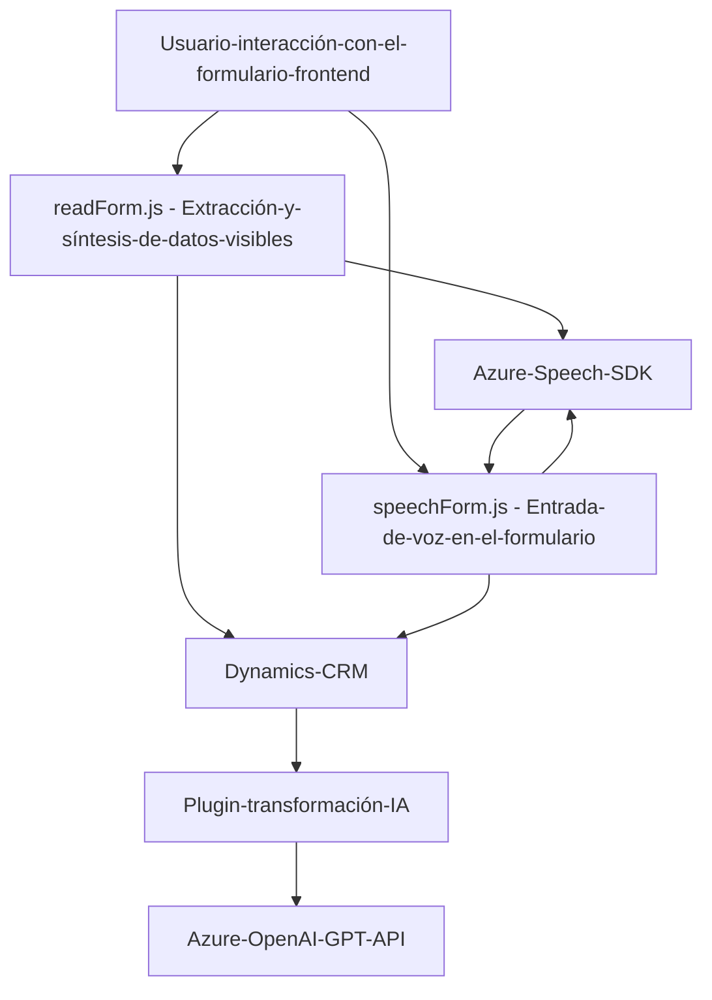

### Breve resumen técnico:

El repositorio incluye archivos para implementar funcionalidades de entrada/salida de voz y procesamiento de texto en formularios y plugins dentro del ecosistema de Dynamics CRM. Utiliza servicios de Microsoft Azure, como Azure Speech SDK y Azure OpenAI, integrados con Dynamics CRM. La solución permite interacción mediante voz y transformación avanzada de texto a través de servicios API.

---

### Descripción de arquitectura:

La arquitectura principal sigue un enfoque híbrido de **n capas** y **modularidad**:
1. **Presentación**: Archivos de frontend (`readForm.js`, `speechForm.js`) manejan la interacción con el usuario y las capacidades de entrada/salida de voz.
2. **Capa de negocio y procesamiento lógico**:
   - Los archivos de frontend manejan dinámicamente la extracción y mapeo de datos de formularios.
   - El plugin (`TransformTextWithAzureAI.cs`) se encarga de integración con Azure OpenAI para procesamiento avanzado de texto.
3. **Capa de integración/servicios**: El SDK de Dynamics CRM y los servicios Azure (Speech y OpenAI) actúan como componentes externos que proporcionan las capacidades avanzadas.

### Tecnologías usadas:

1. **Frontend**:
   - **JavaScript**: Lenguaje principal para la lógica del cliente.
   - **Azure Speech SDK**: Para el manejo de entrada/salida de voz.
   - **Microsoft Dynamics JavaScript SDK (Xrm)**: Para interacción con formularios en Dynamics CRM.

2. **Backend/Plugin**:
   - **C# (.NET Framework)**: Lenguaje y framework para desarrollo del plugin de Dynamics CRM.
   - **Azure OpenAI**: Integración de AI para procesamiento de texto usando el modelo GPT.
   - **ASP.NET**: Framework subyacente para comunicaciones HTTP entre sistemas.
   - **JSON (System.Text.Json / Newtonsoft.Json)**: Para manejar estructuras de datos.

3. **Dependencias externas**:
   - Azure Speech SDK y OpenAI SDK (API y claves necesarias).
   - Network libraries (`System.Net.Http`) para comunicaciones con API externas.

---

### Diagrama Mermaid:

---

### Conclusión final:

El repositorio presenta una arquitectura modular y especializada para integrar funcionalidades avanzadas de entrada/salida de voz y procesamiento de texto en formularios de Dynamics CRM. Usa servicios externos como Azure Speech SDK y OpenAI para añadir capacidades de interacción con el usuario basadas en voz e inteligencia artificial. La solución demuestra un enfoque claro hacia un diseño extensible que permite adaptarse fácilmente a necesidades futuras en el ecosistema de Dynamics 365.