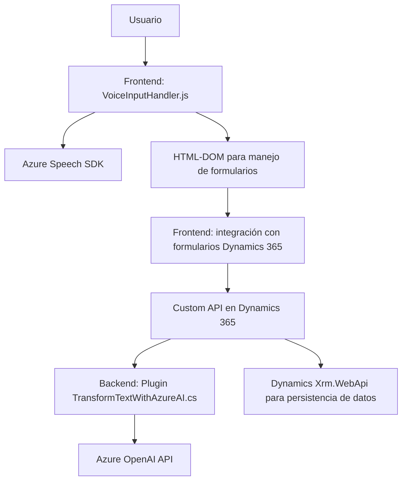

## Resumen Técnico

El repositorio integra soluciones que combinan procesamiento de voz, interacción con formularios dinámicos en Dynamics 365 y transformación de texto mediante una integración directa con Azure OpenAI. Está compuesto por tres componentes principales:
1. **Frontend (JavaScript)**: Gestiona la interacción del usuario con el reconocimiento de voz y la síntesis de audio.
2. **Backend (Dynamics 365)**: Un plugin que realiza transformaciones de texto utilizando Azure OpenAI.
3. **Dependencias externas**: Azure Speech SDK y OpenAI API para procesamiento de voz y transformación avanzada de texto.

---

## Arquitectura

### Tipo de solución

La solución es un **sistema híbrido de frontend y backend** que actúa como una interfaz inteligente para formularios integrados con Dynamics 365. Utiliza servicios en la nube como Azure Speech SDK y OpenAI para habilitar funcionalidades avanzadas como entrada por voz y procesamiento de texto en tiempo real.

### Arquitectura Aplicada

1. **Frontend (navegador)**:
   - Procedural y modular, centrado en funciones específicas.
   - Carga dinámica de dependencias externas como Azure Speech SDK.

2. **Backend en Dynamics 365**:
   - Plugin orientado a eventos, basado en la arquitectura **plugin-based** de Dynamics.
   - Interacción con microservicios externos.

3. **Estilo general**:
   - **Arquitectura por capas**: Con separación de responsabilidades entre frontend, API personalizada y lógica del plugin.
   - **Integración con servicios en la nube**: Usa patrones de microservicio para conectar SDK y APIs como OpenAI y Azure Speech.

---

## Tecnologías Usadas

1. **Frontend**:
   - **Azure Speech SDK**: Para reconocimiento y síntesis de voz.
   - **HTML DOM API**: Manipulación de formularios y lectura dinámica de datos.
   - **JavaScript** (ES6+): Código modular orientado a funciones.

2. **Backend**:
   - **Dynamics CRM SDK**: Implementación basada en plugins.
   - **Azure OpenAI API**: Consumida mediante HTTP.
   - **Newtonsoft.Json**: Uso para manejo avanzado de JSON.

3. **General**:
   - **HTTP REST APIs**: Integración con microservicios externos (Azure Speech y OpenAI).
   - **Xrm.WebApi**: Comunicación entre formularios Dynamics y lógica del plugin.

---

## Diagrama Mermaid

---

## Conclusión Final

Este repositorio implementa una solución avanzada para la interacción con formularios mediante entrada por voz, aprovechando servicios de inteligencia artificial para procesamiento y transformación de datos. Su arquitectura modular, junto con la dependencia en servicios externos como Azure Speech y OpenAI, permite escalabilidad y adaptabilidad al integrarse con plataformas empresariales robustas como Dynamics 365.

### Pros:
- Modularidad y separación de responsabilidades (frontend/backend).
- Uso de servicios en la nube que reducen la carga de infraestructura propia.

### Contras:
- Dependencia fuerte en servicios externos (Azure SDKs y OpenAI API).
- La gestión de claves de API podría mejorarse para mayor seguridad.