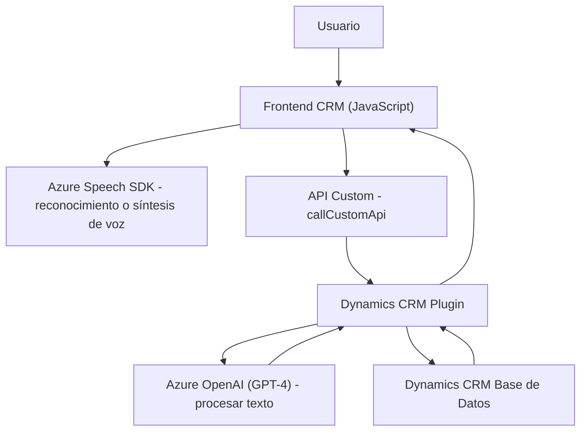

## Breve resumen técnico
La solución presentada se compone de funcionalidades que interactúan con formularios de **Dynamics CRM** para mejorar la accesibilidad y automatizar la gestión de datos con tecnologías como reconocimiento de voz, síntesis de voz y transformación de texto a través de **Azure AI**. 

Los archivos indican una aplicación modular construida alrededor de:
1. **Frontend:** Scripts en **JavaScript** que procesan datos de formularios, manejan síntesis y reconocimiento de voz (por ejemplo, mediante el **Azure Speech SDK**) y envían solicitudes a APIs externas.
2. **Backend Plugin:** Un plugin de **Dynamics CRM** (escrito en C#) que utiliza **Azure OpenAI (GPT-4)** para transformar texto ingresado por el usuario en un formato estructurado JSON.

## Descripción de arquitectura
La solución tiene características híbridas:
- **N-capas** (Capas: frontend, lógica del plugin, backend CRM/API).
- **Orientada a eventos:** Uso intensivo de `callbacks` y Promesas en los scripts para el manejo de flujos asíncronos.
- **Integración con microservicios:** La conexión con servicios de Azure (Speech SDK y OpenAI) refuerza la arquitectura distribuida al delegar tareas específicas de AI/voz fuera del sistema principal.

Los scripts y plugins trabajan como intermediarios entre el usuario, el CRM y los servicios de Microsoft Azure.

## Tecnologías usadas
1. **Frontend (JavaScript):**
   - **Azure Speech SDK:** Para reconocimiento y síntesis de voz.
   - **JavaScript ES6:** Modularidad con funciones globales, Promesas para control de asincronía.
   - **Dynamics CRM client-side API:** (`Xrm.WebApi.online.execute`, manipulación de `formContext`, etc.).

2. **Backend (C#):**
   - **Dynamics SDK:** Para los eventos de plugins y manejo de servicios organizacionales.
   - **Azure OpenAI:** Para procesamiento con GPT-4.
   - **Newtonsoft.Json:** Manipulación de JSON en backend.

3. **Otros servicios:**
   - **Dynamics CRM (nativo):** Contexto del formulario, mapeo de atributos, e interacción con entidad CRM.
   - **HTTP API:** Plugins que interactúan con Azure OpenAI vía solicitudes HTTP.

## **Diagrama Mermaid**
Para ilustrar los componentes principales y sus interacciones, se genera el siguiente diagrama:

## **Conclusión final**
La implementación presentada es una solución integrada entre **Dynamics CRM**, un frontend basado en JavaScript que utiliza APIs de Microsoft Azure, y un backend plugin escrito en C#. La arquitectura es **híbrida**, con características de **n-capas** y **orientación a eventos**, aprovechando **microservicios externos** para tareas de AI y reconocimiento/síntesis de voz. Este sistema destaca por su capacidad de integrar múltiples tecnologías para mejorar la experiencia del usuario, automatizar flujos de trabajo, y extender las capacidades de Dynamics CRM con servicios en la nube.