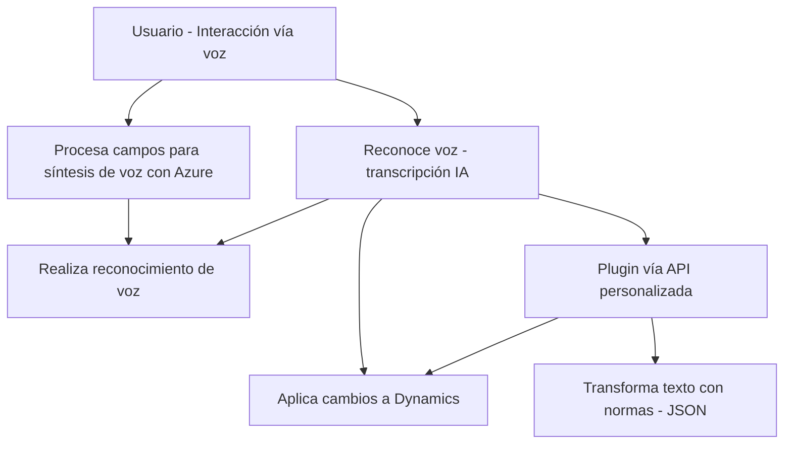

### Breve resumen técnico:
El análisis de los archivos dentro del repositorio muestra que la solución consiste en una **extensión para Dynamics 365**, integrada con funcionalidades avanzadas de reconocimiento y síntesis de voz mediante el **Azure Speech SDK**, así como procesamiento de texto con **Azure OpenAI**. Esta implementación permite la interacción entre usuarios y formularios de Dynamics mediante entrada por voz y generación estructurada de JSON.

---

### Descripción de arquitectura:
La arquitectura de esta solución tiene las siguientes características principales:
1. **Estructura basada en capas**:
   - La solución utiliza una separación lógica de responsabilidades:
     - **Frontend:** Contiene el código JavaScript específicamente diseñado para integrarse con Dynamics 365 en el navegador. Realiza tareas de síntesis de voz y relleno de formularios.
     - **Plugins/Backend:** La capa del servidor se maneja dentro de Dynamics 365, implementando controles y enlaces con la API de Azure OpenAI.
2. **Microservicio externo**:
   - Se integra con servicios externos (Azure Speech SDK y Azure OpenAI) para tareas de inteligencia. Esto hace que la arquitectura tenga características de **arquitectura orientada a servicios (SOA)**.
3. **Event-driven architecture**:
   - Usa eventos del entorno de Dynamics para iniciar los procesos en el frontend y en los plugins.
4. **Modularidad**:
   - Cada archivo y clase están estructurados para cumplir con una responsabilidad bien definida, favoreciendo la reutilización y el mantenimiento.

---

### Tecnologías, frameworks y patrones usados:
1. **Frontend**:
   - **JavaScript** para la lógica de interacción, síntesis de voz y reconocimiento natural de comandos hablados.
   - **Azure Speech SDK** para tareas NLP (Natural Language Processing) relacionadas con voz.
   - **Dynamics 365 API** (`Xrm.WebApi`), usada para la interacción con formularios y entidades del CRM.
   - **Modularidad funcional**: Las funciones están optimizadas para cumplir un propósito específico (ej. extracción de datos visibles).

2. **Backend**:
   - **C#** con el **Microsoft Dynamics Plugin Framework**, indispensable para extender las capacidades del CRM.
   - **Azure OpenAI API** para transformar texto según reglas mediante IA.
   - Dependencias clave:
     - `Microsoft.Xrm.Sdk` para integración directa con Dynamics CRM.
     - `Newtonsoft.Json` para manejo de datos JSON.
     - `System.Net.Http` y `System.Text.Json` para facilitar las solicitudes HTTP y serialización/deserialización de objetos.

3. **Patrones arquitectónicos**:
   - **Fachada**: En el plugin y las funciones del frontend, se encapsula la lógica de interacción con APIs externas.
   - **Separación de responsabilidades**: Cada archivo cumple un propósito claro (por ejemplo, síntesis de voz, reconocimiento de texto, y procesamiento de JSON).
   - **Integración basada en servicios REST**: Todas las llamadas a Azure Speech y OpenAI se realizan utilizando HTTP REST API.

---

### Diagrama **Mermaid** 100% compatible con **GitHub Markdown**:

---

### Conclusión final:
La solución analizada es una extensión modular de **Dynamics 365**, diseñada para mejorar la interacción hombre-máquina mediante tecnologías como reconocimiento de voz, síntesis, y transformación de texto con IA. Su arquitectura es de tipo **n capas**, que combina frontend interactivo con un backend en Dynamics CRM potenciado por APIs externas (Azure Speech SDK y OpenAI). Esta solución es extensible, bien estructurada y capaz de integrarse eficientemente con otros servicios y sistemas.

- **Fortalezas**:
  - Modularidad y separación de responsabilidades.
  - Uso de tecnologías avanzadas para IA y voz (Azure Speech SDK, Azure OpenAI).
  - Integración fluida con Dynamics 365.

- **Mejoras posibles**:
  - Implementar abstracción para la seguridad de claves API (por ejemplo, en un servicio de configuración o KeyVault).
  - Optimizar el manejo de errores y latencia en servicios externos como el reconocimiento de voz.

Esta arquitectura puede adaptarse para escalar y soportar más funcionalidades inteligentes dentro del ecosistema Dynamics.