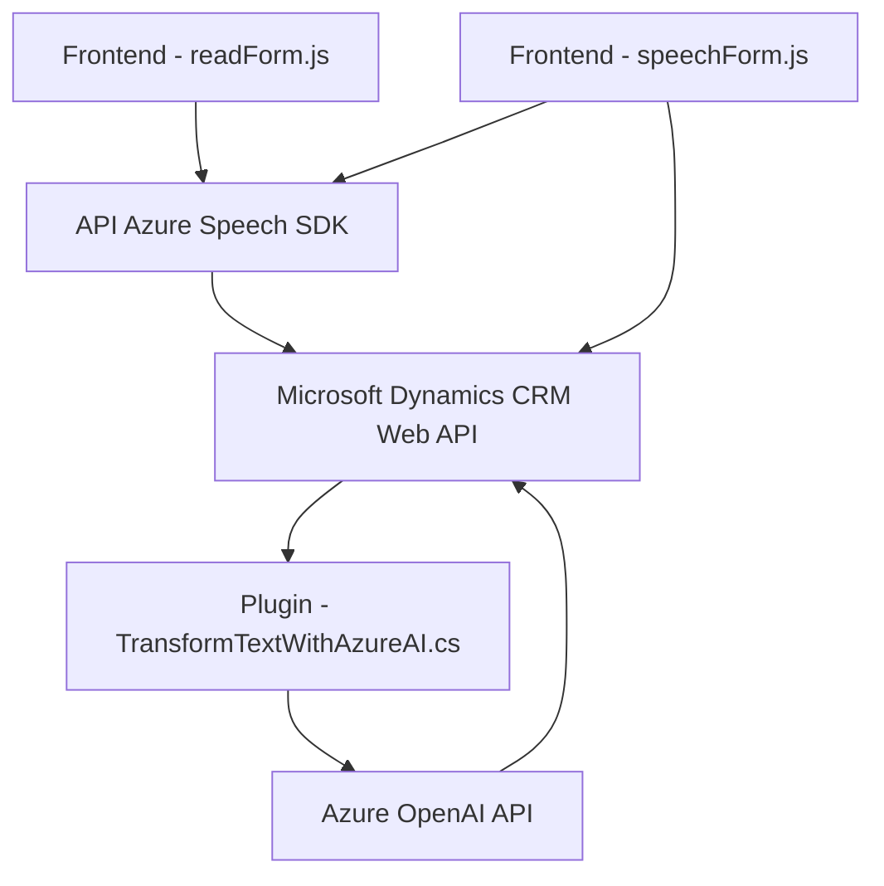

### Breve resumen técnico:

El repositorio analiza una solución que integra Microsoft Dynamics CRM con servicios avanzados de reconocimiento de voz (Azure Speech SDK) y procesamiento de texto mediante inteligencia artificial (Azure OpenAI). Incluye tres módulos principales:
1. **Frontend**: Archivos JavaScript (e.g., `readForm.js`, `speechForm.js`) destinados a gestionar la interacción con los usuarios mediante formularios de Dynamics y el reconocimiento/síntesis de voz.
2. **Backend Plugin**: Un `plugin` en C# (`TransformTextWithAzureAI.cs`) conectado a Dynamics CRM que procesa texto con Azure OpenAI API, transformándolo en datos estructurados (JSON).

---

### Descripción de arquitectura:

Este sistema utiliza una arquitectura de **n capas** que combina los siguientes elementos:
1. **Capa frontend**: Permite interacción con formularios y voz mediante JavaScript y Azure Speech SDK.
2. **Capa de lógica de negocio (backend)**: Representada por el plugin en Dynamics CRM, que con ayuda de Azure OpenAI API realiza transformaciones complejas de datos estructurados.
3. **Capa de servicios externos**: Comunicación con Azure Speech SDK y Azure OpenAI como dependencias externas para reconocimiento, síntesis de voz y procesamiento de texto.

**Patrones identificados:**
- **Delegate Pattern**: En la gestión dinámica del SDK.
- **Adapter Pattern**: Transformación de datos entre voz, JSON y campos del formulario.
- **External API Integration Pattern**: Uso de Azure Speech SDK y OpenAI API para ampliar funcionalidades.
- **Plugin Pattern**: Implementación específica para Dynamics CRM.

---

### Tecnologías usadas:

1. **Frontend (JavaScript):**
   - **Azure Speech SDK**: Para reconocimiento y síntesis de voz.
   - **Microsoft Dynamics CRM Web API**: Para manipulación de datos en formularios.

2. **Backend (C#):**
   - **Microsoft.Xrm.Sdk**: Interacción con Dynamics CRM.
   - **Azure OpenAI API**: Para procesamiento de texto hacia JSON estructurado.
   - **Newtonsoft.Json** y **System.Text.Json**: Manipulación y serialización de datos JSON.

---

### Dependencias o componentes externos:

1. **Azure Speech SDK**:
   - Dinámicamente cargado desde CDN (`https://aka.ms/csspeech/jsbrowserpackageraw`).
   - Requiere configuración de `azureKey`, `azureRegion`.

2. **Azure OpenAI API**:
   - Endpoint: `https://openai-netcore.openai.azure.com/`, utilizado para transformar texto en datos JSON.

3. **Microsoft Dynamics CRM Web API**:
   - Manipula datos del modelo de CRM.
   - Acceso a datos de entidades mediante `Xrm.WebApi`.

4. **Custom API en Dynamics**:
   - Invocada desde JavaScript (`callCustomApi`) como API personalizada configurada en Dynamics CRM.

---

### Diagrama Mermaid:

Aquí se presenta el diagrama del flujo de interacción entre componentes en la solución.

---

### Conclusión final:

La solución propuesta combina tecnologías modernas para ofrecer una sincronización eficiente entre la entrada de voz, procesamiento de texto con inteligencia artificial y la manipulación de datos en formularios de Microsoft Dynamics CRM. Es una arquitectura **de tres capas** que utiliza servicios externos para ampliar sus capacidades funcionales, como la síntesis y reconocimiento de voz mediante Azure Speech SDK, y el procesamiento de texto usando Azure OpenAI API. Este diseño logra modularidad, extensibilidad, y una integración directa con servicios en la nube, lo que lo hace ideal para entornos empresariales que requieren automatización avanzada y compatibilidad con CRM.