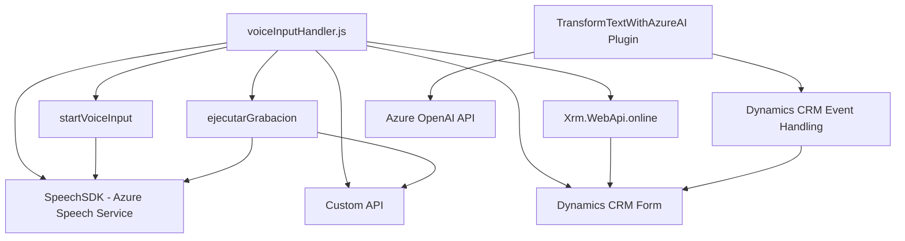

**Breve resumen técnico:**
El análisis del repositorio incluye archivos relacionados con funcionalidades avanzadas de interacción y procesamiento de datos de voz y texto, integradas con Microsoft Dynamics CRM y los servicios de Azure (Speech SDK y OpenAI API). La solución está destinada a mejorar la experiencia del usuario mediante un sistema de entrada por voz y complementa funcionalidades como la síntesis de voz y el análisis inteligente de datos.

---

**Descripción de arquitectura:**
La solución sigue una arquitectura híbrida basada en la separación de responsabilidades:
1. **Frontend**: Se enfoca en módulos JavaScript para capturar e interpretar la entrada de voz, usar el SDK de Azure Speech y manipular formularios en Dynamics CRM.
   - Organización modular, con funciones independientes para tareas específicas.
   - Integra un patrón orientado al procesamiento de eventos y objetos en el DOM.
   - Comunicación directa con APIs externas (Azure Speech y Dynamics CRM).
   
2. **Backend Plugin**: Implementa una **arquitectura basada en plugins** para Dynamics CRM.
   - Ejecuta operaciones bajo demanda en eventos organizacionales.
   - Consume la Azure OpenAI API para transformar texto.

La arquitectura general podría clasificarse como **n capas**:
- **Capa de interacción y lógica empresarial**: Modificación y análisis de datos en formularios de Dynamics CRM mediante la integración de SDK y APIs.
- **Capa de servicios externos**: Uso de Azure Speech SDK y Azure OpenAI para operaciones de voz y transformación de texto.

---

**Tecnologías usadas:**
1. **Frontend**:
   - JavaScript como lenguaje de programación.
   - Azure Speech SDK: Para reconocimiento, síntesis de voz e interacciones relacionadas.
   - Dynamics 365 API (`Xrm.WebApi`): Para integración directa con formularios y entidades del CRM.

2. **Backend (plugin)**:
   - **C#**: Implementación del plugin.
   - .NET Framework/SDK: Proporciona integración con Dynamics 365 CRM.
   - Azure OpenAI API: Para transformar texto según reglas predefinidas.
   - System.Net.Http y librerías JSON (System.Text.Json, Newtonsoft.Json.Linq): Para comunicación con servicios REST y procesamiento de datos JSON.

**Patrones usados:**
- **Modularidad**: Una función, una responsabilidad.
- **SDK Integration Pattern**: Uso de SDK de Azure Speech para conexión con servicios de voz.
- **External API Consumption**: Interacción y consumo de servicios basados en REST API (Azure OpenAI y Dynamics CRM).
- **Facade Pattern**: Creación de funciones de entrada simplificada (`startVoiceInput`) para orquestación de recursos.
- **Dynamic Plugin Integration**: Carga personalizada de plugins para Dynamics CRM.

---

**Diagrama Mermaid:**

---

**Conclusión final:**
El repositorio contiene componentes de una solución empresarial para Dynamics CRM, destinada a mejorar la experiencia del usuario mediante entrada y salida por voz, y para realizar manipulaciones avanzadas del texto basadas en inteligencia artificial. La solución adopta una arquitectura de **n capas** con una fuerte integración con servicios externos por API y SDK. Destaca por su enfoque modular en el frontend y su uso de patrones de diseño como **facade** y **API consumer**, así como por la extensibilidad proporcionada por el modelo de plugins en Dynamics CRM. Sin embargo, se recomienda revisar las prácticas de seguridad y configuración de credenciales sensibles para evitar riesgos.