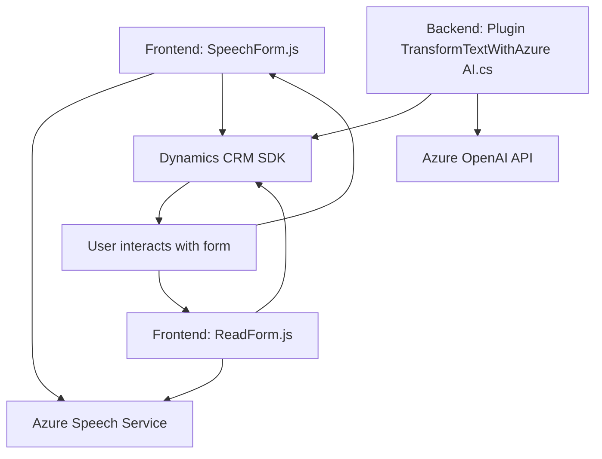

### Breve resumen técnico
El repositorio contiene archivos que implementan funcionalidad de entrada y salida de voz (usando Azure Speech SDK) en el frontend y la integración con servicios externos como APIs de Azure AI y Dynamics CRM en el backend. La solución utiliza patrones orientados a servicios y modularidad, gestionando la interacción del usuario con formularios digitales mediante accesibilidad mejorada (voz y texto).

---

### Descripción de arquitectura
La arquitectura del sistema parece ser **n-capas**, la cual organiza el código en capas de funcionalidades distintas:
1. **Frontend** (JavaScript): Lógica de negocio del cliente web.
    - Manejo de entrada de voz y salida de texto a voz.
    - Procesamiento de transcripciones con reglas predefinidas.
    - Comunicación con backend mediante APIs y procesamiento de formularios dinámicos (Dynamics CRM).
2. **Backend** (.NET Plugin): Gestión de reglas basadas en IA para transformar texto con Azure OpenAI.
    - Sirve como capa de abstracción entre Azure AI y CRM Dynamics.

El sistema se integra con servicios externos, usa eventos y modularidad en sus componentes, lo cual sugiere un _Service-Oriented Architecture_ que interactúa con API basadas en REST en servicios cloud como Azure.

---

### Tecnologías usadas
1. **Frontend**
    - JavaScript
    - Azure Speech SDK
    - Web APIs para formularios dinámicos (Dynamics CRM).

2. **Backend**
    - C# (.NET Framework)
    - Dynamics CRM SDK (`IPlugin`).
    - Azure OpenAI (interacción con modelos GPT-4).
    - Newtonsoft.Json (biblioteca .NET para manejo de JSON).

---

### Diagrama Mermaid válido para GitHub

---

### Conclusión final
Este repositorio combina accesibilidad, integración con servicios en la nube y procesamiento avanzado de datos y voz para formularios dinámicos en CRM. La arquitectura n-capas es ideal para separar responsabilidades y garantizar la modularidad del sistema. Con tecnologías como Azure Speech SDK y OpenAI APIs, se asegura una interacción usuario-servicio optimizada y con características de inteligencia artificial. Para futuras mejoras, sería recomendable garantizar un diseño más extensible y escalable, posiblemente migrando hacia una arquitectura hexagonal que facilite el desacoplamiento del sistema.