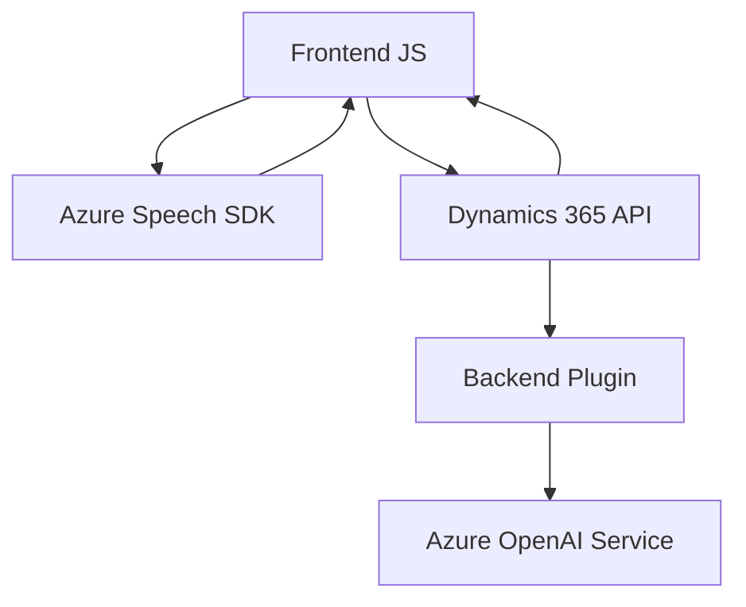

### Resumen técnico:
El repositorio contiene tres componentes principales:
1. **FRONTEND/JS/readForm.js**: Funcionamiento relacionado con la extracción de datos del formulario y síntesis de voz mediante **Azure Speech SDK**.
2. **FRONTEND/JS/speechForm.js**: Procesamiento de comandos hablando usando reconocimiento de voz y procesamiento con Inteligencia Artificial en el contexto de Dynamics 365.
3. **Plugins/TransformTextWithAzureAI.cs**: Un plugin que conecta Dynamics 365 con el servicio **Azure OpenAI** para transformar texto.

---

### Descripción de arquitectura
La solución es una arquitectura orientada a **n-capas** con fuerte integración de componentes distribuidos. Cada archivo realiza tareas específicas asociadas al **frontend** (interacción con formularios y APIs) y **backend** (procesamiento del servicio Azure OpenAI). La arquitectura utiliza un patrón SOA (**Service-Oriented Architecture**), delegando cálculos complejos a servicios externos.

---

### Tecnologías usadas
1. **Frontend**:
   - **JavaScript**: Manipulación de campo y lógica de síntesis y reconocimiento de voz.
   - **Azure Speech SDK**: Para sintetizar texto y reconocer comandos.
   - **Dynamics 365 API** (Xrm.WebApi): Integración con el sistema CRM.

2. **Backend**:
   - **C#**: Implementación del plugin para Dynamics 365.
   - **Azure OpenAI Service**: Procesamiento de texto con GPT (posiblemente gpt-4o).
   - **Newtonsoft.Json** (posible): Serialización y deserialización de JSON.

---

### Dependencias o componentes externos
1. **Azure SDKs**:
   - Speech SDK para síntesis y reconocimiento de voz.
   - OpenAI SDK para procesamiento avanzado de texto.
2. **Dynamics 365**:
   - Xrm.WebApi para interactuar con formularios y entidades del CRM.
3. **Librerías estándar .NET**:
   - Para manejo de HTTP, JSON, y procesamiento de texto en el backend.
4. **Servicios HTTP**:
   - Endpoint para Azure Speech SDK y OpenAI Service.

---

### Diagrama Mermaid válido para GitHub

---

### Conclusión final
La solución representa una arquitectura de software con **n-capas** enfocada en la integración entre **frontend interactivo** y servicios externos como **Azure Speech SDK** y **Azure OpenAI Service**. La parte **backend** procesa el texto transformándolo mediante Inteligencia Artificial y está vinculado directamente al ecosistema **Dynamics 365**. El diseño modular y orientado a servicios permite una alta escalabilidad y facilidad de mantenimiento en un entorno corporativo CRM.