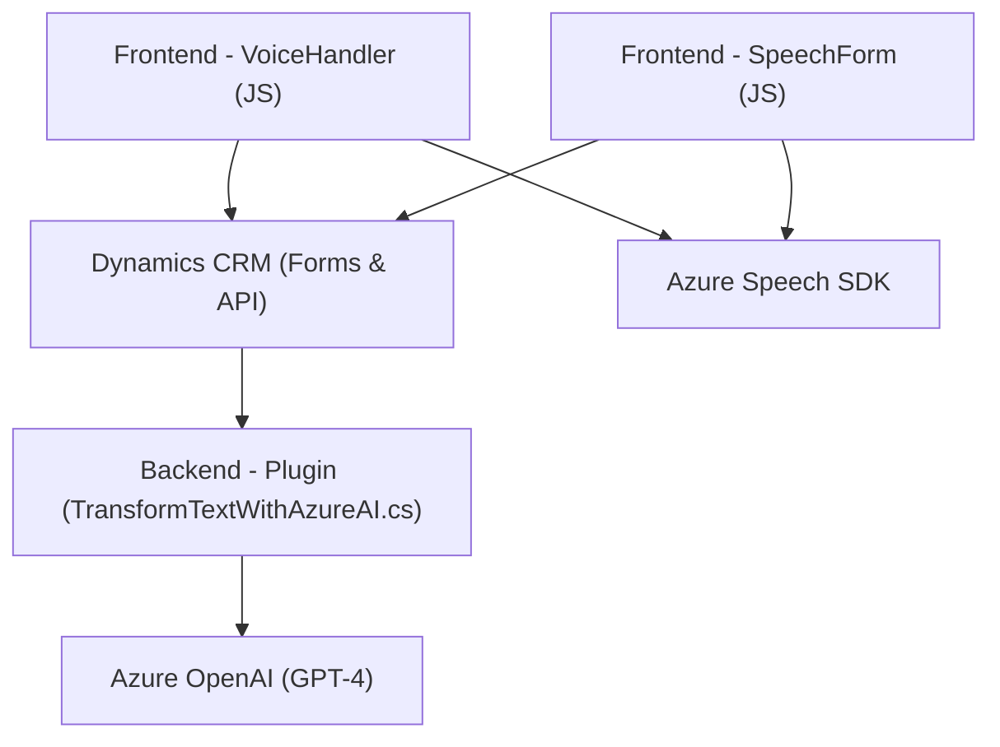

### Breve Resumen Técnico
Esta solución incluye módulos de frontend, backend y plugins que integran funcionalidades complejas en una plataforma CRM, utilizando tecnologías como **Azure Speech SDK** para síntesis y reconocimiento de voz y **Azure OpenAI GPT-4** para procesamiento avanzado de datos. Los archivos del repositorio demuestran una arquitectura compuesta por capas que interactúan con componentes externos para gestionar datos de formularios dinámicos y realizar análisis de texto.

---

### Descripción de Arquitectura
La arquitectura está basada en:
- **Frontend (JS):** Facilita la interfaz y manipulación de formularios mediante reconocimiento de voz y síntesis, integrándose con el SDK de Azure Speech. Utiliza funciones para extraer datos del formulario, sintetizarlos y alimentarlos a la lógica CRM.
- **Backend Plugin (.NET):** Extiende las capacidades de **Microsoft Dynamics CRM** mediante integración directa con la API de Azure OpenAI para transformar texto en objetos JSON estructurados. Este plugin utiliza `IPlugin` para integrarse con eventos de Dynamics CRM, permitiendo procesar datos directamente en los formularios.
- **Integración externa:** Utiliza los servicios de Azure Speech SDK y Azure OpenAI para realizar tareas avanzadas de voz/texto y procesamiento con inteligencia artificial.

La arquitectura global se puede interpretar como **n capas** (con frontal, capa de lógica de negocio, y una integración externa con servicios de Azure). Por otra parte, la interacción entre el CRM, los SDKs de Azure y el plugin forman parte de una arquitectura orientada a servicios (SOA), con componentes desacoplados que delegan tareas específicas a servicios externos.

---

### Tecnologías, Frameworks y Patrones Usados
**Frontend:**
- **JavaScript:** Para manipulación y transformación de datos en formularios dinámicos.
- **Azure Speech SDK:** Reconocimiento y síntesis de voz.
- Patrones:
  - Modularización: Funciones aisladas según su propósito (lectura de formularios, síntesis de datos, mapeo de campos).
  - Event-driven: Control mediante eventos como la carga del SDK o inicio de funciones.

**Backend Plugin:**
- **Microsoft Dynamics CRM SDK:** Para la interacción directa con los datos y atributos de formularios CRM.
- **System.Net.Http:** Para integrar servicios externos mediante solicitudes HTTP.
- **Azure OpenAI GPT-4:** Inteligencia artificial para transformar texto.
- **JSON processing:** Para manejar y procesar datos en formato JSON dentro del plugin.
- Patrones:
  - **Plugin pattern:** Extensiones personalizadas que se ejecutan en eventos CRM.
  - **Microservicio externo:** Delegación en Azure OpenAI para procesamiento complejo.

---

### Posibles Dependencias o Componentes Externos
1. **Azure Speech SDK:** Para síntesis y reconocimiento de voz en frontend.
2. **Dynamics 365 Web API:** Para manipular datos de formularios CRM.
3. **Azure OpenAI GPT-4:** Para transformar texto en backend mediante IA.
4. **HTTP Client:** Para llamadas a servicios externos como Azure OpenAI desde el plugin backend.
5. **Newtonsoft.Json:** Para manipulación avanzada de datos estructurados en JSON.

---

### Diagrama Mermaid Compatible con GitHub Markdown

---

### Conclusión Final
La solución muestra una arquitectura **n-capas** con un enfoque hacia la integración externa utilizando servicios de **Azure Speech SDK** y **Azure OpenAI GPT-4** para ampliar las capacidades de manipulación de datos y formularios dinámicos dentro de un sistema CRM (Dynamics 365). La estructura de los archivos está organizada, con un uso eficaz de patrones como la modularización y el plugin pattern. Sin embargo, ciertas configuraciones sensibles (como claves de API) requieren manejo seguro para evitar riesgos de exposición. La solución es escalable y adaptativa, permitiendo integrar más microservicios o funcionalidades avanzadas según las necesidades.