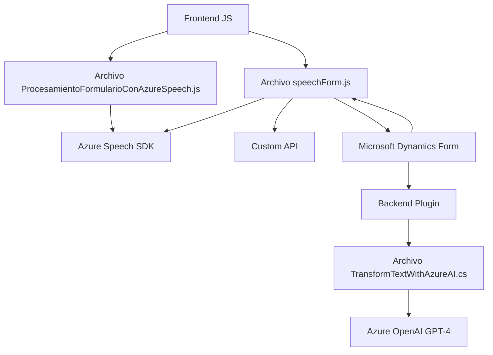

### Breve Resumen Técnico
El repositorio implementa una solución que integra capacidades de interacción vocal y procesamiento de texto utilizando servicios de Azure, aplicable en formularios dentro de Microsoft Dynamics CRM. Los archivos en JavaScript manejan la lógica del cliente, mientras que el plugin en C# realiza procesamiento del lado del servidor con Azure OpenAI en Dynamics CRM.

### Descripción de Arquitectura
La arquitectura se organiza en **capas** con un enfoque **n-capas**:
1. **Cliente (Frontend)**: Código JavaScript interactúa con Azure Speech SDK y un API personalizada en tiempo de ejecución.
2. **Servidor (Dynamics CRM Plugins)**: C# trabaja como capa de negocio al consumir servicios de Azure OpenAI para lógica avanzada de procesamiento.
3. **Integración con Servicios Externos**: Dependencias de Azure, APIs personalizadas y servicios Dynamics CRM integran las funcionalidades.

### Tecnologías Usadas
1. **Lenguajes**:
   - **JavaScript**: Lógica del cliente para asistencia vocal y manipulación del DOM.
   - **C# (.NET Framework)**: Desarrollo de plugins para Dynamics CRM.
2. **Servicios Externos**:
   - Azure Cognitive Services Speech SDK.
   - Azure OpenAI.
3. **Frameworks**:
   - **Microsoft Dynamics Web API**.
   - **Newtonsoft.Json** (manejo de JSON en C#).
4. **Patrones**:
   - **Carga dinámica de dependencias** para SDK (Frontend).
   - **Plugin Pattern** en Dynamics CRM.
   - **Encapsulamiento modular** y **Facade Pattern** para simplificar la interacción con APIs externas.
   - **Layered Architecture** para separar niveles Cliente, Servidor, e Integración.

### Dependencias o Componentes Externos
1. **Azure Cognitive Services Speech SDK**: Para reconocimiento y síntesis de voz.
2. **Azure OpenAI API**: Procesamiento de texto con GPT-4.
3. **Microsoft Dynamics Web API**: Manipulación de formularios en el CRM.
4. **Custom API**: Lógica avanzada de manipulación de texto.

### Diagrama Mermaid

### Conclusión Final
La solución combina síntesis y reconocimiento de voz con Azure Speech SDK en el frontend para interacción avanzada en formularios de Dynamics CRM, mientras que el backend complementa el flujo con procesamiento de texto vía Azure OpenAI. La arquitectura en capas garantiza modularidad y una clara separación de responsabilidades, mientras que los patrones empleados optimizan el manejo de dependencias y robustez de la integración. Es una solución escalable y bien alineada con las mejores prácticas en desarrollo de aplicaciones basadas en servicios integrados.