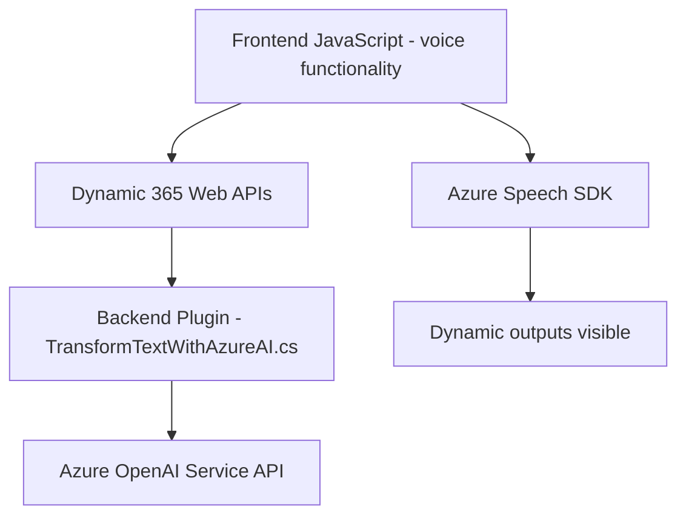

### Breve resumen técnico
El repositorio combina programación de frontend en JavaScript con la integración de servicios externos, como Azure Speech SDK, y plugins desarrollados en C# orientados a Dynamics 365. Permite manejar accesibilidad mediante funcionalidades de síntesis de voz y reconocimiento, además de integrar procesamiento semántico avanzado con Azure OpenAI GPT. La arquitectura se orienta hacia modularidad y adaptabilidad en un entorno CRM.

---

### Descripción de arquitectura
La solución se divide en tres partes principales:
1. **Frontend Modular:** Archivos JavaScript diseñados para capturar datos de formularios y realizar síntesis de voz y reconocimiento de voz. Emplean patrones como separación de responsabilidades y callbacks para asegurar la carga dinámica del SDK.
2. **Interfaz Conectada CRM:** Los archivos interactúan con Dynamics 365 mediante APIs personalizadas (`Xrm.WebApi.online`) y manipulan el contexto del formulario visible. 
3. **Backend Plugin:** Un plugin para Dynamics 365 que extiende sus capacidades estándar al utilizar Azure OpenAI GPT para transformar texto ingresado en datos estructurados JSON. Este plugin utiliza arquitectura basada en un patrón de cliente REST para conectarse con servicios externos.

### Tecnologías usadas
1. **Frontend:**
   - JavaScript ES6.
   - Azure Speech SDK (para síntesis y reconocimiento de voz).
   - APIs de Dynamics 365 (`Xrm.WebApi.online`).
2. **Backend:**
   - C# .NET Framework (para el desarrollo del plugin).
   - `Microsoft.Xrm.Sdk` (manejo del contexto del plugin en Dynamics).
   - Azure OpenAI Service API (GPT para transformar texto).
   - Json Frameworks (`Newtonsoft.Json` y `System.Text.Json`).

### Diagrama Mermaid válido para GitHub

---

### Conclusión final
La solución es un ecosistema integrado basado en una arquitectura **modular conectada** que opera como una extensión de Dynamics 365 y mejora su capacidad mediante **procesamiento de voz y texto conectado a servicios externos**. Utiliza patrones escalables como cliente REST/API Gateway, asegurando una separación adecuada entre frontend, manejo de SDK, y backend.