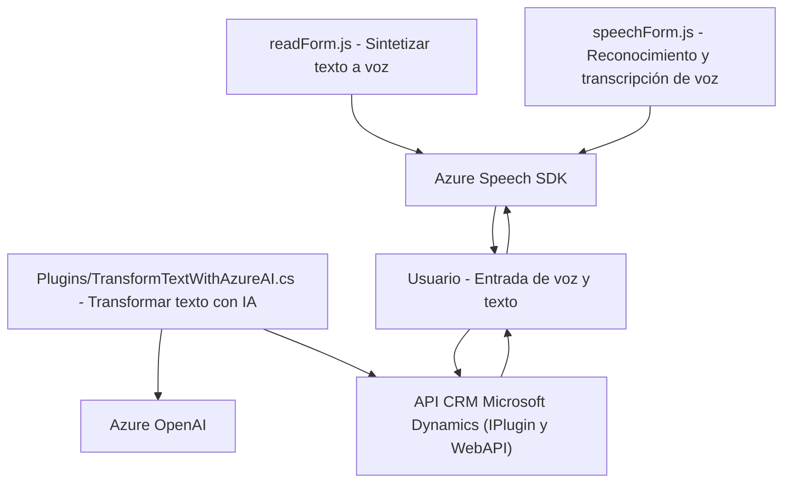

### Breve resumen técnico

El repositorio contiene tres archivos que implementan un solución orientada a la integración de procesamiento de texto y voz con sistemas CRM, específicamente Microsoft Dynamics, empleando servicios en la nube de Microsoft Azure. La solución puede clasificarse como una combinación de frontend (JavaScript-based) y backend (Microsoft Dynamics plugin) components, donde las funciones implementadas son altamente dependientes de APIs externas, integrando tecnologías como **Microsoft Azure Speech SDK** y **Azure OpenAI** para cumplimiento de operaciones.

---

### Descripción de arquitectura

La arquitectura de esta solución es **n capas**, con la siguiente distribución:

1. **Capa de presentación**:
   - Implementada con JavaScript, soporta el frontend del sistema CRM mediante archivos como `readForm.js` y `speechForm.js`. Aquí, se gestionan la síntesis y reconocimiento de voz junto con la manipulación de formularios.
   - Ambos archivos implementan funcionalidad para interactuar con usuarios: entrada de texto y voz, reconocimiento y transcripción, manejo de datos visualizados y trabajo basado en eventos.
   - Los archivos están organizados como módulos funcionales reutilizables, manejando tareas específicas como carga del SDK, generación de audios y mapeo de campos.

2. **Capa de lógica empresarial**:
   - Representada por el archivo `TransformTextWithAzureAI.cs`, implementa un plugin de Dynamics CRM que ejecuta transformaciones del texto utilizando servicios externos (Azure OpenAI).
   - Este plugin modela la lógica empresarial para procesar datos externos.
   - Se encarga de transformar los datos recibidos en un formato estructurado para su posterior integración con formularios CRM.

3. **Capa de servicios externos**:
   - La solución delega funciones críticas, como la síntesis y reconocimiento de voz, o el procesamiento de texto, a servicios ofrecidos por **Microsoft Azure**.
     - Azure Speech SDK para funciones de síntesis y reconocimiento de voz.
     - Azure OpenAI para transformar el texto con reglas específicas mediante IA.
   - Los servicios externos se manejan con peticiones asíncronas y se integran a través de APIs REST.

**Patrones empleados**:
- **Modularidad:** Funciones que encapsulan responsabilidades específicas.
- **Event-Driven:** Uso de callbacks y eventos para orquestar flujos de trabajo, especialmente con SDK externos.
- **Plugin-Based Architecture:** Utilizado en el desarrollo del archivo `TransformTextWithAzureAI.cs`.
- **Service-Oriented Architecture (SOA):** Uso de servicios externos como Azure Speech SDK y Azure OpenAI para delegar lógica compleja.

---

### Tecnologías usadas

1. **Lenguajes:**
   - JavaScript para el frontend (`readForm.js`, `speechForm.js`).
   - C# (.NET Framework) para el plugin backend (`TransformTextWithAzureAI.cs`).

2. **Frameworks y APIs:**
   - **Microsoft Dynamics CRM SDK**:
     - `executionContext`, `formContext`, `Xrm.WebApi.online.execute` para la integración nativa.
     - Extensión a través de `IPlugin`.
   - **Azure Speech SDK**:
     - Para síntesis y reconocimiento de voz.
   - **Azure OpenAI**:
     - Via API REST para transformar texto en un JSON estructurado según reglas.
   - **JSON Serialization**:
     - Uso de `Newtonsoft.Json.Linq` y `System.Text.Json` para trabajar con objetos JSON.

3. **Tecnologías externas:**
   - **Azure Services**: Plataforma de IA que incluye herramientas para procesamiento de voz y texto.
   - **HTTP Clients**: Se utiliza `System.Net.Http` para integrar con APIs REST.

---

### Dependencias y componentes externos

1. **Azure Speech SDK**:
   - Cargado dinámicamente desde `https://aka.ms/csspeech/jsbrowserpackageraw`.
   - Requerido para funciones en `readForm.js` y `speechForm.js`.

2. **Azure OpenAI**:
   - Usado para transformar texto dentro del plugin `TransformTextWithAzureAI.cs`.
   - Requiere configuración previa del endpoint API y la clave de autenticación.

3. **Microsoft Dynamics CRM API**:
   - Usa funciones nativas como `Xrm.WebApi.online.execute` en los archivos frontend.

4. **Librerías de C#:**
   - Newtonsoft.Json.Linq
   - System.Text.Json
   - System.Net.Http

5. **Entorno CRM**:
   - Contextos como `executionContext` y `formContext` en los archivos frontend.

---

### Diagrama Mermaid

---

### Conclusión final

La solución presentada implementa una arquitectura **n capas** con modularidad y programación basada en eventos en el frontend y lógica empresarial basada en plugins en el backend. Mediante el uso de APIs de Microsoft Dynamics, Azure Speech SDK y Azure OpenAI, integra servicios avanzados de síntesis y reconocimiento de voz con procesamiento de texto bajo reglas definidas. Su diseño está orientado a la interacción humana y la optimización del flujo de datos entre los usuarios (clientes) y un sistema CRM, logrando una solución altamente escalable y extendible. Sin embargo, la solución tiene alta dependencia de servicios externos, lo que puede implicar costos adicionales y desafíos asociados con las claves API y la disponibilidad del servicio.