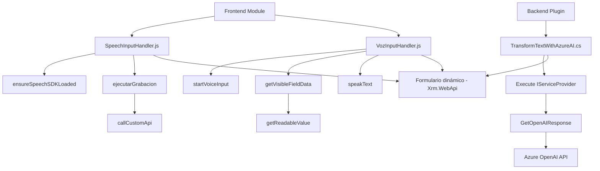

### Breve resumen técnico

El repositorio describe una solución modular que facilita la integración entre formularios interactivos, reconocimiento de voz y servicios cloud como Azure Speech SDK y Azure OpenAI API. Está compuesto principalmente por dos módulos frontend y un plugin backend para Microsoft Dynamics CRM, siendo diseñado para enriquecer la experiencia del usuario mediante voz y capacidades de inteligencia artificial.

---

### Descripción de arquitectura

La arquitectura se divide entre una solución de frontend y un plugin backend:

1. **Frontend:**  
   - Manejo de entrada y síntesis de voz a través de Azure Speech SDK.
   - **Patrones principales:** Modularidad, Event-based programming, y integración con SDK externo.
   - Utiliza un enfoque desacoplado para procesar datos dinámicos de formularios y convertirlos en voz o transcripción.
   
2. **Backend:**  
   - Acceso directo al Dynamics CRM mediante un plugin que invoca servicios externos como Azure OpenAI API.
   - **Patrones principales:** Plugin Pattern típico de Dynamics CRM y REST API Interaction.
   
**Arquitectura general:**  
La solución emplea una arquitectura distribuida con características de **Microservicios ligeros**, pues utiliza integración de servicios en la nube (Azure Speech y OpenAI API) mediante modulares funciones frontend y backend. Sin embargo, el entorno de Dynamics CRM introduce un estilo híbrido, consolidando datos y operaciones relacionadas con los formularios dentro del mismo contexto CRM.

---

### Tecnologías usadas  
1. **Frontend:**  
   - **JavaScript:** Núcleo del desarrollo frontend. Gestiona eventos y lógica.
   - **Azure Speech SDK:** Procesamiento de voz, síntesis de texto en voz y reconocimiento.
   
2. **Backend:**  
   - **C#:** Desarrollo principal del plugin.
   - **Microsoft Dynamics SDK:** Contexto para el plugin y acceso a datos del CRM.
   - **Azure OpenAI API:** Procesamiento de datos usando GPT-4 para proporcionar salidas JSON.
   - **HttpClient y JSON manipulación (`System.Text.Json`, `Newtonsoft.Json.Linq`)**: Comunicación con servicios externos e interpretación de datos.

---

### Dependencias o componentes externos

1. **Frontend:**
   - Azure Speech SDK: Uso de reconocimiento de voz y síntesis de texto en voz.
   - Scripts dinámicos cargados desde URLs específicas (`https://aka.ms/csspeech/jsbrowserpackageraw`).

2. **Backend:**
   - Azure OpenAI API: Procesamiento avanzado de texto.
   - Microsoft Dynamics CRM SDK: Contexto API CRM y acceso a datos entre entidades.

3. **Potenciales dependencias contextuales:**
   - Integración con sistemas SaaS como Dynamics CRM y otros servicios cloud de Azure (API Management).

---

### Diagrama Mermaid

---

### Conclusión final

La solución presentada combina capacidades de entrada por voz, síntesis, procesos dinámicos de datos y procesamiento de texto usando inteligencia artificial. El diseño modular y el uso de servicios cloud externos hacen que esta arquitectura sea adecuada para entornos SaaS como Dynamics CRM y aplicaciones con flujo intensivo de datos. Sin embargo, dado que el backend funciona como un plugin en el ecosistema CRM, podría considerarse un híbrido entre arquitectura de n capas y microservicios ligeros debido al componente de Azure OpenAI API y SDK externos.