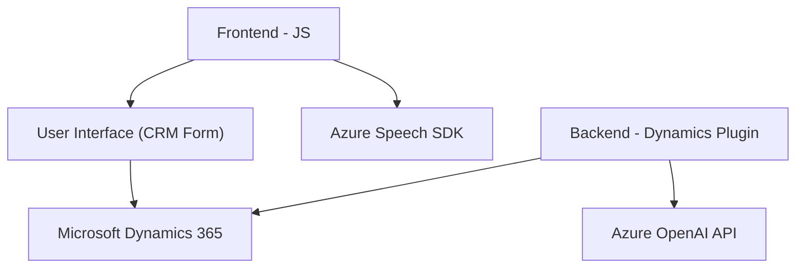

### Breve resumen técnico:

El repositorio abarca una solución que integra funcionalidades avanzadas de reconocimiento de voz y procesamiento de datos mediante **Azure AI** y **Microsoft Dynamics 365**. Los archivos individuales denotan diferentes puntos de interacción: desde el frontend usando JavaScript para manejar formularios y voz, hasta plugins en C# que extienden la lógica empresarial en Dynamics CRM. Se utiliza un enfoque modular, con fuertes dependencias en herramientas de Microsoft y Azure.

---

### Descripción de arquitectura:

#### Tipo de solución:
La solución es una **integración cliente-servidor con servicios externos**. Se usa frontend en JavaScript para actividades relacionadas con formularios (lectura, escritura) y backend con **Microsoft Dynamics 365** y un plugin C# que extiende la funcionalidad de negocio usando **Azure OpenAI API**.

#### Arquitectura:
- **Estructura en capas**:
  1. **Presentación**: Visto en los archivos frontend, se ocupa de la interacción con el usuario mediante Dynamics 365 y Azure Speech SDK.
  2. **Business Logic**: Plug-ins como `TransformTextWithAzureAI.cs` implementan reglas de negocio y llaman APIs externas.
  3. **Integración con APIs externas**: Se observa la interacción con Azure Speech (SDK) y Azure OpenAI API para funciones específicas de IA.

- Uso de patrones:
  - **Delegación dinámica**: Carga condicional de dependencias en los archivos de frontend.
  - **MVC**: Rigor en la separación de controladores, lógica empresarial y modelos de datos.
  - **Plug-in Pattern**: El backend en C# usa los patrones de Dynamics CRM para extender sus funcionalidades nativas.

---

### Tecnologías usadas:

1. **Lenguajes de programación**:
   - **JavaScript** (archivos frontend): Para la captura y síntesis de voz, además de manipulación de datos en formularios web vinculados a Dynamics 365.
   - **C#** (backend): Implementación de plugins Dynamics con llamadas HTTP a la API de Azure OpenAI.

2. **Frameworks/Librerías**:
   - **Azure Speech SDK**: Reconocimiento de voz y síntesis directa en el frontend.
   - **Dynamics 365 API**: APIs que sirven para manipular formularios y datos del CRM.
   - **Microsoft.Xrm.Sdk**: Aplicado en plugin para interactuar con la infraestructura de Dynamics CRM.
   - **Azure OpenAI API**: Comunicación con modelos de inteligencia artificial alojados en la nube, específicamente GPT-4o.

3. **Patrones de diseño observados**:
   - Modularización: Código organizado en funciones y métodos especializados en cada archivo.
   - Plug-in Pattern y Delegación Dinámica: Carga selectiva y ejecución de librerías externas e interacción con otros servicios.

---

### Diagrama Mermaid válido para GitHub:

---

### Conclusión final:

La solución está diseñada como una integración basada en capas, alineada con arquitecturas cliente-servidor. Su principal funcionalidad radica en la interacción del usuario con formularios de Dynamics 365, habilitada por el reconocimiento de voz y la síntesis de texto a habla mediante Azure Speech SDK, y la conversión de texto a JSON usando Azure OpenAI en el backend. Se utiliza un patrón de desarrollo modular orientado a la delegación de tareas, con dependencias empresariales maduras y servicios externos. La arquitectura enfatiza flexibilidad, escalabilidad y extensibilidad, siendo adecuada para entornos corporativos que buscan potenciar CRMs con capacidades avanzadas de IA y voz.