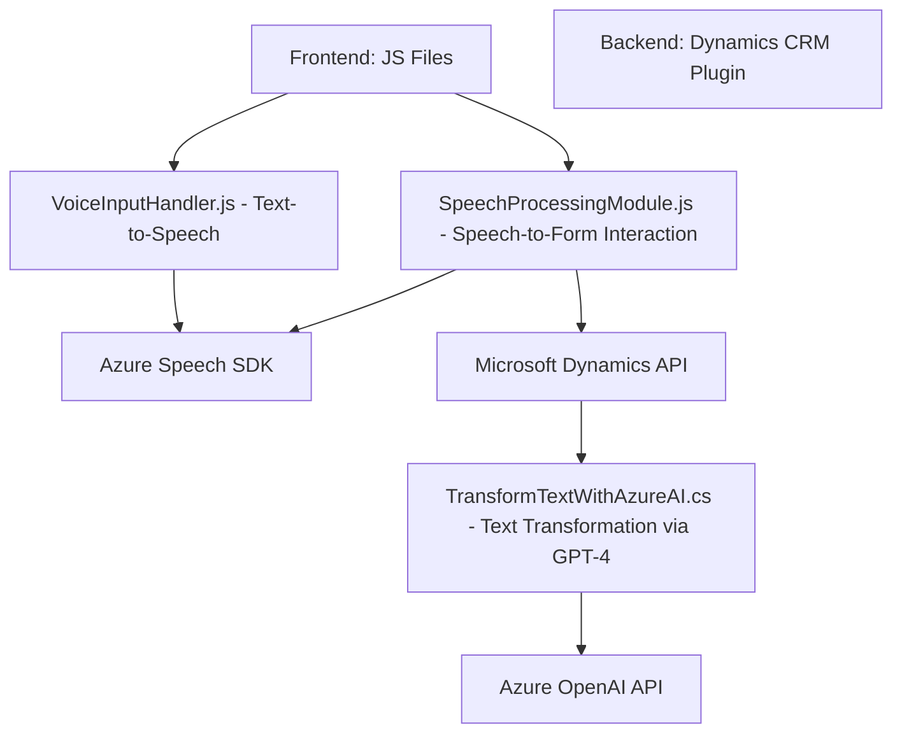

### Breve Resumen Técnico

El repositorio presenta una solución híbrida que implementa una serie de archivos orientados a la interacción con formularios en entornos de CRM, específicamente en Microsoft Dynamics 365. Utiliza capacidades avanzadas del **Azure Speech SDK** y la **Azure OpenAI API** para habilitar funcionalidades como síntesis de voz, reconocimiento de voz, y transformación de texto en reglas predefinidas. La arquitectura integra componentes frontend en JavaScript y un backend basado en plugins de .NET en Dynamics CRM.

---

### Descripción de Arquitectura
La solución sigue una arquitectura de capas donde:
1. **Frontend:** Archivos de JavaScript funcionan como capa de interacción directa con el usuario y el formulario CRM.
2. **Backend:** Un plugin (.cs) para Dynamics CRM gestiona las solicitudes desde el frontend hacia la **Azure OpenAI API**. Actúa como un middleware para transformar los datos.

El diseño sugiere una arquitectura **orientada a servicios** (SoA), donde el uso de servicios externos como el **Azure Speech SDK** y **Azure OpenAI API** están centralizados.

---

### Tecnologías Usadas
- **Frontend:**
  - **JavaScript**: Lógica de cliente y procesamiento de formularios.
  - **Azure Speech SDK**: Para síntesis de texto a voz y reconocimiento de voz.
  - **Microsoft Dynamics Xrm Client API**: Para la manipulación de formularios en Dynamics CRM.
- **Backend:**
  - **C# Plugins en Dynamics CRM**: Extensión del sistema para realizar transformaciones basadas en AI.
  - **Azure OpenAI API (GPT-4)**: Inteligencia artificial para procesamiento avanzado del texto.
  - **System.Net.Http**: Realiza solicitudes HTTP desde el plugin.
  - **Newtonsoft.Json y System.Text.Json**: Manejo de JSON en el plugin.
- **Patrones de Diseño:**
  - **Modularidad**: Separación de funciones en la lógica del frontend y métodos encapsulados en el plugin.
  - **Carga dinámica**: SDK de Azure Speech cargado bajo demanda en frontend.
  - **Integración de APIs**: Comunicación entre plataformas CRM y servicios Azure mediante SDK y Web APIs.

---

### Diagrama Mermaid

---

### Conclusión Final

La solución presenta un caso avanzado en el ámbito de aplicaciones empresariales inteligentes, integrando capacidades de reconocimiento del habla, síntesis de voz y procesamiento avanzado de texto en plataformas CRM como Dynamics 365. Combina un robusto frontend basado en JavaScript con servicios en la nube mediante SDK, junto a un plugin especializado para el backend.

Esta arquitectura es altamente adecuada para escenarios de **automatización de procesos empresariales**, siendo escalable gracias al uso de servicios en la nube. Con su diseño modular, se facilita la extensibilidad y la integración continua de servicios externos como GPT-4 y Azure Speech.

Este sistema demuestra altos estándares para optimizar la interacción del usuario en formularios detallados y complejos mediante IA y voz, posicionándose como una solución útil para empresas orientadas a sistemas CRM avanzados.