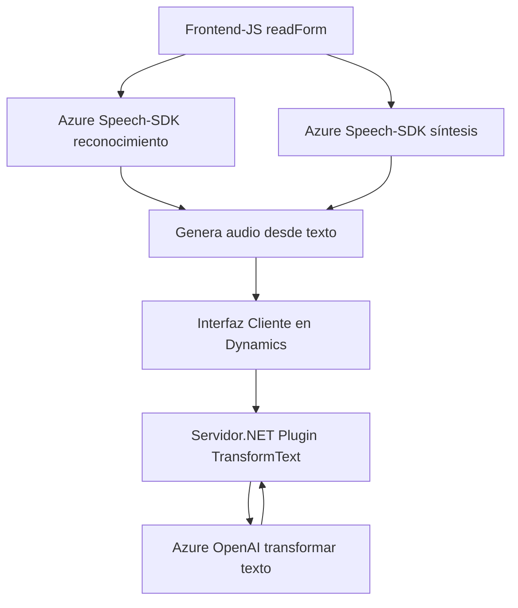

### Resumen técnico
El repositorio analiza tres componentes principales:
1. **Frontend** (JavaScript): Implementa capacidades de reconocimiento y síntesis de voz mediante Azure Speech SDK. Utiliza eventos y asincronía para conectar los datos del formulario dinámico con el procesamiento de voz y texto.
2. **Backend Plugin (.NET)**: Se extiende la funcionalidad de Microsoft Dynamics CRM mediante un plugin en C#, transformando texto con normas predefinidas utilizando Azure OpenAI.
3. **Dependencias Externas**: Azure Speech SDK y Azure OpenAI son servicios críticos para el procesamiento de voz y texto respectivamente. También se realiza una interacción directa con los servicios Dynamics CRM y API personalizadas.

---

### Descripción de arquitectura
La solución presentada abarca una arquitectura **cliente-servidor de múltiples capas**, donde:
1. **Cliente:**
   - Frontend (JavaScript) implementa la interacción directa del usuario mediante voz y formulario en aplicaciones Dynamics 365.
   - Comunicación se realiza con servicios externos (Azure Speech SDK y API personalizada).
2. **Servidor:**
   - El backend utiliza arquitectura basada en **componentes extensibles** de Dynamics CRM (Plugin Architecture).
   - Implementa lógica de negocio en la capa lógica del servidor, conectando con Azure OpenAI y devolviendo resultados dinámicos en formato JSON.

#### Aplicación de patrones:
- **Asincronía:** Callbacks y promesas se emplean en el front para garantizar el flujo de dependencias externas sin bloqueos.
- **Modularización funcional:** Existe separación estricta de conceptos entre el manejo de voz/audio, los datos del formulario, y las llamadas a APIs en ambos lados (cliente y servidor).
- **Encapsulación:** Métodos concretos gestionan internamente lógicas específicas, como la extracción de campos de formularios (frontend) o conexión HTTP (backend).

---

### Tecnologías usadas
1. **Frontend:**
   - **JavaScript** con integración de **Azure Speech SDK** (https://aka.ms/csspeech/jsbrowserpackageraw).
   - **Dynamics 365 (API personalizada)** para manipular datos del formulario.
   - Patrones de asincronía: `promise/async-await`.

2. **Backend (.NET Plugin):**
   - Framework **.NET** con librerías como `Microsoft.Xrm.Sdk`.
   - **HttpClient** para llamadas REST a Azure OpenAI.
   - **Azure OpenAI API** para manipulación avanzada de texto (transformación en JSON).

---

### Diagrama Mermaid (Compatible con GitHub):

---

### Conclusión final
La solución está diseñada sobre un modelo **cliente-servidor integrado** donde el cliente consume servicios de voz (Azure Speech SDK) y conecta datos de formularios a APIs personalizadas. Por su parte, el servidor utiliza un plugin en Dynamics CRM que integra capacidades de procesamiento avanzado de texto mediante Azure OpenAI. La arquitectura basada en componentes extensibles y su integración con servicios externos lo convierten en una implementación robusta y escalable, ideal para entornos empresariales que dependen de procesamientos de voz, texto y APIs de inteligencia artificial.