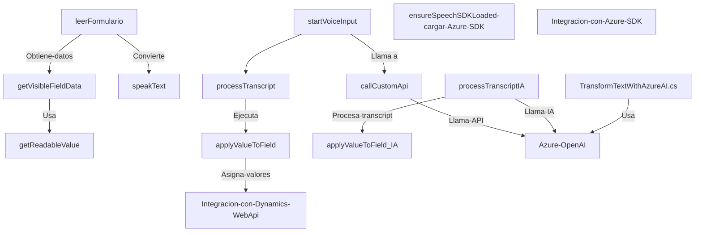

### Breve resumen técnico

El repositorio contiene una solución orientada a la interacción entre sistemas como **Microsoft Dynamics CRM**, **Azure Speech SDK** y **Azure OpenAI API**, enfocándose en dos aspectos principales: 
1. Procesamiento de datos de formularios acompañado de reconocimiento de voz y síntesis de texto a voz.
2. Una extensión de Dynamics CRM mediante plugins que integran el procesamiento de lenguaje natural con **Azure OpenAI**.

### Descripción de arquitectura

#### General
La solución sigue un enfoque híbrido que combina principios de **arquitectura de n capas** y patrones de **servicio-dominio**. Se estructura en capas:
1. **Capa de presentación:** archivos en la carpeta `FRONTEND/JS` realizan operaciones en el navegador, interactuando con formularios en el contexto del CRM.
2. **Capa de negocio:** la carpeta `Plugins` contiene lógica del negocio y su integración con **Azure OpenAI API**, implementada como plugins siguiendo el modelo de *Dynamics CRM Plugin Architecture*.
3. **Capa de servicios externos:** interacción con servicios externos como **Azure Speech SDK** y **Azure OpenAI API**.

#### Detalles arquitectónicos
La solución aprovecha múltiples patrones:
- **Modularización:** A través del uso de funciones altamente específicas y separación por responsabilidades en los scripts JavaScript. Esto facilita su reutilización y mantenimiento.
- **Evento-asíncrono:** Las operaciones dependen de promesas (`async/await`) para manejar integraciones con servicios externos, mejorar la gestión de eventos y evitar bloqueos en operaciones.
- **Acoplamiento controlado:** Los plugins manejan la integración con Dynamics CRM y llamadas a APIs externas mediante puntos de extensión claramente definidos.

### Tecnologías usadas

1. **Frontend (JS files)**
   - **Azure Speech SDK:** Para reconocimiento de voz y síntesis de voz en español.
   - **Microsoft Dynamics CRM Web API (`Xrm.WebApi`)**: Manipulación de formularios y datos.
   - Frameworks/librerías:
     - `SpeechSDK` (SDK de Azure para reconocimiento de voz y texto a voz).
     - Otros módulos dinámicos del CRM (como `lookup` y `optionset`).

2. **Backend (C# Plugin)**
   - **Microsoft Dynamics SDK**: Implementación de extensiones que se ejecutan en el servidor de Dynamics CRM.
   - **Azure OpenAI API**: Servicios de procesamiento avanzado de lenguaje natural.
   - **Newtonsoft.Json.LINQ**: Para manipulación de JSON.
   - **System.Net.Http:** Para realizar solicitudes y consumir APIs RESTful.

#### Información adicional
- **Infraestructura de servicios en la nube:** Interacción con **Azure** a través de Speech SDK y OpenAI API.
- **Interacción con Custom APIs:** Además del API estándar de Dynamics, se integran APIs personalizadas para usos específicos de negocio.

### Diagrama Mermaid

### Conclusión final

La solución es una integración de servicios de Azure con interfaces y extensiones de **Microsoft Dynamics CRM**, usando técnicas y frameworks modernos. El uso de una arquitectura híbrida, que combina n capas con patrones de servicio-dominio, la hace modular y adecuada para la gestión de formularios dinámicos y el procesamiento de lenguaje natural. Sin embargo, algunas partes pueden beneficiarse de una mayor separación entre lógica de negocio y acceso a servicios externos para mejorar su mantenibilidad y seguridad.