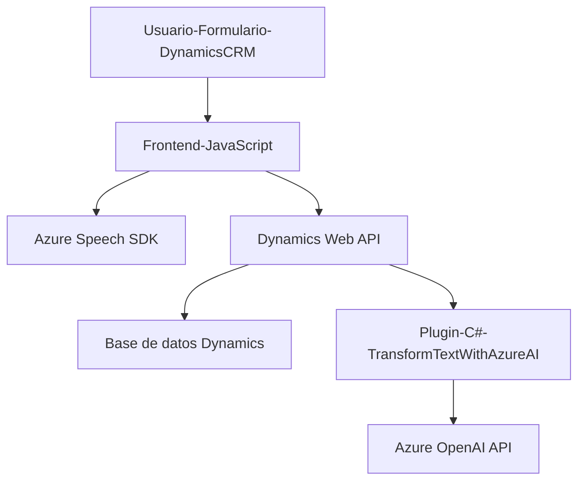

# Breve resumen técnico
El repositorio implementa soluciones orientadas a la interacción entre un sistema frontend, Dynamics CRM (Microsoft Dynamics 365), y servicios externos de Azure (Speech SDK y OpenAI API). La solución incluye archivos JavaScript y C# distribuidos funcionalmente para realizar tareas como síntesis y reconocimiento de voz, manejo de datos en formularios, y transformación de texto mediante IA.

---

# Descripción de arquitectura
La arquitectura está construida principalmente sobre un enfoque **n -capas/modular**, complementado por la integración con servicios externos (Azure Speech SDK y Azure OpenAI). Aunque presenta características propias del diseño de microservicios en los componentes conectados a APIs externas, parece ser más una solución monolítica basada en capas que se integra dinámicamente en Dynamics CRM. 

1. **Frontend**:
   - JavaScript en combinación con la API de Dynamics CRM para manipular formularios y manejar eventos.
   - Modularización definida por pequeñas funciones específicas que delegan la responsabilidad.

2. **Backend**:
   - Un plugin en C# que actúa como un conector entre Dynamics CRM y el servicio de Azure OpenAI.
   - Orientado a eventos cuando se activa en el contexto del sistema Dynamics.

---

# Tecnologías usadas
1. **Frontend (JavaScript)**:
   - Comunicación directa con Dynamics CRM mediante funciones nativas (`executionContext`, `Xrm.WebApi.online`).
   - Azure Speech SDK para síntesis y reconocimiento de voz.
   - Promesas y programación asíncrona para manejar flujos de datos de APIs externas.
   
2. **Backend (C#)**:
   - Dynamics CRM SDK (`IPlugin`, `IOrganizationServiceFactory`).
   - Azure OpenAI API para transformación de texto usando REST.
   - Manejo de JSON con Newtonsoft y System.Text.Json.
   - Solicitudes HTTP mediante `HttpClient`.

---

# Diagrama Mermaid

---

# Conclusión final
La solución utiliza una arquitectura orientada a capas, integrando la funcionalidad de reconocimiento y transformación de texto con APIs externas (Azure). Aunque los componentes parecen estar centralizados en un monolito que depende del entorno de Dynamics CRM, la modularidad del diseño y las integraciones externas sugieren potenciales características de escalabilidad hacia una arquitectura más distribuida (microservicios). Este diseño puede ser ampliado para incluir más servicios externos o adaptarse a otras plataformas compatibles, como parte de una estrategia de transformación digital.