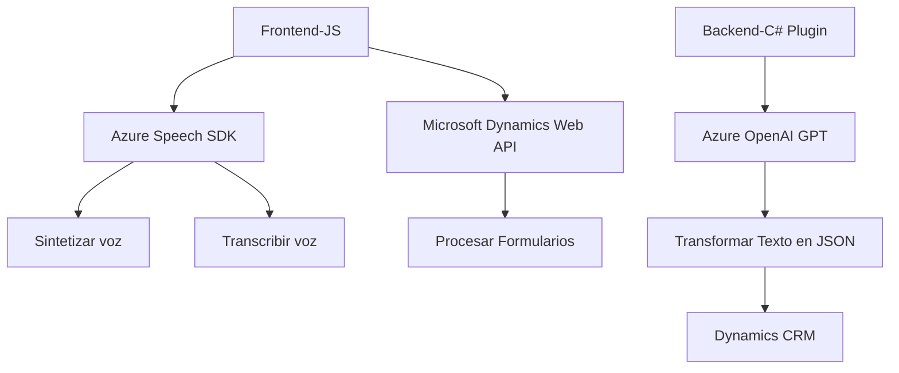

### Breve Resumen Técnico
El repositorio implementa una solución que integra servicios de voz y texto, con aplicaciones específicas para interactuar con formularios en Dynamics 365, aprovechando **Azure Speech SDK** y **Azure OpenAI**. Contiene un frontend basado en JavaScript para manejar la captura de voz y la síntesis de texto, junto con un backend basado en plugins .NET para procesamiento avanzado de texto.

---

### Descripción de Arquitectura
La arquitectura de este proyecto combina una estructura **n capas** con integración a servicios externos. Los diferentes componentes están divididos principalmente entre:

- **Frontend (Javascript)**:
  - Manejo de la interfaz y lógica para captar voz y actualizar formularios.
  - Suministro e interacción directa con **Azure Speech SDK** y **Dynamics Web API**.
- **Backend (Plugin en C#)**:
  - Procesamiento avanzado de texto mediante una arquitectura orientada a eventos, basada en la extensión de Dynamics CRM con **plugins** que interactúan con **Azure OpenAI GPT-4o**.

**Resumen de Arquitectura**:  
La solución implementa un diseño modular orientado a la integración de APIs externas (Speech, OpenAI y Dynamics) junto con patrones estándares como **gestión de eventos** y separación de lógica funcional entre frontend y backend.

---

### Tecnologías Usadas
1. **Frontend**:
   - *Lenguaje*: `Javascript`.
   - *Frameworks/Libraries*: `Azure Speech SDK`.
   - *Patrones*: Modularidad, controlador/eventos, Promises (gestión de asincronía).
   - *Plataforma*: Microsoft Dynamics 365.

2. **Backend**:
   - *Lenguaje*: `C#`.
   - *Frameworks/Libraries*: 
     - `Microsoft.Xrm.Sdk` (Dynamics CRM SDK para plugins).
     - `Newtonsoft.Json.Linq` (manejo avanzado de JSON).
     - `System.Net.Http` y `System.Text.Json` (interacción con servicios HTTP y serialización).
   - *Patrones*: Plugin (arquitectura de eventos), servicio REST.

3. **Externo**:
   - **Azure Speech SDK**: Suministrar capacidades de síntesis y reconocimiento de voz.
   - **Azure OpenAI GPT-4o**: Procesar texto y realizar transformaciones avanzadas.
   - **Dynamics Web API**: Interactuar dinámicamente con registros de CRM.

---

### Diagrama Mermaid

---

### Conclusión Final
Este repositorio constituye una **solución híbrida** entre frontend y backend para habilitar funcionalidades de voz y procesamiento de datos en aplicaciones integradas con Microsoft Dynamics 365. La arquitectura de **n capas** permite una clara separación de responsabilidades y asegura una interacción fluida con servicios externos como **Azure Speech SDK** y **Azure OpenAI GPT**.  
Aunque el código muestra un diseño funcional sólido y modular, hay áreas de mejora como la gestión de credenciales y el manejo avanzado de asincronía para optimizar el rendimiento en escenarios de alta concurrencia.