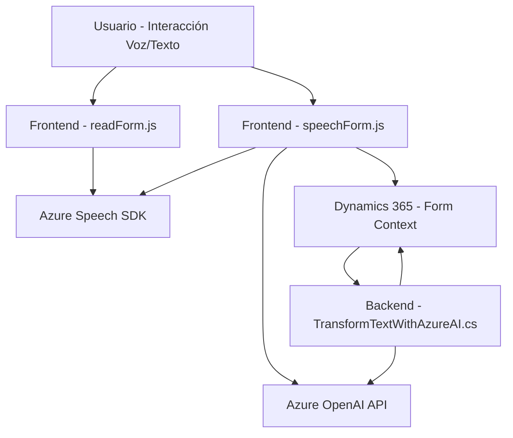

## Resumen técnico

El repositorio describe una solución con varias funcionalidades que emplean Dynamics 365, Azure Speech SDK, y Azure OpenAI API. Está orientado hacia interacción avanzada con formularios, utilizando voz para entradas y salidas, y funcionalidades de inteligencia artificial para transformar texto en datos estructurados. Los componentes indicados están organizados de forma modular.

### Descripción de la arquitectura
La solución parece una arquitectura basada en **n capas**, en donde los **plugins** funcionan como una capa de negocio que interactúa con Dynamics CRM para aplicar la lógica del sistema, y los archivos JavaScript implementan la capa de presentación y comunicación con servicios externos (Azure Speech y Azure OpenAI).

#### Componentes principales
1. **Frontend (JavaScript)**:
   - **readForm.js**: Extrae datos de formularios y utiliza Azure Text-to-Speech para sintetizar voces.
   - **speechForm.js**: Maneja entrada de voz, interpreta comandos usando reconocimiento automático y estructuras dinámicas de IA.

2. **Backend (C# Plugin)**:
   - **TransformTextWithAzureAI.cs**: Plugin de Dynamics CRM que utiliza Azure OpenAI para transformar texto.

### Tecnologías usadas
1. **En tecnologías frontend**:
   - **JavaScript**: Lógica del cliente, procesamiento de formularios y conexión a servicios externos.
   - **Azure Speech SDK**: Texto a voz y reconocimiento de voz.
   - **Xrm.WebApi**: Para manipulación del API de Dynamics 365 desde el cliente.
   - **Integración con APIs personalizadas** (basado en Dynamics y lógica adicional).

2. **En tecnologías backend**:
   - **C#** para el plugin integrado.
   - **Dynamics CRM SDK (Microsoft.Xrm.Sdk)**: Extensiones que usan eventos personalizados en Dynamics CRM.
   - **Azure OpenAI**: Llamadas HTTP para transformaciones de texto.
   - **System.Net.Http y System.Text.Json**: Comunicación con servicios externos y procesamiento de datos JSON.

### Patrones y principios arquitectónicos
- **Patrón n capas**:
  - Capa de presentación (manejo de formularios y voz con Azure Speech SDK).
  - Capa de lógica empresarial (Plugins para manejo avanzado de datos e integración con Azure OpenAI).
  - Capa de servicio o integración (comunicación con APIs externas).
- **Patrón Modular**: Cada archivo tiene funciones autónomas orientadas a tareas específicas.
- **Observer/Callback**: Detección de eventos para carga de SDK y activación de callbacks.
- **Encapsulación de Integración de Servicios**: Uso explícito de módulos para comunicación con Azure Speech SDK y APIs externas.
- **Separación de Responsabilidades**: Las tareas específicas (voz, transformar texto y manejar formularios) están claramente segregadas.

### Dependencias o componentes externos
1. **SDK de Azure Speech**: Para sintetizar voz y manejar comandos de voz.
2. **Azure OpenAI API**: Transformación e interpretación de datos estructurados desde texto.
3. **Dynamics 365 API**:
   - Manejo e interacción con formularios.
   - Integraciones avanzadas mediante plugins personalizados (C#).

### Diagrama Mermaid

---

## Conclusión final

La solución presentada es un sistema modular integrado con **Dynamics 365 CRM**. Emplea tecnologías como **Azure Speech SDK** para interacción por voz avanzada, y **Azure OpenAI** para transformar datos en formatos estructurados. La arquitectura es **n capas**, organizada con separación de responsabilidades y componentes bien definidos (frontend, backend, integración de servicios). Esto puede ser aplicado en soluciones como accesibilidad avanzada, entrada/salida por voz o automatización de flujos empresariales en CRM.