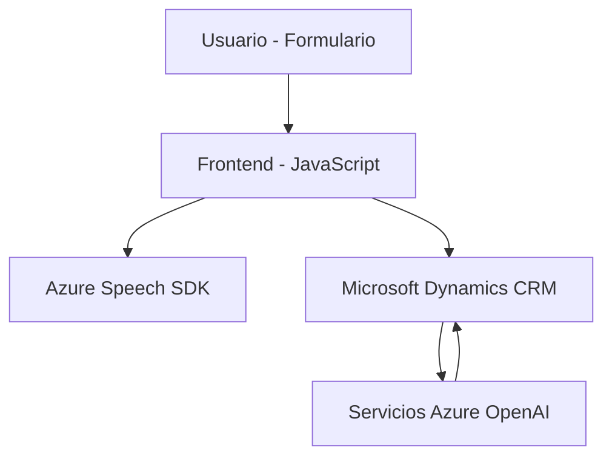

### Breve Resumen Técnico
El repositorio contiene una solución orientada a la interacción entre un frontend basado en JavaScript y un sistema backend alojado en Microsoft Dynamics CRM. Incluye componentes diseñados para integrar Azure Speech SDK con formularios y un plugin personalizado que utiliza Azure OpenAI GPT-4 para el procesamiento de texto. 

La arquitectura sugiere una combinación de un frontend con una lógica dinámica orientada a eventos y una integración con APIs y servicios externos proporcionados por Azure y Dynamics CRM. El plugin para Dynamics CRM enfatiza el uso de servicios descentralizados y comunicación asincrónica con APIs.

### Descripción de Arquitectura
La aplicación utiliza una **arquitectura de n capas**:
1. **Capa de presentación (frontend)**: Implementada con JavaScript, conecta los usuarios de formularios con el Azure Speech SDK para lectura y generación de textos a partir de la voz.
2. **Capa lógica (backend)**: Microsoft Dynamics CRM actúa como el núcleo del almacenamiento de datos y negocios, mientras que el plugin `TransformTextWithAzureAI` amplía la funcionalidad para integrar a Azure OpenAI GPT-4.
3. **Servicios externos**: Azure Speech SDK para síntesis de texto a voz y reconocimiento de audio, además de OpenAI GPT para análisis y transformaciones de texto natural.

### Tecnologías y Patrones Usados
1. **Frontend (JavaScript)**
   - **Frameworks/Librerías**: Azure Speech SDK.
   - **Patrones**:
     - **Carga dinámica**: SDK cargado en tiempo de ejecución si no está disponible en el objeto global.
     - **Gestión de eventos**: Lectura del estado del formulario y manejo de resultados del reconocimiento de voz.
     - **Asincronía**: Uso extensivo de `Promise` y `async/await`.
     - **Delegación de responsabilidad**: Se delegan funciones específicas como mapeo, asignación de valores y búsquedas.

2. **Backend (C# Plugin para Dynamics CRM)**
   - **Tecnologías**:
     - Microsoft Dynamics CRM SDK (IPlugin).
     - Microsoft HTTP Client (System.Net.Http).
     - JSON con `System.Text.Json` y `Newtonsoft.Json.Linq`.
     - Azure OpenAI GPT-4 (APIs externas).
   - **Patrones**:
     - **Orientado a eventos**: Plugin ejecutado por el motor de eventos del CRM.
     - **Microservicios**: Plugin que actúa como integrador entre Dynamics CRM y una API externa.
     - **Builder Pattern**: Construcción del JSON para la comunicación con Azure OpenAI.

### Dependencias o Componentes Externos
1. **Azure Speech SDK**: Reconocimiento de voz y generación de texto a voz que se integra con el frontend.
2. **Microsoft Dynamics CRM**: Base estructural del backend y almacenamiento de datos.
3. **Azure OpenAI GPT-4**: Procesamiento de texto basado en normas.
4. **JavaScript Libraries**: Métodos DOM para interacción con formularios.
5. **HTTP Client**: Enviando solicitudes web desde los plugins hacia Azure.

---

### Diagrama Mermaid

---

### Conclusión Final
La solución propuesta es un sistema de **n capas**, compuesto por un frontend dinámico basado en JavaScript que interactúa con un backend en Microsoft Dynamics CRM, extendido por un plugin y servicios externos como el SDK de Azure Speech y OpenAI GPT-4. Este diseño modular permite una buena separación de responsabilidades y escalabilidad para incluir nuevas capacidades con microservicios adicionales.

El enfoque es adecuado para aplicaciones sensibles que requieren procesamiento en tiempo real, como síntesis de voz y análisis de datos basados en IA, al tiempo que aprovecha los servicios potentes de Azure y Dynamics CRM para gestionar la integración y el procesamiento de datos.