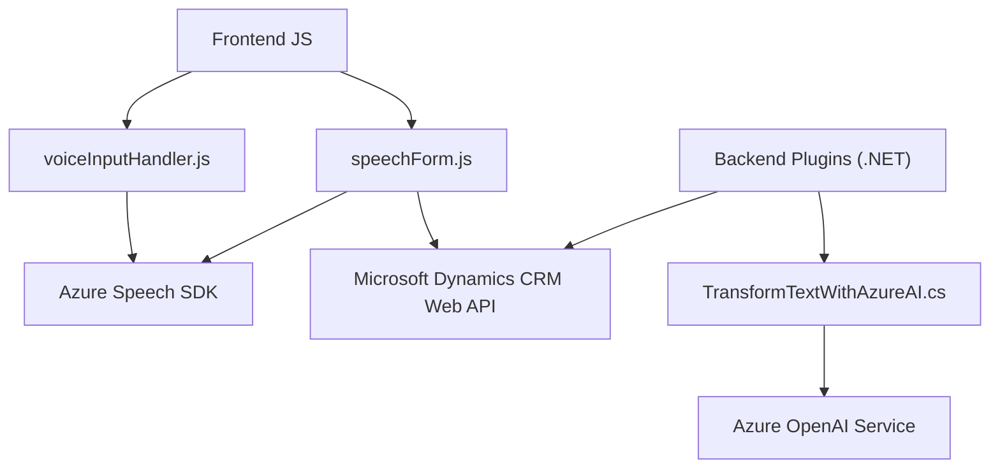

### Breve resumen técnico
El repositorio analiza la implementación de una solución que integra funcionalidades avanzadas como reconocimiento de voz, síntesis de texto a voz y procesamiento mediante inteligencia artificial. Estas funcionalidades están ligadas a formularios dinámicos en un contexto CRM probablemente basado en Microsoft Dynamics 365. Además, se aprovechan servicios externos, como **Azure Speech SDK** y **Azure OpenAI**, para enriquecer la experiencia del usuario y la automatización.

---

### Descripción de arquitectura
La solución parece ser modular y se integra en una arquitectura de **n capas** o posiblemente orientada a servicios (SOA). El frontend (en JavaScript) interactúa con servicios externos como el **Azure Speech SDK** y una API personalizada de Dynamics 365. Por otro lado, los plugins (en C#) demuestran suficiente independencia para realizar operaciones específicas como transformar texto utilizando el servicio **Azure OpenAI**.

Se observa una separación entre las capas **presentación** (Frontend JS), **negocio** (plugins .NET), y **integración/externalidades** (Microsoft Dynamics Web API y Azure). Esto sugiere una organización basada en patrones de **n capas**.

---

### Tecnologías usadas
1. **Frontend (JavaScript)**:
   - **Azure Speech SDK**: Para funcionalidades de Text-to-Speech y Speech-to-Text.
   - **Microsoft Dynamics Web API (Xrm.WebApi)**: Para integrar e interactuar con CRM.
   - **Dominio JavaScript general**: Manejo de objetos DOM, promesas y asincronía.

2. **Backend/Plugins (.NET)**:
   - **Microsoft Dynamics SDK**: `IServiceProvider`, `Microsoft.Xrm.Sdk`.
   - **Azure OpenAI Service**: Para transformar texto en JSON estructurado (GPT-4).
   - **Newtonsoft.Json**: Para manejo de JSON.
   - **System.Net.Http**: Para integrar servicios externos de Azure OpenAI.

3. **Patrones de diseño usados**:
   - **Modularidad**: Funciones específicas para realizar tareas bien definidas.
   - **Service Locator**: Uso de Azure Speech SDK y Dynamics API sin acoplamiento directo.
   - **Data Mapper**: Mapeo entre atributos de formulario y su representación interna.
   - **Adapter**: Transformación de datos con OpenAI para integrar respuestas entre CRM y Azure.

---

### Diagrama Mermaid válido para GitHub

---

### Conclusión final
El repositorio implementa una arquitectura centrada en integrar múltiples servicios avanzados para la interacción con usuarios y la gestión de formularios dinámicos. Se organiza de manera modular utilizando patrones de diseño eficientes y se basa en una arquitectura de **n capas**, ideal para soluciones integradas con CRM y sistemas externos robustos como Azure Service SDK y OpenAI. 

Esta solución es idónea para sistemas que requieran interacciones avanzadas con voz e inteligencia artificial, además de una fuerte integración con plataformas como Dynamics, destacándose por su escalabilidad y extensibilidad.