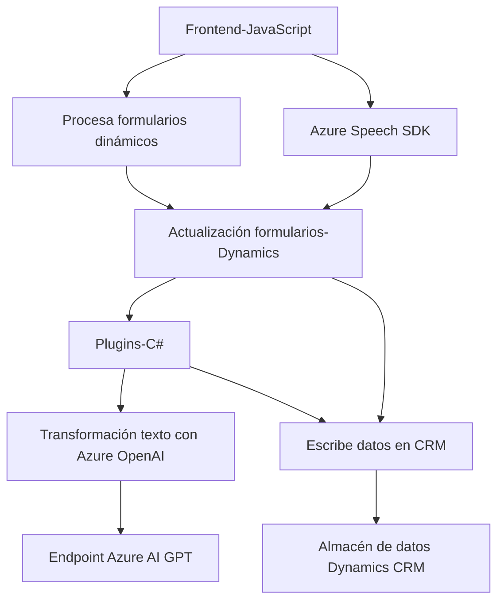

### Resumen técnico
El repositorio contiene una solución completa que integra entrada de voz, manipulación de formularios dinámicos y procesamiento de texto avanzado mediante servicios de Azure. Su propósito es extender la funcionalidad de un sistema CRM, específicamente Dynamics 365, mediante síntesis y reconocimiento de voz, además de transformación inteligente de texto.

Esta solución tiene tres áreas funcionales principales:
1. **Frontend basado en JavaScript**: Extiende la funcionalidad de formularios dinámicos.
2. **Backend especializado en procesamiento de texto**: Implementa lógica avanzada vinculada a Azure OpenAI.
3. **Dependencias externas**: Azure Speech SDK y Azure OpenAI son los pilares tecnológicos de la solución.

---

### Descripción de arquitectura
La arquitectura combina elementos del modelo de capas (N-capas) con integración de APIs externas y extensibilidad específica para Dynamics CRM:
- **Frontend con lógica en eventos** que se conecta directamente con el contexto de Dynamics y binarias externas (SDK).
- **Plugins y servicios personalizados** en el backend, que transforman datos con Azure OpenAI y generan JSON.
- **Flujo de interacción**: Los usuarios introducen o procesan voz/formulario en el frontend. Esto completa o manipula datos en Dynamics CRM mediante lógica definida en el servidor.

### Tecnologías usadas
#### Frontend:
- **JavaScript**: Manejo de eventos, manipulación DOM y lógica de integración con Dynamics.
- **Azure Speech SDK**: Realiza síntesis y reconocimiento de voz.

#### Backend:
- **C# (Microsoft.NET)**: Implementación de plugins para Dynamics CRM.
- **Azure OpenAI API**: Utiliza GPT-4 para procesar y transformar texto.
- **Dynamics CRM SDK**: Permite integrarse con la base de datos e interfaces del sistema CRM.
- **JSON Libraries (System.Text, Newtonsoft.Json)**: Serialización y deserialización de datos.

### Dependencias o componentes externos
- **Azure Speech SDK**: Requiere la clave API (`azureKey`) y región (`azureRegion`) para uso correcto.
- **Azure OpenAI API**: Necesita endpoint específico y clave API para realizar los procesos de transformación de texto.
- **Dynamics CRM SDK**: Necesario para interactuar con entidades, formularios y configuraciones de Dynamics 365.
- **Xrm.WebApi**: Usado en el frontend para comunicación directa con entidades de Dynamics.
- **Normas o reglas de transformación**: Estas probablemente se cargan desde configuración externa para usar en el plugin OpenAI.

---

### Diagrama **Mermaid** compatible con GitHub Markdown

---

### Conclusión final
La solución del repositorio implementa una arquitectura basada en el enfoque **N-capas**, donde el frontend, backend y las APIs externas trabajan en un flujo secuencial. Se aprovechan patrones como **modularidad**, **event-driven programming**, e **integración de APIs** para soportar funcionalidades de síntesis y entrada de voz, así como transformación inteligente de texto. El uso de SDKs como Azure Speech y OpenAI conecta el sistema a un ecosistema robusto de IA, mientras que la arquitectura extiende de manera eficiente un sistema CRM como Dynamics 365.