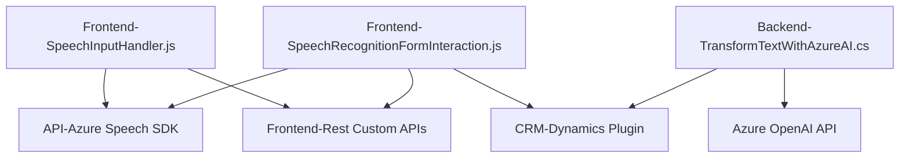

### Breve resumen técnico:
El repositorio contiene varios archivos que apuntan a una solución compuesta por un frontend y un backend integrado con Microsoft Dynamics CRM, que realiza procesamiento de datos relacionados con formularios y voz mediante servicios de Microsoft Azure (Azure Speech SDK y Azure OpenAI). Utiliza arquitectura modular y patrones bien definidos, especialmente en las áreas de plugin development y API wrapping.

---

### Descripción de arquitectura:
La solución implementa una **arquitectura híbrida** como sigue:
- **Frontend:** Una aplicación modular escrita en JavaScript que interactúa con Dynamics CRM y usa el SDK de Azure Speech para reconocimiento de voz y síntesis de texto a una experiencia interactiva basada en voz.
- **Backend:** Un **plugin basado en Dynamics CRM** que utiliza la **Azure OpenAI API** para aplicar procesamiento semántico a datos textuales y devolver JSON estructurado a Dynamics para consumo interno o sincronización en los formularios interactivos.
- **Patrones detectados:**
  - **Modularización:** Separación de lógica en funciones específicas.
  - **API Wrapper:** Encapsulación de interacción con APIs (Azure Speech SDK, Azure OpenAI API).
  - **Event-driven:** La interacción basada en eventos de voz y acciones en la interfaz.
  - **Integración de servicios externos:** Dependencia del SDK de Azure Speech, Azure OpenAI API, y Dynamics CRM SDK.

---

### Tecnologías y frameworks:
1. **Frontend:**
   - Lenguaje: JavaScript.
   - Servicios utilizados:
     - Azure Speech SDK para síntesis de voz y reconocimiento.
   - Modelos y herramientas:
     - procesamiento asíncrono y dinámico para usar APIs externas.
     - Clase `SpeechSDK`.

2. **Backend y Plugins:**
   - Lenguajes: C# (integración en Dynamics CRM).
   - Frameworks y SDKs:
     - Dynamics CRM SDK (`Microsoft.Xrm.Sdk` y `Microsoft.Xrm.Sdk.Query`).
     - System.Net.Http para llamadas a servicios REST (Azure OpenAI).   
   - Servicios externos:
     - **Azure OpenAI API** (usando GPT para procesamiento semántico de texto).
     
3. **Generales:**
   - Gestión de datos externos con JSON (`System.Text.Json` y `Newtonsoft.Json.Linq`).

### Dependencias detectadas:
1. **FrontEnd:**
   - Azure Speech SDK.
   - Dynamics CRM APIs.
   - Potential Web API for external custom processing.

2. **BackEnd (Plugin):**
   - Azure OpenAI services.
   - Dynamics CRM APIs.
   - External APIs (from custom endpoints listed in speechForm.js).

3. **Shared libraries:**
   - Newtonsoft.Json: Interacción eficiente con datos en formato JSON.
   - System.Net.Http: Manejo de peticiones HTTP para integrar servicios de Azure.

---

### Diagrama Mermaid válido para GitHub:

---

### Conclusión final:
Esta solución implementa una arquitectura modular orientada a un sistema híbrido con capacidades avanzadas, cuyos componentes clave del frontend y backend están dedicados a mejorar la interacción con formularios CRM mediante voz y procesamiento semántico enriquecido. Utilizando servicios externos como **Azure Speech SDK** y **Azure OpenAI API**, el sistema permite crear aplicaciones inteligentes y adaptativas. Sin embargo, se debe reforzar la **seguridad de credenciales API** mediante configuraciones seguras (variantes de entorno, claves protegidas) y mejorar la gestión de fallos en los componentes de backend.