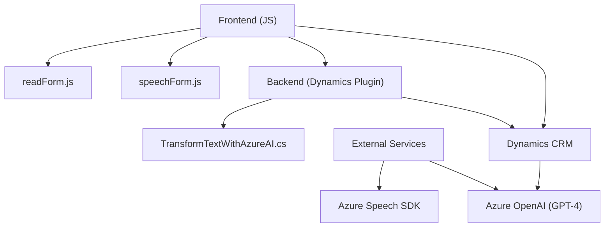

### Breve resumen técnico

El repositorio contiene tres módulos principales:
1. **Frontend (`readForm.js` y `speechForm.js`)**: Implementado con JavaScript y diseñado para interactuar con Azure Speech SDK. Procesa formularios dinámicos en Dynamics 365 utilizando integración con APIs y servicios de reconocimiento/síntesis de voz.
2. **Plugin (`TransformTextWithAzureAI.cs`)**: Escritos en C#, implementa un plugin para Microsoft Dynamics CRM que conecta con Azure OpenAI para realizar transformaciones avanzadas de texto a formato JSON estructurado, utilizando reglas específicas.

---

### Descripción de arquitectura

- **Tipo de solución**: Solución híbrida con integración entre frontend dinámico (JavaScript) y backend extensible (plugin en C#). El plugin en Dynamics CRM actúa como un adaptador lógico entre el frontend y el servicio externo de Azure OpenAI.
  
- **Arquitectura general**: Esta solución parece estar diseñada para integrarse con Microsoft Dynamics CRM, por lo que sigue una **arquitectura en capas** y una integración basada en servicios (SOA). La lógica del frontend obtiene datos del formulario y usa servicios como el Azure Speech SDK y APIs para un procesamiento avanzado. El backend (plugin) complementa esta arquitectura para realizar transformaciones externas y estructurar datos.

---

### Tecnologías usadas

1. **Frontend**:
   - **JavaScript**: Para la construcción de las funcionalidades interactivas.
   - **Azure Speech SDK**: Usado para síntesis y reconocimiento de voz.
   - **Dynamics 365 APIs**: Para manipular y actualizar datos en los formularios de CRM.

2. **Backend**:
   - **C#**: Desarrollo del plugin en Microsoft .NET Framework.
   - **Newtonsoft.Json/JObject**: Manejo dinámico de JSON.
   - **Azure OpenAI API**: Consumo de servicios de procesamiento de lenguaje natural ofrecidos por GPT-4.
   - **System.Net.Http**: Consumo de APIs REST.

### Patrones utilizados
- **Modularización de funciones**: En el frontend, cada tarea funcional (lectura, reconocimiento de voz, asignación al formulario) está encapsulada en funciones específicas, lo que mejora la mantenibilidad y la separación de responsabilidades.
- **SDK Integration Pattern**: En ambos niveles (frontend y backend), el repositorio utiliza APIs (Azure Speech SDK, OpenAI y Dynamics 365 APIs) para delegar tareas específicas.
- **Event-Driven Design**: Uso de eventos en el frontend para responder a interacciones de usuario y entrada de voz.
- **Adapter Pattern**: El plugin actúa como adaptador entre Dynamics CRM y Azure OpenAI, transformando datos según reglas específicas en este último.
- **Service-Oriented Architecture (SOA)**: Integración directa entre Dynamics CRM y Azure OpenAI API.
- **Dynamic Data Binding**: En el frontend, se observa un mapeo dinámico entre los atributos visibles del formulario y los elementos del modelo.

---

### Diagrama Mermaid

---

### Conclusión final

Este repositorio representa una **n-capas con arquitectura híbrida**, donde el frontend gestiona la interacción directa con los usuarios de la aplicación (mediante la interfaz gráfica y funcionalidad dinámica) mientras que la capa de plugins en Dynamics CRM permite ejecutar transformaciones más complejas utilizando servicios AI externos como Azure OpenAI. La integración entre ambas capas y los servicios externos se establece a través de APIs y SDKs, lo que se alinea con un enfoque basado en **service-oriented architecture (SOA)**.